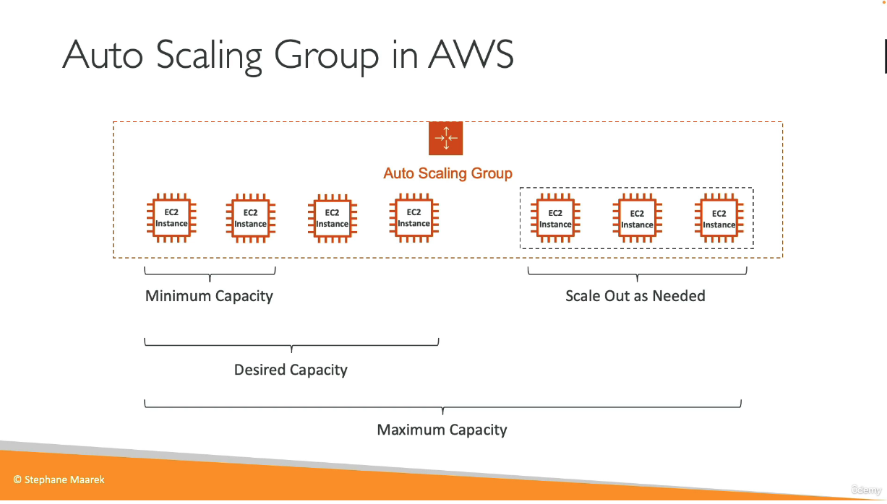
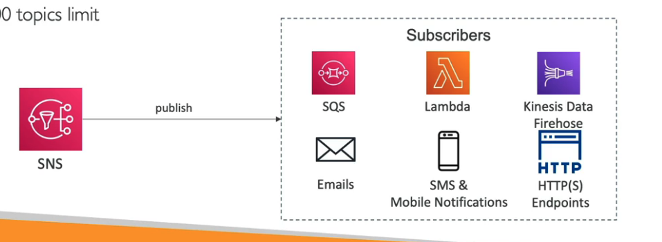
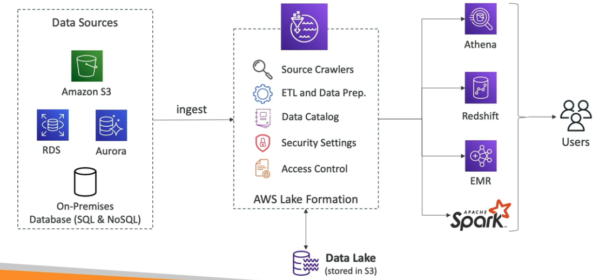
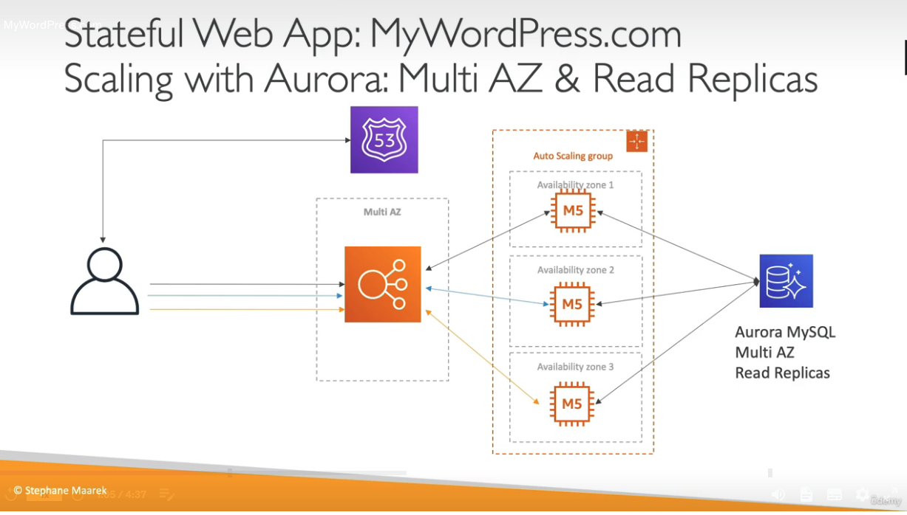
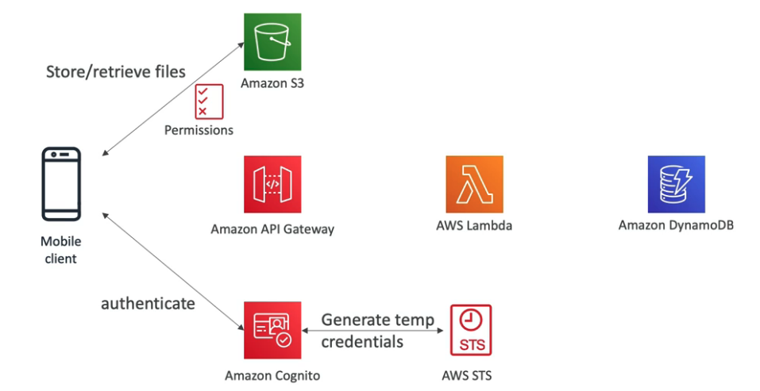
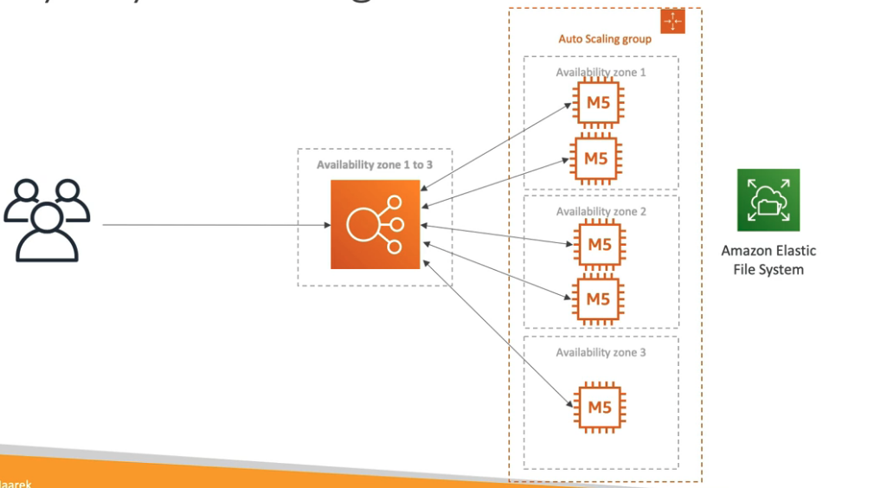
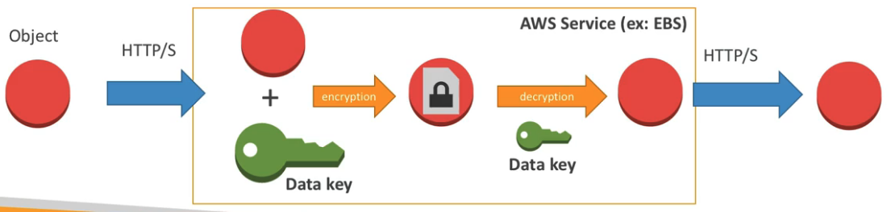

# Amazon AWS Study Solution Architecture Certification

## IAM: User and groups
- IAM -> Identity and Access Management, global service
- Root account -> crated by default, shouldn't used or shared
- Users/groups can be assinged to json documents(policy), to refeer whitch user/group is allowed to do on the AWS account
- Policies define permissions, don't give more permission that the user needs
- IAM is a global service, users and groups are created in a global fashion

- URL IAM example https://edvargas-aws.signin.aws.amazon.com/console

- IAM policies structure:
    - Version - policiy language version, awways inclde "2012-10-17"
    - Id - identifier optional
    - Statment - one or more (required)
        - Sid: an identifier for the statment (optional)
        - Effect: whether the statement allows or denies access(Allow,Deny)
        - Principal: account/user/role to whitch this policy applied to
        - Action: list of actions
        - Resource: list of resources
        - Condition: condition for when this policy is in effect

- Password policy -> in AWS we can set a password policy, increasing the security for the account. We can setup a password policy
    - Minimum password length
    - Require specific character types
    - Allow all IAM user to change their own passwords
    - Password expiration
    - Prevent password re-use

- Multi Factor Authentication - MFA
    - combination password + secutiry device you own
    - Virtual MFA device: an APP in the smartphone like Google authenticatior
    - Universal 2nd Factor(U2F)/Hardware Key fob MFA: it's an phisycal key make by a 3rd party company, support for multiple root and IAM users using a single key

- IAM Roles for Services
    - Some AWS services will need to perform some actions on your behald, for e.g.: EC2 instance escalating memory
    - To do so, we will assing permissions to AWS services with IAM Roles
    - Commons roles:
        - EC2 Instance roles
        - Lambda Function roles
        - Roles for CloudFormation

- IAM Security Tools
    - IAM Credentials Report (account-level): a report that lists all your account's users and the status of their various credentials
    - IAM Access Advisor (user-level): Acccess advisor shows the service permissions granted to a user and when those services were last accessed, you can use this info to revise your policies

- IAM Guideline and Best Practices
    - Don't use the root account except for AWS account setup
    - One physical user = One AWS user
    - Assign users to groups and assign permissions to groups
    - Create a strong password policy
    - Use and enforce the use of MFA
    - Create and user Roles for giving permissions to AWS services
    - Use Access Key for Programmatic Access (CLI/SDK)
    - Audit permissions of your account with the IAM Credentials Report
    - Never share IAM users and Access Keys

- Conditions
    - Implies in in policies for users / resources / endpoints

    - aws:SourceIp: restrict the client IP from wich the API calls are being made
    - aws:RequestRegion: restrict the region the API calls are made to
    - ec2:ResourceTag: restrict based on tags
    - aws:MultiFactorAuthPresent: to force MFA

- Resource Policies & aws:principalOrgId
    - aws:PrincipalOrgID can be used in any resource policies to restrict access to accounts that are member of an AWS Organization

- IAM Roles vs Resource Based Policies
    - Cross account:
        - attaching a resource-based policy to a resource (example: s3 bucket policy)
        - OR using a role as a proxy
        
    
    - When you assume a role (user, application or service), you give up your original permissions and take the permissions assigned to the role
    - When using a resource-based policy, the principal doesn't have to give up his permissions

    - Suppoerted by: Amazon S3 buckets, SNS topics, SQS queues, etc...

- Amazon Event Bridge - Security
    - When a rule runs, it needs permissions on the target
    - Resource-based policy: Lambda, SNS, SQS, CloudWatch Logs, API Gateway...
    - IAM role: Kinesis stream, Systems Manager Run Commands, ECS task...

- Permission Boundaries
    - IAM Permission Boundaries are supported for users and roles (not groups)
    - Advanced feature to use a managed policy to set the maximum permissions an IAM entity can get

    - Can be used in combination of AWS Organizations SCP
    

    - Use cases:
        - Delgate responsabilities to non administrators within their permission boundaries, for example create new IAM user
        - Allow developers to self-assign policies and manage their own permissions, while making sure they can't "escalate" their privileges (=make themselves admin)
        - Useful to restrict one specific user (instead of a whole account using Organizations & SCP)

- Policy Evaluation Logic

## AWS CLI - Command line interface and AWS Shell
- AWS CLI/Shel are tools that enables to interact with AWS services using commands in your command-line shell
- On AWS CLI case, we need to sing in on terminal, using the user's access key and secret key
- On the AWS Shell case, it's available on the AWS console for specific regions

## AWS EC2 - Elastic Compute Cloud
- EC2: Elastic Compute Cloud -> Infra as a Service
    - Renting virtual machines(EC2)
    - Storing data on virtual drives(EBS)
    - Distributing load across machines(ELB)
    - Scaling the services using an auto-scaling group(ASG)

- Sizing and configuration options
    - SO: Linux, Windows or Mac OS
    - How much CPU
    - How much RAM
    - How much storage
        - Network-attached(EBS and EFS)
        - hardware (EC2 Instance store)
    - Network card: speed of the card, public IP address
    - Firewall rules
    - Bootstrap script(configura at first launch): EC2 User data
        - Bootstrapping means launching commands when a machine starts
        - Thats script is only run once at the instance firts start
        - EC2 user data is used to automate boot tasks such as:
            - Installing updates
            - Installing software
            - Downloading commons files from the internet
            - Anything you can think of
        - The EC2 User Data Script runds with the root user
- The Instance's public IP may change, but the private IP is aways be the same

- EC2 Instance Types:
    - We can use different ypes of EC2 instances that are optimised for different use cases
    - AWS has the following naming convention, for E.g.: m5.2xlarge:
        - m: instance class
        - 5: generation (AWS imrpvoes them over time)
        - 2xlarge: size within the instance class
    - List of EC2 instance types:
        - General Purpose: great for a diversity of workloads such as web servers or code repositories, balance between:
            - Compute
            - Memory
            - Networking
        - Compute Optimized: great for compute-intensive tasks that require high performance processors:
            - Batch processing workloads
            - Media transcoding
            - High performance web servers
            - High performance computing (HPC)
            - Scientific modeling and machine learning
            - Dedicated gaming servers
        - Memory Optimized: fats performance for workloads that process large data sets in memory, use cases:
            - High performance, relational/non-relational databases
            - Distributed web scale cache stores(elasticache for example)
            - In-memory databases optmized for BI(business intalligence)
            - Applications performing real-time processing of big unstructured date
        - Storage Optimized: great for storage-intesive tasks tha require high, sequential read and write access to large data sets on local storage, use cases:
            - High frequency online transaction processing (OLTP) systems
            - Relational and NoSQL databases
            - Cache for in-memory databases (for example, Redis)
            - Data warehousing applications
            - Distributed file systems

- Security Groups: are the fundamentals of network security in AWS
    - They control how traffic is allowed into or out of our EC2 Instances
    - Security groups only contain allow rules
    - Security groups rules can reference by IP or by security group
    - Security groups are acting as a "firewall" on EC2 instances, they regulate:
        - Access to Ports
        - Authorized IP ranges - IPv4 or IPv6
        - Control of inbound network (from other to the instance)
        - Control of outbound network (from the instance to other)
    - Security group can be attached to multiple instances
    - Locked down to a region / VPC combination
    - Does live "outside" the EC2 - if traffic is blocked the EC2 instance won't see it
    - It's good to maintain one separate security group for SSH access
    - If your application is not accessible (time out), then it's a security group issue
    - If your application gives a "connection refused" error, then it's an application error or it's not launched
    - All inbound traffic is blocked by default
    - All outbound traffic is authorised by default
    - Classic Ports to know:
        - 22 = SSH (Secure Shell) - log into a Linux instance
        - 21 = FTP (File Transfer Protocol) - upload files into a file share
        - 22 = SFTP (Secure File Transfer Protocol) - upload files using SSH
        - 80 = HTTP - access unsecured websites
        - 443 = HTTPS - access secured websites
        - 3389 = RDP (Remote Desktop Protocol) - log into a Windows instance

- EC2 SSH connection - that is the command to access EC2 from SSH:
    - ssh -i EC2Turorial.pem ec2-user@44.204.66.19
    - if we're using key pair on the EC2 instance, it's necessary to user "-i [keyPair]", otherwise, just ignore it
    - and after that, ec2-user@[instanceIP]

- EC2 Instance Roles - instead use credentials when accessing EC2 instance, we should use IAM Roles on the instance to have access to the AWS functionalities

- EC2 Instances Purchasing Options:
    - On-Demand Instances - short workload, predictable pricing, pay by second
        - Pay for what you use
        - Has the highets cost but no upfront payment
        - No long-term commitment
        - Recommended for short-term and un-interrupted workloads, where you can't predict how the application will behave
    - Reserved Instances (1 and 3 years) - Up to 72% discount comparated to On-demand
        - Reserved Instances - long workloads
        - We reserve a specific instance attributes (Instance Type, Region, Tenancy, OS)
        - Payment Options - No upfront, Partitial upfront, All upfront
        - Reserved Instance's Scope - Regional or Zonal (reserver capactity in an AZ)
        - Recommended for steady-stated usage applications (think database)
        - We can buy and sell in the Reserved Instance Marketplace

        - Convertible reserved instances - long workloads with flexible instances
            - Can change the EC2 instance type, instance family, OS, scope and tenancy
            - Up to 66% discount
    - Saving Plans (1 and 3 years) - commitment to an amount of usage, long workload
        - Get a discount based on long-term usage (up to 72%)
        - Commit to a certaing type of usage ($10/hour for 1 or 3 years)
        - Usage beyond EC2 Savings Planas is billed at the On-Demand price

        - Locked to a specific instance family and AWS region (e.g, M5 in us-east-1)
        - Flexible across:
            - Instance Size (e.g., m5.xlarge to m5.2xlarge)
            - OS (e.g., Linux to Windows)
            - Tenancy (Host, Dedicated, Default)
    - Spot Instances - short workloads, cheap, can lose instances (less reliable)
        - Can get a discount of up to 90% comparated to On-demand
        - Instances that you can "lose" at any point of time if your max price is less than the current spot price
        - The MOST cost-efficient instances in AWS

        - Useful for workloads that are resilient to failure
            - Batch jobs
            - Data analysis
            - Image processing
            - Any distributed workloads
            - Workloads with a flexible start and end time
        - Not Suitable for critical jobs or databases

        - EC2 Spot Instance Requests:
            - Define max spot price and get the instance while current spot price < max
                - The hourly spot price varies based on offer and capacity
                - If the current spot price > your max price you can choose to stop or teminate your instance
            - Other strategy: Spot Block
                - "block" spot instance during a specified time frame (1 to 6 hours) without interruptions
                - In rare situations, the instance may be reclaimed
    - Dedicated Hosts - book an entire physical server, control instance placement
        - A physical server with EC2 instance capacity fully dedicated to your use
        - Allows you address compliance requirements and use your existing server-bound software licences (per-socket, per-core, pe-VM software licenses)
        - Purchasing Options:
            - On-demand - pay per second
            - Reserved - 1 or 3 years (No Upfront, Partial Upfront, All Upfront)
        - The most expensive option

        - Useful for software that have complicated licensing model (BYOL - Bring Your Own License)
        - Or for companies that have strong regulatory or compliance needs
        
        - I have my own Instance on my own Hardware
    - Dedicated Instances - no other customer will share your hardware
        - Instances run on hardware that's dedicated to you
        - May share hardware with other instances in same account
        - No control over instance placement (can move hardware after Stop / Start)

        - It's a physical server itself, that's gives lower level visibility
    - Capacity Reservations - reserve capacity in a specific AZ for any duration
        - Reserve On-Demand instances capacity in a specific AZ for any duration
        - We always have access to EC2 capacity when you need it
        - No time commitment (create/cancel anytime), no billing discounts
        - Combine with Regional Reserved Instances and Saving Plans to benefit from billing discounts
        - We're charged at On-Demand rate wheter you run instances or not

        - Suitable for short-term, uninterrupted workloads that needs to be in a specific AZ

    - Which purchasing option is right for me? (Using a resort as example)
        - On demand: coming and staying in resort whenever we like, we pay the full price
        - Reserved: like planning ahead and if we plan to star for a long time, we may get a good discount
        - Saving Plans: pay a certain amount per hour for certain period and stay in any room type
        - Spot instances: the hotel allows people to bid for the empty rooms and the highest bidder keeps the rooms. You can get kicked out at any time
        - Dedicated Hosts: We book an entire building of the resort
        - Capacity Reservations: You book a room for a period with full price even you don't staty in it

    - Spot Fleets = set of Spot Instances + (optional) On-Demand Instances
        - The Spot Fleet will try to meet the target capacity with price constraints
            - Define possible launch pools: instance type (m5.large), OS, Availability Zone
            - Can have multiple launch pools, so that the fleet can choose
            - Spot Fleet stops lauching instances when reaching capacity or max cost
        - Strategies to allocate Spot Instances:
            - lowestPrice: from the pool with the lowest price (cost optimization, short workload)
            - diversified: distributed across all pools (great for availability, long workloads)
            - capacityOptimized: pool with the optimal capacity for the numbers of instances
        - Spot Fleets allow us to automatically request Spot Instances with the lowest price

- EC2 - Elastic IPs
    - When you stop and then start an EC2 instance, it can change its public IP
    - If you need to have a fixed public IP for your incesntace, you need an Elastic IP
    - An Elastic IP is a public IPv4 IP you own as long as you don't delete it
    - You can attach it to one instance at a time
    - With an Elastic IP address, you can mask the failure of an instance or software by rapidly remapping the address to another instance in your account
    - You can only have 5 Elastic IP in your account (you can ask AWS to increase that)

    - Overall, try to avoid using Elastic IP
        - They often reflect poor architectural decisions
        - Instead, use a random public IP and register a DNS name to it
        - Or, use a Load Balancer and don't use a public IP

- Placement Groups
    - Sometimes you want control over the EC2 Instance placement strategy
    - That strategy can be defined using placement groups
    - When you create a placement group, you specify one of the following strategies for te group:
        - Cluster - clusters instances into a low-latency group in a single Availability Zone
            - Pros - Great network
            - Cons: If the rack fails, all instances fails at the same time
            
            - Use case:
                - Big Data job that needs to complete fast
                - Application that need extremely low latency and high network throughput
        - Spread - spreads instances across underlying hardware (max 7 instances per group per AZ) - critical applications
            - Pros:
                - Can span across Availability Zones
                - Reduced risk is simultaneous failure
                - EC2 Instances are on different physical hardware
            - Const:
                - Limited to 7 instances per AZ per placement group
            
            - Use case:
                - Application that need to maximize high availability
                - Critical Applications where each instance must be isolated from failure from each other
        - Partition - spreads instances across many different partitions (which rely on different sets of racks) within an AZ. Scales to 100s of EC2 instances per group (Hadoop, Cassandra, Kafka)
            - Up to 7 partitions per AZ
            - Can span across multiple AZs in the same region
            - Up to 100s of EC2 instances
            - The instances in a partition do not share racks with the instances in the other partitions
            - A partitions failure can affect many EC2 but won't affect other partitions
            - EC2 instances get access to partition information as metadata
            - Use cases: big data applications, HBase, Cassandra, Kafka

- Elastic Network Interfaces (ENI)
    - Logical component in a VPC that represents a virtual network card
    - The ENI can have the following attributes:
        - Primary private IPv4, one or more secondary PVv4
        - One Elastic IP (IPv4) per private IPv4
        - One Public IPv4
        - One or more security groups
        - A MAC address
    - We can create ENI independendtly and attach them on the fly (move them) on EC2 instances for failover
    - Bound to a specific availability zone (AZ)

- EC2 Hibernate
    - The in-memory (RAM) stated is preserved
    - The instance boot is much faster
    - Under the hood: the RAM state is written to a file in the root EBS volume
    - The root EBS volume must be encrypted

    - User cases:
        - Long-running processing
        - Saving the RAM state
        - Services that take time to initialize

- EBS Volume - Elastic Block Store
    - An EBS is a network drive you can attach to your instances while they run
    - It allows your instances to persist data, even after their termination
    - They can only be mounted to one instance at a time (at the CCP level)
    - They are bound to a specific availability zone

    - Analogy: Think of them as a "network USB stick"
    - Free tier: 30 GB of free EBS storage of type General Purpose (SSD) or Magnetic per month

    - It's a network drive (i.e. not a physical drive)
        - It uses the network to communicate the instance, which means there might be a bit of latency
        - It can detached from an EC2 instance and attached to another one quickly
    - It's locked to an AZ
        - An EBS Volume in us-east-1a cannot be attached to us-east-1b
        - To move a volume across, you first need to snapshot it
    - Have a provisioned capacity (size in GBs, and IOPS)
        - We get billed for all the provisioned capacity
        - We can increase the capacity of the drive over time

    - EBS - Delete on Terminations attribute
        - Controls the EBS behaviour when an EC2 instance terminates
            - By default, the root EBS volume is deleted (attribute enabled)
            - By default, any other attached EBS volume is not deleted (attribute disabled)
        - This can be controlled by the AWS console / AWS CLI
        - User case: preserve root volume when instance is terminated

- EBS Snapshots
    - Make a backup (snapshot) of your EBS volume at a point in time
    - Not necessary to detach volume to do snapshot, but recommended
    - Can copy snapshots (backups) across AZ or Region

    - EBS Snapthos Feature
        - EBS Snapshot Archive
            - Move a Snapshot to and "archive tiers" that is 75% cheaper
            - Takes within 24 to 72 hours for restoring the archive
        - Recycle Bin for EBS Snapshots
            - Setup rules to retain deleted snapshots so you can recover them after an accidental deletion
            - Specify retention (from 1 day to 1 year)
        - Fast Snapshot Restore (FSR)
            - Force full initialization of snapshot to have no latency on the first use ($$$)

- EBS Volume Types
    - EBS Volume come in 6 types:
        - gp2 / gp3 (SSD): General purpose SSD volume that balances price and performance for a wide variety of workloads
        - io1 / io2 (SSD): Highest-performance SSD volume for mission-critical, low-latency or high-thoughput workloads
        - st1 (HDD): Low cost HHD volume designed for frequently accessed, throughput-intensive workloads
        - sc1 (HDD): Lowest cost HDD volume designed for less frequently accessed workloads

    - EBS Volumes are characterized in Size | Throughpu IOPS
    - When in doubt always consult the AWS documentation
    - Only gp2/gp3 and io1/io2 can be used as boot volumes

    - EBS Volume Types Use Cases:
        - General Purpose:
            - Cost effective storage, low-latency
            - System boot volumes, Virtual desktops, Development and test environments
            - 1 GiB - 16 TiB
            - gp3:
                - Baseline of 3,000 IOPS and throughput of 126MiB/s
                - Can increase IOPS up to 16,000 and throughput up to 1000 MiB/s independently 
            - gp2:
                - Small gp2 volumes can burst IOPS to 3,000
                - Size of the volume IOPS are linked, max IOPS is 16,000
                - 3 IOPS per GB, means at 5,334 GB we are at the max IOPS
        
        - Provisioned IOPS (PIOPS) SSD:
            - Critical business applications with sustained IOPS performance
            - Or applications that need more than 16,000 IOPS
            - Great for databases workloads (sensitive to storage perf and consistency)
            - io1/io2 (4 GiB - 16 Tib):
                - Max PIOPS: 64,000 for Nitro EC2 instances and 32,000 for other
                - Can increase PIOPS independently from storage size
                - io2 have more durability and more IOPS per GiB (at the same price as io1)
            - io2 Block Express (4 GiB - 64 TiB):
                - Sub-millisecond latency
                - Max PIOPS: 256,000 with an IOPS: GiB ratio of 1,000:1
            - Supports EBS Multi-attach
        
        - Hard Disk Drives (HDD): 
            - Cannot be a boot volume
            - 125 Mib to 16 TiB
            - Throughtput Optimized HDD (st1)
                - Big Data, Data Warehouses, Log Processing
                - Max throughput 500 MiB/s - max IOPS 500
            - Cold HDD (sc1)
                - For data that is infrequently accessed
                - Scenarios where lowest cost is important
                - Max throughput 250 MiB/s - max IOPS 250

- EBS Multi-Attach - io1/io2 family
    - Attach the same EBS volume to multiple EC2 instances in the same AZ
    - Each instance has full read and write permissions to the high-performance volume
    - Use case:
        - Achive higher application availability in clustered Linux applications (ex: Teradata)
        - Applications must manage concurrent write operations
    - Up to 16 EC2 Instances at a time
    - Must use a file system that's cluster-aware (not XFS, EX4, etc...)

- EBS Encryption
    - When you create an encrypted EBS volume, you get the following:
        - Data at rest is encrypted inside the volume
        - All the data in flight moving between the instance and the volume is encrypted
        - All snapshots are encrypted
        - All volumes created from the snapshot
    - Encryption and decryption are handled transparently, EC2 and EBS behind the scenes
    - Encryption has a minimal impact on latency
    - EBS Encryption leverages key from KMS (AES-256)
    - Copying an unencrypted snapshot allows encryption
    - Snapshots of encrypted volumes are encrypted

- AMI - Amazon Machine Image
    - AMI are customization of an EC2 instance
        - You add your own software, configuration, operating system, monitoring...
        - Faster boot/configuration time because all your software is pre-packaged
    - AMI are built for a specific region (and can be copied across regions)
    - You can launch EC2 instances from:
        - A Public AMI: AWS provided
        - Your own AMI: you make and maintain them yourself
        - An AWS Marketplace AMI: an AMI someone else made (and potentially sells)
    
    - AMI Process (from an EC2 instance)
        - Start an EC2 instance and customize it
        - Stop the instance (for data integrity)
        - Build an AMI - this will also create EBS snapshots
        - Launch instances from other AMIs

- EC2 Instance Store
    - EBS volumes are network drives with good but "limited" performance
    - If you need a high-performance hardware disk, use EC2 Instance Store

    - Better I/O performance
    - EC2 Instance Store lose their storage if they-re stopped (ephemeral)
    - Good for buffer / cache / scratch data / temporary content
    - Risk of data loss if hardware fails
    - Backups and Replications are your responsability

- Instance Metadata
    - AWS EC2 Instance Metadata is powerful but one of the least known features to developers
    - It allows AWS EC2 instance to "learn about themselves" without using an IAM Role for that purpose
    - The URL is http://169.254.169.254/latest/meta-data
    - You can retrieve the IAM Role name from the metadata, but you CANNOT retrieve the IAM Policy
    Metadata = Info about the EC2 Instance
    - Userdata = launch script of the EC2 instance

## Amazon EFS - Elastic File System

- Managed NFS (network file system) that can be mounted on many EC2
- EFS works with EC2 instances in multi-AZ
- Highly available, scalable, expensive (3x gp2), pay per use

- Use cases: content management, web serving, data sharing, Wordpress
- Uses NFSv4.1 protocol
- Uses security group to control access to EFS
- Compatible with Linux based AMI (not Windows)
- Encryption at rest using KMS

- POSINX file system (Linux) that has a standard file API
- File system scales automatically, pay-per-use, no capacity planning, pay for each GB used

- EFS - Performance and Storage Classes
    - EFS Scale
        - 1000s of concurrent NFS clients, 10 GB+/s throughtput
        - Grow to Petabyte-scale network file system, automatically
    - Performance mode (set at EFS creation time)
        - General purpose (default): latency-sensitive use cases (web servers, CMS, etc...)
        - Max I/O - Highet latency, throughput, highly prallell (big data, media processing)
    - Throughput mode
        - Bursting (1 TB = 50MiB/s + burst of up to 100MiB/s)
        - Provisioned: set your throughput regardless of storage size, ex: 1 GiB/s for 1 TB storage
    
    - Storage Tiers (lifecycle management feature - move file after N days)
        - Standard: for frequently accessed files
        - Infrequent access (EFS-IA) with a Lifecycle Policy
    - Availability and durability
         - Standard: Multi-AZ, great for prod
         - One Zone: One AZ, great for dev, backup enabled by default, compatible with IA (EFS One Zone-IA)
        - Over 90% in cost savings

- EFS vs EBS vs Instance Store
    - EFS is for network file system mounted in a multiple instances 
    - EBS is for a network volume that in mounted in one instance and it is locked to an AZ
    - Instance Store maximum amount of IO in EC2 instance, but it's something that you lose, ephemeral

## AWS ELB - Elastic Load Balancer
- Load Balances are servers that forward traffic to multiple servers (e.h., EC2 instances) downstream

- Health Checks
    - health Checks are crucial for Load Balancers
    - They enable the load balancer to know if instances it forwards traffic to are available to reply to requests
    - The health check is done on a port and a route(/heath is common)
    - If t he response is not 200 (OK), then the instance is unhealthy

- Types of load balancer on AWS
    - Classic Load Balancer (v1 - old generation) - 2009 - CLB
        - HTTP, HTTPS, TCP, SSL
    - Application Load Balancer (v2 - new generation) - 2016 - ALB
        - HTTP, HTTPS, WebSocket
    - Network Load Balancer ( v2 - new generation) - 2017 - NLB
        - TCP, TLS, UDP
    - Gateway Load Balancer - 202 - GWLB
        - Operates at layer 3 (Network layer) - IP Protocol
    
    - Overall, it is recommended to use the newer generation load balancers as they provide more features
    - Some load balancers can be setup as internal (private) or external (public) ELBs

- Load Balancer Security Groups
    - Load Balancer has the own Securty group
    - For example, we can allow the users from anywhere access the Load Balancer, but the EC2 Instances only allow traffic comming only from the Load Balancer, because de EC2 Security Group will allow HTTP traffic only from the Load Balancer Security Group, this way linking Security Groups
    

- Application Load Balancer (v2) - ALB
    - Application load balancers is Layer 7 (HTTP)

    - Load Balancing to multiple HTTPS applications across machines (target groups)
    - Load balancing to multiple applications on the same machine (ex: containers)
    - Support for HTTP/2 and WebSocket
    - Support redirects (from HTTP to HTTPS for example)

    - Routing tables to different targe groups:
        - Routing based on path in URL (example.com/users & example.com/posts)
        - Routing based on hostname in URL (one.example.com & other.example.com)
        - Routing based on Query String, Headers (example.com/users?id=123&order=false)
    - ALB are a great fit for micro services & container-based application (example: Docker & Amazon ECS)
    - Has a port mapping feature to redirect to a dynamic port in ECS
    - Has a port mapping feature to redirect to a dynamic port in ECS
    
    - Target Groups
        - EC2 instances (can be managed by an Auto Scaling Groups) - GTTP
        - ECS tasks (managed by ECS itself) - HTTP
        - Lambda functions - HTTP request is translated into a JSON event
        - IP Addresses - must be private IPs

        - ALB can route to multiple target groups
        - Health checks are at the target group level
    
    - Good to Know
        - Fixed hostname (XXX.region.elb.amazonaws.com)
        - The application servers don't see the IP of the client directly
            - The true IP of the client is inserted in the header X-Forwarded-For
            - We can also get Pot (X-Forwarded-Port) and proto (X-Forwarded-Proto)

- Network Load Balancer (v2) - NLB
    - Network Load balancers (Layer 4) allow to:
        - Forward TCP & UDP traffic to your instances
        - Handle millions of request per second
        - Less latency ~100 ms ( vs 400 ms for ALB)

    - NLB has one static IP per AZ, and supports assigning Elastic IP (helpful for whitelisting specific IP)

    - NLB are used for extreme performance, TCP or UDP traffic
    - Not included in the AWS free tier

    - NLB Target Groups
        - EC2 instances
        - IP Addresses - must be private IPs
        - Application Load Balancer(yeah, an ALB)
        - Health Checks support the TCP, HTTP and HTTPS Protocols

- Gateway Load Balancer - GWLB
    - Deploy, scale ,and manage a fleet of 3rd party network virtual appliances in AWS
    - Example: Firewalls, Intrusion Detection and PRevention Systems, Deep Packaet Inspection Systems, payload manipulation,...

    - Operates at Layer 3 (Network Layer) - IP Packats
    - Combines the following functions:
        - Transparent Network Gateway - single entry/exit for all traffic
        - Load Balancer - distributes traffic to your virtual appliances
    - Uses the GENEVE protocol on port 6081

    - Target Groups:
        - EC2 instances
        - IP Addresses - must be private IPs

- Sticky Sessions (Session Affinity)
    - It is possible to implement stickiness so that the same client is always redirected to the same instance behind a load balancer
    - This works for CLB and ALB
    - The "cookie" used for stickiness has an expiration date you control
    - Use case: make sure the user doesn't lose his session data
    - Enabling stickiness may bring imbalance to the load over the backend EC2 instances

    - Cookie Names
        - Application-based Cookies
            - Custom cookie
                - Generated by the target
                - Can include any custom attributes required by the application
                - Cookie name must be especified individually for each target group
                - Don't use AWSALB, AWSALBAPP or AWSALBTG (reserved for use by the ELB)
            - Application cookie
                - Generated by the load balancer
                - Cookie name is AWSALBAPP
        - Duration-based Cookie
            - Cookie generated by the load balancer
            - Cookie name is AWSALB for ALB, AWSELB for CLB
    
- Cross-Zone Load Balancing
    - With Cross Zone Load Balancing - each instance distributes evenly across all registered instances in all AZ
    - Without Cross Zone Load Balancing - requests are distributed in the instance of the node of the Elastic Load Balancer
    

    - Application Load Balancer - ALB
        - Enabled by default (can be disabled at the Target Group level)
        - No charges fo inter AZ data
    - Network Load Balancer & Gateway Load Balancer - NLB & GWLB
        - Disabled by default
        - You pay charges ($) for inter AZ data if enabled
    - Classic Load Balancer CLB
        - Disabled by default
        - No charges for inter AZ data if enabled

- SSL/TLS
    - An SSL Certificate allows traffic between your clients and your load balancer to be encrypted in transit (in-flight encryption)

    - SSL refers to Secure Sockets Layer, used to encrypt connections
    - TLS refers to Transport Layer Security, witch is a newer version
    - Nowadays, TLS certificates are mainly used, but people still refer as SSL

    - Public SSL certificates are issued by Certificate Authorities (CA)
    - Comodo, Synmantec, GoDaddy, GlobalSign, Digicert, Letsencrypt, etc...

- SSL Certificates
    - The load balancer uses an X.509 certificate (SSL/TLS server certificate)
    - You can manage certificates using ACM (AWS Certificate Manager)
    - You can create upload your own certificates alternatively
    - HTTPS listener:
        - You must specify a default certificate
        - You can add an optional list o certs to support multiple domains
        - Clients can use SNI (Server Name Indication) to specify the horname they reach
        - Ability to specify a security policy to support older version of SSL / TLS (legacy clients)

    - Server Name Indication - SNI
        - SNI solves the problem of loading multiple SSL certificates onto one web server (toserve multiple websites)
        - It's a "newer" protocol, and requires the client to indicate the horname of the target server in the initial SSL handshake
        - The server will then find the correct certificate, or return the default one

        * Note
        - Only works for ALB & NLB (newer generation), CloudFront
        - Does not work for CLB (older gen)

    - ELB - SSL certificates
        - Classic Load Balancer - CLB (v1)
            - Support only one SSL certificate
            - Must user multiple CLB for multiple horname with multiple SSL certifcates
        - Application Load Balancer - ALB (v2)
            - Supports multiple listeners with multiple SSL certificates
            - Uses Server Name Indication (SNI) to make it work
        - Network Load Balancer (v2)
            - Supports multiple listeners with multiple SSL certificates
            - Uses SNI to make it work

- Connection Draining
    - Feature naming
        - Connection Draining - for CLB
        - Deregistration Delay - for ALB and NLB
    - Time to complete "in-flight requests" while the instance is de-registering or unhealthy
    - Stops sending new requests to the EC2 instance which is de-registering
    - Between 1 to 3600 seconds (default: 300 seconds)
    - Can be disabled (set value to 0)
    - Set to a low value if your requests are short

## AWS ASG - Auto Scaling Group
- In real-life, the load on your websites and applications can change
- In the cloud, yo ucan create and get rid of servers very quickly

- The goal of an Auto Scaling Group is to:
    - Scale out (add EC2 instances) to match an increased load
    - Scale in (remove EC2 instances) to match a decreased load
    - Ensure we have a minimum and a maximum number of EC2 instances running
    - Automatically register new instances to a load balancer
    - Re-create an EC2 instance in case a previous one is terminated (ex: if unhealthy)
- ASG are free (you only pay for the underlying EC2 instances)

- ASG Attributes
    - A Launch Template
        - AMI + Instance Type
        - EC2 User Data
        - EBS Volumets
        - Security Groups
        - SSH Key Pair
        - IAM Roles for your EC2 Instances
        - Network + Subnets Information
        - Load Balancer Information
    - Min Size / Max Size / Initial Capacity
    - Scaling Policies

- Auto Scaling - CloudWatch Alarms & Scaling
    - It is possible to scale an ASG based on CloudWatch alarms
    - An alarm monitor a metric (such as Avarage CPU, or a custom metric)
    - Metricis such as Avarage CPU are computed for the overall ASG instances
    - Based on the alarm:
        - We can create scale-out policies (increase the number of insances)
        - We can create scale-in policies (decrease the number of instances)

- ASG - Dynamic Scaling Policies
    - Target Tracking Scaling
        - Most simple and easy to set-up
        - Example: I want to avarage ASG CPU to stay at around 40%
    - Simple / Step Scaling
        - When a CloudWatch alarmig is triggered (example CPU > 70%), then add 2 units
        - When a CloudWatch alarmig is triggered (example CPU < 30%), then add 1 units
    - Scheduled Actions
        - Anticipate a scaling based on known usage patterns
        - Example: increase the min capacity to 10 at 5 pm on Fridays

- ASG - Predictive Scaling
    - Predictive sacaling: continuously forecast load and schedule scaling ahead (machine learning powered)

- Good metrics to scale on
    - CPUUtilization: avarage CPU utilization across your instances
    - RequestCountPerTarget: to make sure the number of requests per EC2 instances is stable
    - Avarage NEtwork In / Out (if your're application is network bound)
    - Any custom metric (that you push using CloudWatch)

- ASG - Scaling Cooldowns
    - After a scaling activity happens, you are in the cooldown period (default 300 seconds)
    - During the cooldown period, the ASG will not launch or terminate additional instances (to allow for metrics to stabilize)
    
    - Advice: Use a ready-to-use AMI to reduce configuration time in order to be serving request fasters an reduce the cooldown period

## AWS RDS - Relational Database Service
- RDS stands for Relational Database Service
- It's a managed DB service for DB use SQL as a query language
- It allows you to create databases in the cloud that are managed by AWS
    - Postgres
    - MySQL
    - MariaDB
    - Oracle
    - Microsoft SQL Server
    - Aurora

- Advantage over using RDS versus deploying DB on EC2
    - RDS is a managed service
        - Automated provisioning, OS patching
        - Continuous backups and restore to specific timestamp (Point in Time Restore)
        - Monitoring dashboards
        - Read replicas for improved read performance
        - Multi AZ setup for DR (DIsaster Recovery)
        - Maintenance windows for upgrades
        - Scaling capability (vertical and horizontal)
        - Storage backed by EBS (gp2 or io1)
    - But you can't SSH into your instances

- RDS - Storage Auto Scaling
    - Helps you increase storage on your RDS DB instance dynamically
    - When RDS detects you are running out of free database storage, it scales automatically
    - Avoid manually scaling your database storage
    - You have to set Maximum Storage Threshold (maximum limit for DB storage)
    - Automatically modify storage if:
        - Free storages is less than 10% of allocated storage
        - Low-storage lasts at lesast 5 minutes
        - 6 hours have passed since last modification
    - Useful for applications with unpredictable workloads
    - Supports all RDS database engines (MariaDB, MySQL, PostgreSQL, SQL Server, Oracle)

- RDS Read Replicas, for read scalability
    - Up to 5 Read Replicas
    - Within AZ, Cross AZ or Cross Region
    - Replication is ASYNC, so reads are eventually consistent
    - Replicas can be promoted to their own DB
    - Applications must update the connection string to leverage read replicas

    - Use cases
        - You have a production database that is taking on normal load
        - You want to run a reporting application to run som analytics
        - Your create a Read Replica to run the new workload there
        - The production application is unaffected
        - Read replicas as used for SELECT (=read) only kind of statements (not INSERT, UPDATE, DELETE)
    
    - Network Cost
        - In AWS there's a network cost when data goes from one AZ to another
        - For RDS Read Replicas within the same region, you don't pay that fee
    
- RDS Multi AZ (Disaster Recovery)
    - SYNC replication
    - One DNS name - automatic app failover to standby
    - Increase availability
    - Failover in case of loss of AZ, loss of network, instance or storage failure
    - No manual intervention in apps
    - Not used for scaling

    * Note
        - The Read Replicas be setup as Multi AZ for Disaster Recovery (DR)
    
- RDS - From Single-AZ to Multi-AZ
    - Zero downtime operation (no need to stop the DB)
    - Just click on "modify" for the database
    - The following happens internally
        - A snapshot is taken
        - A new DB is retored from the snapshot in a new AZ
        - Synchronization is established between the two databases

- RDS Custom
    - Managed Oracle and Microsoft SQL Server Database with OS and database customization
    - RDS - Automates setup, operation, and scaling of database in AWS
    - Custom - access to the underlying database and OS so you can:
        - Configure settings
        - Install patches
        - Enable native features
        - Access the underlying EC2 Instance using SSH or SSM Session Manager
    - De-activate Automation Mode to perform your customization, better to take a DB snapshot before
    - RDS vs RDS Custom
        - RDS: entire database and the OS to be managed by AWS
        - RDS Custom: full admin access to the underlying OS and the database

- Amazon Aurora
    - Aurora is a proprietary technology from AWS
    - Postgres and MySQL are both supported as Aurora DB (means your drivers will work as if Aurora was a Postgres or MySQL database)
    - Aurora is "AWS cloud optimized"and claims 5x performance improvement over MySQL on RDS, over 3x the performance of Postgres on RDS
    - Aurora storage automatically grows in increments of 10GB, up to 128 TB
    - Aurora can have 15 replicas while MuSQL has 5, and the replication process is faster (sub 10 ms replica lag)
    - Failover in Aurora is instantaneous. It's HA (high availability) native
    - Aurora costs more than RDS (20% more) - but is more efficient

    - Aurora High Availability and Read Scaling
        - 6 copies of your data across 3 AZ
            - 4 copies out of 6 needed for writes
            - 3 copies out of 6 need for reads
            - Self healing with peer-to-peer replications
            - Storage is striped across 100s of volumes
        - One Aurora Instance takes writes (master)
        - Automated failover for master in less than 30 seconds
        - Master + up to 15 Aurora Read Replicas serve reads
        - Support for Cross Region Replication
    
    - Aurora DB Cluster
        - Writer Endpoint - POinting to the master
        - Reader Endpoint - Connection Load Balancing to the read replicas
        - Replicas are Auto Scaling
        
    
    - Features of Aurora
        - Automatic fail-over
        - Backup and Recovery
        - Isolation and security
        - Industry compliance
        - Push-button scaling
        - Automated Patching with Zero Downtime
        - Advanced Monitoring
        - Routine Maintenance
        - Backtrack: restore data at any point of time without using backups

    - Aurora Replicas - Auto Scaling
        - Once the Reader Endpoint has a lot of requests and the Reader replicas increase de CPU usage, Auto Scaling creates Endpoint Extended to resolve this situation
    
    - Aurora - Custom Endpoints
        - Define a subset of Aurora Instances as a Custom Endpoint
        - Example: Run analytical queries on specific replicas
        - The Reader Endpoint is generally not used after defining Custom Endpoints
    
    - Aurora Servless
        - Automated database instantiation and auto-scaling based on actual usage
        - Good for infrequent, intermittent or unpredictable workloads
        - No capacity planning needed
        - Pay per second, can be more cost-effective
    
    - Autora Multi-Master
        - In case you want immediate failover for write node (HA)
        - Every node does R/W - vs promoting a RR as the new master
    
    - Global Aurora
        - Aurora Cross Region Read Replicas
            - Useful for disaster recovery
            - Simple to put in place
        - Aurora Global Database (recommended)
            - 1 Primary Region (R/W)
            - Up to 5 secondary (read-only) regions, replication lag is less than 1 second
            - Up t o16 Read Replicas per secondary region
            - Helps for decreasing latency
            - Promoting another region (for disaster recovery) has an RTO of < 1 minute
            - Typical cross-region replication takes less than 1 second
    
    - Aurora Machine LEarning
        - Enables you to add ML-based predictions to your applications via SQL
        - Simple, optimized, and secure integration between Aurora and AWS ML services
        - Supported services
            - Amazon SageMaker (use with any ML model)
            - Amazon Comprehend (for sentiment analysis)
        - You don't need to have ML experience
        - Use cases: fraud detection, ads targeting, sentiment analysis, product recommendations

- RDS Backups
    - Automated backups:
        - Daily full backup of the database (during the backup window)
        - Transaction logs are backed-up by RDS every 5 minutes
        - => ability to restore to any point in time (from oldest backup to 5 minutes ago)
        - 1 to 35 days of retention, set 0 to disable automated backups
    - Manual DB Snapshots
        - Manually triggered by the user
        - Retention of backup for as long as you want
    
    * Trick: in a stopped RDS database you will still pay for storage. If you plan on stopping it for a long time, you should snapshot and restore instead

- Aurora Backups
    - Automated bakcups
        - 1 to 35 days (cannot be disabled)
        - point-in-time recovery in that timeframe
    - Manual DB Snapshots
        - Manyally triggered by the user
        - Retention of backup for as long as you want
    
- RDS & Aurora Restore options
    - Restoring a RDS / Aurora backup or a snapshot creates a new database
    
    - Restoring MySQL RDS database from S3
        - Create a backup of your on-premises database
        - Store it on Amazon S3
        - Restore the backup file onto a new RDS instance running MySQL
    
    - Restoring MySQL Aurora cluster from S3
        - Create a backup of your on-premises database using Percona XtraBackup
        - Store the backup file on Amazon S3
        - Restore the backup file onto a new Aurora cluster running MySQL

- Aurora Database Cloning
    - Create a new Aurora DB Cluster from an existing one
    - Faster than snapshot and restore
    - The new DB cluster uses the same cluster volume and data as the original but will change when data updates are made
    - Very fast and cost-effective
    - Useful to create a "staging" database from a "production" database without impacting the production database

- RDS and Aurora Security
    - At-rest encryption
        - Database master and replicas encryption using AWS KMS - must be defined as launch time
        - If the master is not encrypted, the read replicas cannot be encrypted
        - To encrypt an un-encrypted database, go through a DB snapshot and restore as encrypted
    - In-flight encryption: TLS-ready by default, use the AWS TLS root certificates client-side
    - IAM Authentication: IAM roles to connect to your database (instead of username/pw)
    - Security Groups: Control Network access to your RDS/ Aurora DB
    - No SSH available excpet on RDS Custom
    - Audit Logs can be enabled an sent to CloudWatch Logs for longer retention

- RDS Proxy
    - Fully managed database proxy for RDS
    - Allows apps to pool and share DB connections established with database
    - Improving database efficiency by reducing the stress on database resources (e.g., CPU, RAM) and minimize open connections (and timeouts)
    - Serverless, autoscaling, highly available (multi-AZ)
    - Reduced failover time by up 66%
    - Supports RDS (MySQL, PostgresSQL, MariaDB) and Aurora
    - No code changes required for most apps
    - Enforce IAM Authentication for DB, and securely store credentuas in AWS Secrets Manager
    - RDS Proxy is never publicly accessible (must be accessed from Virtual Privated Cloud - VPC)

## AWS ElastiCache 
- The same way RDS is to get managed Relational Databases
- ElastiCache is to get managed Redis or MemCached
- Caches are in-memory databases with really high performance, low latency
- Helps reduce load off of databases for read intensive workloads
- Helps make your application stateless
- AWS takes care of OS maintenance / patching, optimizations, setup, configuration, monitoring, failure recovery and backups
- Using ElastiCache involves heavy application code changes

- ElastiCache Solution Architecture - DB Cache
    - Applications queries ElastiCache, if not available, get from RDS and store in ElastiCache
    - Helps relieve load in RDS
    - Cache must have an invalidation strategy to make sure only the most current data is used in there
    

- ElastiCache Solution Architecture - User Session Store
    - User logs into any of the application
    - The application writes the session data into ElastiCache
    - The user hits another instance of our application
    - The instance retrieves the data and the user is already logged in
    

- ElastiCache - Redis vs Memcached
    - Redis
        - Multi AZ with Auto-Failover
        - Read Replicas to scale reads and have high availability
        - Data Durability using AOF persistence
        - Backup and restore features
    - Memcached
        - Multi-node for partitioning of data (sharding)
        - No high availability (repliaction)
        - Non persistent
        - No backup and restore
        - Multi-threaded architecture

- Cache Security
    - All caches in ElastiCache
        - Do not support IAM authentication
        - IAM policies on ElastiCache are only used for AWS API-level security
    - Redis AUTH
        - You can set a "password/token" when you create a Redis cluster
        - This is an extra level of security for your cache
        - Support SSL in flight encryption
    - Memcached
        - Supports SASL-based authentication (advanced)
    
- Patters for ElastiCache
    - Lazy Loading: all the read data is cached, data can become stale in cache
    - Write Through: adds or update data in the cache when written to a DB (no stale data)
    - Session Srote: store temporary session data in a cache (using TTL features)

    * Note: There are only two hard things in Computer Science: cache invalidation and naming things

- Redis Use Case
    - Gaming Leaderboards are computtationally complex
    - Redis Sorted sets guarantee both uniqueness and element ordering
    - Each time a new element added, it's ranked in real time, then added in correct order

## AWS Route 53
- A highly available, scalable, fully managed and Authoritative DNS 
    - Authoritative = the customer can update the DNS records
- Route 53 is also a Domain Registrer
- Ability to check the health of your resources
- The only AWS service wich provides 100% availability SLA
- Why Route 53? 53 is a reference to the traditional DNS port

- Records
    - How you want to route traffic for a domain
    - Each record contains:
        - Domain / subdomain Name - e.g., example.com
        - Record Type - e.g., A or AAAA
        - Value - e.g., 12.34.56.78
        - Routing Policy - how Route %3 responds to queries
        - TTL - amount of time the record cached at DNS Resolvers
    - Rout 53 supports the following DNS record types
        - (must know) A / AAAA / CNAME / NS
    
- Record Types
    - A - maps a hostname to IPv4
    - AAAA - maps a hostname to IPv6
    - CNAME - maps a hostname to another hostname
        - The targe is a domain name wich must have an A or AAAA record
        - Can't create a CNAME record for the top node of a DNS namespace (Zona Apex)
        - Example: you can't create for example.com, but you can create for www.example.com
    - NS - Name Servers for the Hosted Zone
        - Control how traffica is routed for a domain
    
- Hosted Zones 
    - A container for records that define how to route traffic to a domain and its subdomains 

    - Public Hosted Zones - contains records that specify how to route traffic on the Internet (public domain names) - application1.myplublicdomaincom
    - Private Hosted Zones - contain records that specify how you route traffic within one or more VPCs (private domain names) - application1.company.internal

    - You pay $0.50 per month per hosted zone

- Public vs Private Hosted Zones

- Records TTL (Time To Live)
    - High TTL - e.g., 24h
        - Less traffic on Route 53
        - Possibly outdated records
    - Low TTL - e.g., 60 sec.
        - More traffic on Route 53 ($$$)
        - Records are outdated for less time
        - Easy to change records
    
    
    - Except for Alias records, TTL is mandatory for each DNS record

- CNAME vs Alias
    - AWS Resources (Load Balancer, CloudFront...) expose an AWS hostname: lalala.elb.amaon.com and you want lalala.mydomain.com

    - CNAME:
        - Points a hostname to any other hostname (app.mydomain.com => lalala.anything.com)
        - ONLY FOR NON ROOT DOMAIN (aka.something.mydomain.com)
    - Alias:
        - Points a hostname to an AWS Resource (app.domain.com => lalala.amazonaws.com)
        - Works for ROOT DOMAIN and NON ROOT DOMAIN (aka.mydomain.com)
        - Free of charge
        - Native health check
    
- Alias Records 
    - Maps a hostname to an AWS resource
    - An extension to DNS functionality
    - Automatically recognizes changes in the resource's IP addresses
    - Unlike CNAME, it can be used for the top node of a DNS namescpace (Zone Apex), e.g.: example.com
    - Alias Record is always of type A/AAAA for AWS resources (IPv4 / IPv6)
    - TTL is set automatically, you can't change

    - Targets:
        - Elastic Load Balancers
        - CloudFront Distributions
        - API Gateway
        - Elastic Beanstalk environments
        - S3 Websites
        - VPC Interface Endpoints
        - Global Accelerator
        - Rout 53 record in the same hosted zone

        - You cannot se an ALIAS record for an EC2 DNS name

- Routing Policies
    - Define how Route 53 responds to DNS queries
    - Don't get confused by the word "Routing"
        - It's not the same as Load Balancer Routing wich routes the traffic
        - DNS does not route any traffic, it only responds to the DNS queries
    - Route 53 Supports the following Routing Policies
        - Simple
            - Tipically, route traffic to a single resource
            - Can specify multiple values in the same record
            - If multiple values are returned, a random one is chosen by the client
            - When Alias enabled, specify only one AWS resource
            - Can't be associated with Health Checks

        - Weighted
            - Control the % of the requests that go to each specific resource
            - Assign each record a relative weight:
                - traffic (%) = (Weight for a specific record) / (Sum of all the weights for all records)
                - Weights don't need to sum up to 100
            - DNS records must have the same name and types
            - Can be associated with Health Checks
            - Use cases: load balancing between regions, testing new applications versions...
            - Assign a weight of 0 to a record to stop sending traffic to a resource
            - If all records have weight of 0, then all records will be returned equally

        - Latency-based
            - Redirect to the resource that has the least latency close to us
            - Super helpful when latency for users is a priority
            - Latency is based on traffic between users and AWS regions
            - Germany users may be redirected to the US (if that's the lowest latency)
            - Can be associated with HEalth Checks (has a failover capability)

        - Failover (Active-Passive)
            - Once one mandatory Instance is associate with Route 53, and we get an unhealthy statate, Route 53 automatically redirect to another Instance, this secondary instance also can be associated with a Health Check

        - Geolocation
            - Different from Latency-based
            - This routing is based on user location
            - Specify location by Continen, Country or by US State (if ther's overlapping, most precise location selected)
            - Should create a "Default" record (in case there's no match on location)
            - Use Cases: website localization, restrict content distribution, load balancing, ...
            - Can be associated with Health Checks
        
        - Geoproximity
            - Route traffic to your resources based on the geographic location of users and resources
            - Ability to shift more traffic to resources based on the defines bias
            - To change the size of the geographic region, specify bias values:
                - To expand (1 to 99) - more traffic to the resource
                - To shrink (-1 to -99) - less traffic to the resource
            

            - Resources can be:
                - AWS resources (specify AWS region)
                - Non-AWS resources (speficy Latitude and Longitude)
            - You must use Route 53 Traffic Flow (advanced) to use this feature

        - Multi-Value
            - Use when routing traffic to multiple resources
            - Route 53 return multiple values/resources
            - Can be associated with Health Checks (return only values for healthy resources)
            - Up to healthy records are returned for each Multi-Value query
            - Multi-Value is not a substitute for having an ELB, the idea it's to be a client-side load balancing

- Health Checks
    - HTTP Health Checks are only for public resources
    - Health Check => Automated DNS Failover:
        1. Health checks that monitor an endpoint (application, server, other AWS resource)
        2. Health checks that monitor other health checks (Calculated Health Checks)
        3. Health checks that monitor CloudWatch Alarms (full control) - e.g., throttles of DynamoDB, alarms on RDS, custom metrics,... (helpful for private resources)
    
    - Health Checks are integrated with CW (CloudWatch) metrics

    - Monitor an Endpoint
        - About 15 global health checkers will check the endpoint health
            - Healthy / Unhealthy Threshold - 3 (default)
            - Interval - 30 sec (can set to 10 sec - higher cost)
            - Supported protocol: HTTP, HTTPS and TCP
            - If > 18% of health checkers report the endpoint is healthy, Rout 53 considers it Healthy. Otherwise, it's Unhealthy
            - Ability to choose wich locations you want Route 53 to use
        - Health Checks pass only when the endpoint responds with the 2xx and 3xx status codes
        - Health Checks can be setup to pass / fail based on the text in the first 5120 bytes of the response
        - Configure your router / firewall to allow incoming requests from Route 53 Health Checkers

    - Calculated Health Checks
        - Combine the results of multiple Health Checks into a single Health Check
        - You can use OR, AND, or NOT
        - Can monitor up to 256 Child Health Checks
        - Specify how many of the health checks need to pass to make the parent pass
        - Usage: perform maintenance to your website without causing all health checks to fail

    - Private Hosted Zones
        - Route 53 health checkers are outside the VPC
        - They can't access private endpoints (private VPC or on-premises resource)

        - You can create a CloudWatch Metric and associate a CloudWatch Alarm, then create a Health Check that checks the alarm itself

- Domain Registrar vs. DNS Service
    - You buy or register you domain name with a Domain Registrar typically by paying annual charges (e.g, GoDaddy, Amazon Registrar Inc., ...)
    - The Domain Registrar usually provides you with a DNS service to manage your DNS records
    - But you can use another DNS service to manage your DNS records
    - Example: purchase the domain from GoDaddy and user Route 53 to namage your DNS records

    - 3rd Party Registrar with Amazon Route 53
        - If you buy your domain on a 3rd party registrar, you can still use Route 53 as the DNS Service provider

        1. Create a Hoste Zone in Route 53
        2. Update NS Records on 3rd party website to use Route 53 Name Servers

        - Domain Registrar != DNS Service
        - But every Domain Registrar usually comes with some DNS features

## AWS Elastic Beanstalk
- Elastic Beanstalk is a developer centric view of deploying an application on AWS
- It uses all the component's regarding application deployment: EC2, ASG, ELB, RDS, ...
- Managed service
    - Automatically handles capacity provisioning, load balancing, scaling, application health monitoring, instance configuration, ...
    - Just the application code is the responibility of the developer
- We still have full control over the configuration
- Beanstalk is free but you pay for the underlying instances

- Components
    - Application: collection of Elastic Beanstalk component (environments, versions, configurations, ...)
    - Applications Version: an iteration of your application code
    - Environment
        - Collection of AWS resources running an application version (only one application version at a time)
        - Tiers: Web Server Environment Tier And Worker Environment Tier
        - You can create multiple environments (dev, test, prod, ...)
    
- Suppoerted Platforms 
    - Go, Java SE
    - Java with Tomcat
    - .NET Core on Linux
    - .NET on Windows Server
    - Node.js
    - PHP
    - Python
    - Ruby
    - Packer Builder
    - Single Container Docker
    - Multi-container Docker
    - Preconfigured Docker

- Web Server Tier vs Worker Tier
    

## AWS S3 
- Amazon S3 is one of the main building blocks of AWS
- It's advertised as "infinitely scaling" storage

- Many websites use Amazon S3 as a backbone
- Many AWS services use Amazon S3 as an integration as well

- User Cases
    - Backup ans storage
    - Disaster Recovery
    - Archive
    - Hybrid Cloud storage
    - Application hosting
    - Media hosting
    - Data lakes and big data analytics
    - Software delivery
    - Static website

- Buckets
    - Amazon S3 allows people to store objects (files) in "buckets" (directories)
    - Buckets must have a globally unique name (across all regions and accounts)
    - Buckets are defined at the region level
    - S3 looks like a global service but buckets are created in a region
    - Naming convention
        - No uppercase, No underscore
        - 3-63 characters long
        - Not an IP
        - Must start with lowercase letter or number
        - Must NOT start with the prefix xn--
        - Must NOT end with the suffix -s3alias

- Objects
    - Objects (files) have a key
    - The key is the FULL path
        - s3:my-bucket/my_file.txt
    - The key is composed of prefix + object name
    - There's no concept of "directories" within buckets (although the UI will trick you to think otherwise)
    - Just keys with very long names that contains slaches ("/")

    - Object values are the content of the body:
        - Max. Object Size is 5TB
        - If uploading more than 5GB, must use "multi-part upload"
    
    - Metadata (list of text key / value pair - system or user metadata)
    - Tags (Unicode key / value pair - up to 10) - useful for security / lifecycle
    - Version ID (if versioning is enabled)

- Security
    - User-Based
        - IAM Policies - wich API calls should be allowed for a specific user from IAM
    
    - Resource-Based
        - Bucket Policies - bucket wide rules from the S3 console - allows cross account
        - Object Access Control List (ACL) - finer grain (can be disabled)
        - Bucket Access Control List (BCL) - less common (can be disabled)
        
    - Note: an IAM principal can access an S3 object if
        - The user IAM permissions ALLOW it OR the resource policy ALLOWS it
        - AND ther's no explicit DENY
    
    - Encryption: encrypt objects in Amazon S3 using encryption keys

- S3 Bucket Policies
    - JSON based policies
        - Resources: buckets and objects
        - Effect: Allow / Deny
        - Actions: Set of API to Allow or Deny
        - Principal: The account or user to apply the policy to
    
    - Use S3 bucket for policty to:
        - Grant public access to the bucket
        - Force objects to be encrypted at upload
        - Grant access to another account
    
- Static Website Hosting
    - S3 can host static websites and have them accessible on internet
    
    - If you get a 403 Forbidden error, make sure the bucket policy allows public reads

- Versioning
    - You can version your files in Amazon S3
    - It is enabled at the bucket level
    - Same key overwrite will change the "version": 1, 2, 3...
    - It's best pratice to version your buckets
        - Protec against unintended deletes (ability to restor a version)
        - Easy roll back to previous version
    
    * Notes:
        - Any file that is not versioned prior to enabling versioning will have version "null"
        - Suspending versioning does not delete the previous versions

- Replication (CRR & SRR)
    - Must enable Versioning in source and destination buckets
    - Cross-Region Replication (CRR)
    - Same-Region Replication (SRR)
    - Buckets can be in different AWS accounts
    - Copying is asynchronous
    - Must give proper IAM permissions to S3
    
    - Use cases:
        - CRR - compliance, lower latency access, replication across accounts
        - SRR - log aggregation live replication between production and test accounts

    - After you enable Replication, only new objects are replicated
    - Optionally, you can replicate existing objects using S3 Batch Replication
        - Replicates existing objects and objectts that failed replication
    
    - For DELETE operations
        - Can replicate delete markers from source to targe (optional setting)
        - Deletions with a version ID are not replicated (to avoid malicious deletes)
    
    - There is no "chaining" of replication
        - If bucket 1 has replication into bucket 2, wich has replication into bucket 3, then objects created in bucket 1 are not replicated to bucket 3

- Storage Classes
    - Can move between classes manually or using S3 Lifecycle configurations

    - S3 Durability and Availability
        - Durability: High durability (99,99%) of objects across multiple AZ

        - Availability: 
            - Measures how readily available a service is
            - Varies depending on storage class

    - S3 Standard - General Purpose
        - 99,99% of Availability
        - User for frequently accessed data
        - Low latency and high throughput
        - Sustain 2 concurrent facility failures

        - Use cases: Big Data analytics, mobile & gaming applications, content distribution...

    - S3 Storage Classes - Infrequent Access
        - For data that is less frequently accessed, but requires rapid access when needed
        - Lower cost thant S3 Standard

        - Amazon S3 Standard-Infrequent Access (S3 Standard-IA)
            - 99.9% Availability
            - Use cases: Dissaster Recovery, backups

        - Amazon S3 One Zone-Infrequent Access (S3 One Zone-IA)
            - High durability (99.99999999999%) in a sigle AZ; data lost when AZ is destroyed
            - 99.5% Availability
            - Use cases: storing secondary backup copies of on-premise data, or data you can recreate

    - S3 Glacier Storage Classes
        - Low-cost object storage meant for archiving / backup
        - princing: price for stare + object  retrieval cost

        - Amazon S3 Glacier Instant Retrieval
            - Milisecond retrieval, great for data accessed once a quarter
            - Minimum storage duration of 90 days
        - Amazon S3 Glacier Flexible Retrieval (formerly Amazon S3 Glacier)
            - Expedited (1 to 5 minutes), Standard (3 to 5 hours), Bulk (5 to 12 hours) - free
            - Minimum storage duration of 90 days
        - Amazon S3 Glacier Deep Archive - for long term storage:
            - Standard (12 hours), Bulk (48 hours)
            - Minimum storage duration of 180 days

    - S3 Intelligent-Tiering
        - Small monthly monitoring and auto-tiering fee
        - Moves objects automatically between Access Tiers based on usage
        - There are no retrieval charges in S3 Intelligent-Tiering

        - Frequent Access tier (automatic): default tier
        - Infrequent Access tier (automatic): objects not accessed for 30 days
        - Archive Instant Access tier (automatic): objects not accessed for 90 days
        - Archive Access tier (optional): configurable from 90 days to 700+ days
        - Deep Archive Access tier (optional): configurable from 180 days to 700+ days

- Moving between Storage Classes
    - You can transition objects between storage calsses
    
    - For infrequently accessed object, move them to Standard IA
    - For archive objects that you don't need fast access to, move them to Glacier or Glacier Deep Archive

    - Moving Objects can be automated using a Lifecycle Rule

    - Lifecyle Rules
        - Transition Actions - configure objects to transition to another storage class
            - Move objects to Standard IA class 60 days after creation
            - Move to Glacier for archiving after 6 months

        - Expiration actions - configure objects to expire (delete) after some time
            - Access log files can be set to delete after a 365 days
            - Can be used to delete old versions of files (if versioning is enabled)
            - Can be used to delete incomplete Multi-Part uploads

        - Rules can be created for a certain prefix (example:s3://mybucket/mp3/*)
        - Rules can be created for certain objects Tags (example:Department:Finance)

        - Scenario 1:
            - Your application on EC2 creates images thumbnails after profile photos are uploaded to AS3. These thumbnails can be easily recreated, and only need to be kept for 60 days. The source images should be able to be immediately retrieved for these 60 days, and afterwards, the user can wait up to 6 hours. How would you design this?

            - S3 source images can be on Standard, with a lifecycle configuration to transition them to Glacier after 60 days
            - S3 thumbnails can be on One-Zone IA, with a lifecycle configuration to expire them after 60 days.
        
        - Scenario 2:
            A rule in your company states that you should be able to recover your deleted S3 objects immediately for 30 days, although this may happen rarely. After this time, and for up to 365 days, deleted objects should be recoverable within 48 hours.

            - Enable S3 Versioning in order to have object versions, so that "deleted objects" are in fact hidden by a "delete marker" and ca ben recovered
            - Transition the "noncurrent versions" of the object to Standard IA
            - Transition afterwards the "noncurrent versions" to Glacier Deep Archive
    
    - Storage Class Analysis
        - help you decide when to transition objects to the right sotrage class
        - Recommendations for Standard and Standard IA
            - Does NOT work for One-Zone IA or Glacier
        - Report is updated daily
        - 24 to 48 hours to start seeing data analysis

        - Good first step to put together Lifecycle Rules

- Requester Pays
    - In general, bucket owners pay for all Amazon S3 storage and data transfer costs associated with their bucket
    - With Requester Pays buckets, the requester instead of the bucket owner pays the cost of the request and the data download from the bucket
    - Helpful when you want to share large datasets with other accounts
    - The requester must be authenticated in AWS (cannot be anonymous)
    

- Event Notifications
    - Events are things shuch as: S3: S3:ObjectCreated, S3:ObjectRemoved, S3:ObjectRestore, S3:Replication...
    - Object name filtering possible (*.jpg)
    - Use case: generate thumbnails of images uploaded to S3
    - The events could be triggered to SNS, SQS, Lambda Functions, ...
    - Can create as many "S3 events" as desired

    - S3 event notifications typically deliver events in seconds but can sometimes take a minute or longer

    - Integration with Amazon EventBridge
        - Advanced filtering options with JSON rules (metadata, object size, name, ...)
        - Multiple Destinations - ex Step Functions, Kinesis Streams / Firehose ...
        - EventBridge Capabilities - Archive, Replay Events, Reliable delivery
        

- Baseline Performance
    - Amazon S3 automatically sacles to high request rates, latency 100-200 ms
    - Your Application can achieve at least 3,500 PUT/COPY/POST/DELETE and 5,500 GET/HEAD requests per second per prefix in a bucket
    - There are no limits to the number of prefixes in a bucket
    
- Performance
    - Multi-Part upload:
        - Recommended for files > 100MB, must use for files > 5GB
        - Can help parellelize uplodas (speed up transfers)
    - S3 Transfer Acceleration
        - Increase transfer speed by transferring file to an AWS edge location which will forward the data to the S3 bucket in the target region
        - Compatible with multi-part upload
    
    - S3 By-Range Fetches
        - Parallelize GETs by requesting specific byte ranges
        - Better resilience in case of failures

        * Can be user to speedup downloads
        * Can be used to retrieve only partial data (for example the head of a file)

- S3 Select & Glacier Select
    - Retrieve less data using SQL by performing server-side filtering
    - Can filter by rows & columns (simple SQL statements)
    - Less network transfer, less CPU cost client-side

- Batch Operations
    - Perform bulk operations on existing S3 objects with a single request, example:
        - Modify object metadata & roperties
        - Copy objects between S3 buckets
        - Encrypt un-encrypted objects
        - Modify ACLs, tags
        - Restore objects from S3 Glacier
        - Invoke Lambda function to perform custom action on each object
    - A job consists of a list of objects, the action to perform, and optional parameters
    - S3 Batch Operations manages retries, tracks progress, send completion notifications, generate reports ...
    - You can use S3 Inventory to get object list and use S3 Select to filter your objects

- Object Encryption
    - You can encrypt objects in S3 buckets using one of 4 methods

    - Server-Side Encryption (SSE)
        - Server-Sider Encryption with Amazon S3-Managed Keys (SSE-S3)
            - Encrypts S3 objects using keys handled, managed, and owned by AWS
        - Server-Side Encryption with KMS Key stored in AWS KMS (SSE-KM)
            - Leverage AWS Key Management Service (AWS KMS) to manage encryption keys
        - Server-Side Encryption with Customer-Provided Keys (SSE-C)
            - When you want to manage your own encryption keys
        - Client-Side Encryption

        - It's important to understand wich ones are for wich situation for the exam

    - SSE-S3
        - Encryption using keys handled, managed, and owned by AWS
        - Object is encrypted server-side
        - Encryption type is AWS-256
        - Must set header "x-amz-server-side-encryption": "AES256"

    - SSE-KSM
        - Encryption using keys handled and managed by AS KMS (Key Management Service)
        - KSM advantages: user control + audit key usage using CloudTrail
        - Object is encrypted server side
        - Must set header "x-amz-servier-side-encryption": "aws:kms"

        - Limitations
            - If you use SSE-KMS, you may be impacted by the KMS limits
            - When you upload, it calls the GenerateDataKey KMS API
            - When you download, it calls the Decrypt KSM API
            - Count towards the KMS quota per second (5500, 10000, 30000 req/s based on region)
            - You can request a quota increase using the Service Quotas Console
    
    - SSE-C
        - Server-Side Encryption using keys fully managed by the customer outside of AWS
        - Amazon S3 does NOT store the encryption key you provide
        - HTTTPS must be used
        - Encryption key must be provided in HTTP headers, for every HTTP request made

    - Client-Side Encryption
        - Use client libraries such as Amazon S3 Client-Side Encryption Library
        - Clients must encrypt data themselves before sending to Amazon S3
        - Clients must decrypt data themselves when retireving from Amazon S3
        - Customer fully manages the keys and encryption cycle

    - Encryption in transit (SSL/TLS)
        - Amazon S3 exposes two endpoints:
            - HTTPS Endpoint - non encrypted
            - HTTPS Endpoint - encryption in flight

            - HTTPS is recommended
            - HTTPS is mandatory for SSE-C
            - Most clients would use the HTTPS endpoint by default

    - Default Encryption vs. Bucke Policies
        - One way to "force encryption" is to use a bucket policy and refuse any API call to PUT and S3 object without encryption headers
        
        - Another way is to use the "default encryption" option in S3
        * Note: Bucket POlicies are evaluated before "default encryption"

    - S3 CORS
        - CORS (Cross-Origin Resource Sharing)
            - Origin = schem (protocol) + host (domain) + port
                - example: https://www.example.com (implied port is 443 for HTTPS, 80 for HTTP)
            - Web Browser based mechanism to allow request to other origin while visiting the main origin
            - Same origin: http://example.com/app1
             and http://example.com/app2
            - Different origins: http://example.com and http://otherexample.com
            - The requests won't be fulfilled unless the other origin allows for the requests, using CORS Headers (example: Access-Control-Allow-Origin)
        - If a client makes a cross-origin request on our S3 bucket, we need to enable the correct CORS headers
        - It's a popular exam question
        - You can allow for a specific origin or for * (all origins)
    
    - MFA Delete
        - force users to generate a code on a device before doing important operations on S3
        - MFA will be required to:
            - Permanently delete an object version
            - Suspend Versioning on the bucket
        - MFA won't be required to:
            - Enable Versioning
            - List deleted versions
        - To use MFA Delete, Versioning must be enabled on the bucket
        - Only the bucket owner (root account) can enable/disable MFA Delete
- Access Logs
    - For audit purpose, you may want to log all access to S3 buckets
    - Any request made to S3, from any account, authorized or denied, will be logged into another S3 bucket
    - That data can be analyzed using data analysis tools...
    - The target loggin bucket must be in the same AWS region

    - Warning
        - Do not set your logging bucket to be the monitored bucket
        - It will create a logging loop, and your bucket will grow exponentially

- Pre-Signed URLs
    - Generated pre-signed URLs using the S3 Console, AWS CLI or SDK
    - URL Expiration
        - S3 Console - 1min up to 720 mins (12 hours)
        - AWS CLI - configure expiration with --expires-in parameter in seconds (default 3600 secs, max 604800 secs ~ 168 hours)
    - Users given a pre-signed URL inherit the permissions of the user that generated the URL for GET / PUT

    - Examples:
        - Allows only logged-in users to download a premium video from your S3 bucket
        - Allow and ever-changing list of users to download files by generations URLs dynamically
        - Allow temporarily a user to upload a file to a precise location in your S3
    
- S3 Glacier Vault Lock
    - Adopt a WORM (Write Once Read Many) model
    - Create a Vault Lock Policy
    - Lock the policy for future edits (can no longer be changed or deleted)
    - Helpful for compliance and data retention

- S3 Object Lock (versioning must be enabled)
    - Adopt a WORM model
    - Block an object version deletion for a specified amount of time
    - Retention mode - Compliance:
        - Objects versions can't be overwritten or deleted by any user, including the root user
        - Objects retention modes can't be changed, and retention periods can't be shrtened
    - Retention mode - Governance:
        - Most users can't overwrite or delete an object version or alter its lock settings
        - Some users have special permissiions to charge the retention or delete the object
    - Retention Period: protect the object for a fixed period, it can be extended
    - Legal Host:
        - Protect the object indefinitely, independent from retention period
        - can be freely placed and removed using the s3:PutObjectLegalHold IAM permission
    
- Access Points
    - Each Access Point gets its own DNS and policy to limit who can access it
        - A specific IAM user / group
        - One policy per ACcess Point => Easier to manage than complex bucket policies
    

    - S3 Object Lambda
        - Use AWS Lambda Function to change the object before it is retrieved by t he caller application
        - Only one S3 bucket is needed, on top of wich we create S3 Access Point and S3 Object Lambda ACcess Points
        
        - Use Cases:
            - Redacting personally identifiable information for analytics or non-production environments
            - Converting across data  formats, sucha as converting XML to JSON
            - Resizing and watermarking images on the fly using caller-specific details, such as the user who requested the object
    

## AWS CloudFront
- Content Delivery Network (CDN)
- Improves read performance, content is cached at the edge
- Improves users experience
- 216 Point of Presence globally (edge locations)
- DDoS protection (because worldwide), integration with Shield, AWS Web Application Firewall

- Origins
    - S3 bucket
        - For distributing files and caching them at the edge
        - Enhanced security with CloudFront Origin Access Control (OAC)
        - OAC is replacing Origin Access Identity (OAI)
        - CloudFront can be used as an ingress (to upload files to S3)
    
    - Custom Origin (HTTP)
        - Application Load Balancer
        - EC2 instance
        - S3 website (must first enable the bucket as a static S3 website)
        - Any HTTP backend you want

    - CloudFront at a high level
    

    - S3 as an Origin
    

    - CloudFront vs S3 Cross Region Replication
        - CloudFront:
            - Global Edge network
            - Files are cached for a TTL (maybe a day)
            - Great for static content that must be available everywhere
        - S3 Cross Region Replication:
            - Must be setup for each region you want replication to happen
            - Files are updated in near real-time
            - Ready only
            - Great for dynamic content that need to be available at low-latency in few regions

    - ALB or EC2 as an origin
    

- Geo Restriction
    - You can restric who can access your distribution
        - Allowlist: Allow your users to access your content only if they're in one of  the countries on a list of approved countries
        - Blocklist: Prevent your users from accessing your content if the're in one of the countries on a list of banned countries
    - The "country" is determined using a 3rd party Geo-IP database
    - Use cases: Copyright Laws to control access to content

- Pricing
    - CloudFront Edge locations are all around the world
    - The cost of data out per edge location varies

    - Price Classes
        - You can reduce the number of edge locations for cost reduction
        - Three price classes:
            1. Price Class All: all regions - best performance
            2. Price Class 200: most regions, but excludes the most expensive regions
            3. Price Class 100: only the least expensive regions
    
- Cache Invalidations
    - In case you update the back-end origin, CloudFront doesn't know about it and will only get the refreshed content after the TTL has expired
    - However, you can force an entire or partial cache refresh (thus bypassing the TTL) by performing a CloudFront Invalidation
    - You can invalidate all files (*) or a special path (/resources/*)
    

## AWS Global Accelerator
- Leverage the AWS internal network to route to your application
- 2 Anycast IP are created for your application
- The Anycast IP send traffic directly to Edge Locations
- The Edge locations send the traffic to your application

- Works with Elastic IP, EC2 instances, ALB, NLB, public or private
- Consistent Performance
    - Intelligent routing to lowest latency and fast regional failover
    - No issue with client cache (because the IP doesn't change)
    - Internal AWS network
- Health Checks
    - Global Accelerator performs a health check of your applications
    - Helps make your application global (failover less than 1 minute for unhealthy)
- Security
    - only 2 external IP need to be whitelisted
    - DDoS protection thanks to AWS Shield

- AWS Global Accelerator vs CloudFront
    - They both use the AWS global network and its edge locations around the world
    - Both services integrate with AWS Shield for DDoS protection

    - CloudFront
        - Improves performance for both cacheable content (such as images and videos)
        - Dynamic content (such as API acceleration and dynamic site delivery)
        - Content is served at the edge
    - Global Accelerator
        - Improves performance for a wide range of applications over TCP or UDP
        - Proxying packets at the edge to applications running in one or more AWS Regions
        - Good f it for non-HTTP use cases, such as gaming (UDP, IoT) (MQTT), or Voice over IP
        - Good for HTTP use cases that require static IP addresses
        - Good for HTTP use cases that required deterministic, fast regional failover

## AWS Snow Family
- Highly-secure, portable devices to collect and process data at the edge, and migrate data into and out of AWS

- Data migration (physical devices):
    - Snowcone
    - Snowball Edge
    - Snowmobile

- Edge computing:
    - Snowcone
    - Snowball edge

- Data migration with AWS Snow Family
    - AWS Snow Family: offline devices to eprform data migrations
    - If it takes more than a week to transfer over the network, use Snowball devices
    

    - AWS Snowball Edge (for data transfers)
        - Physical ata transport solution: move TBs or PBs of data in or out of AWS
        - Alternative to moving data over the network (and paying network fees)
        - Pay per data transfer job
        - Provide block storage and Amazon S3-compatible object storage
        
        - Snowball Edge Storage Optimized
            - 80 TB of HDD capacity for block volume and S3 compatible object storage
        - Snowball Edge Compute Optimized
            - 42 TB of HDD capacity for block volume and S3 compatible object storage
        
        - Use cases: large data cloud migrations, DC decommision, disaster recovery

    - AWS Snowcone
        - Small, portable computing, anywhere, rugged & secure, withstands harsh envrionments
        - Light, 2.1kg
        - Device used for edge computing, storage, and data transfer
        - 8 TBs of usable storage
        - Use Snowcone, where Snowball does not fit (space-constrained environment)
        - Must provide your own battery / cables

        - Can be sent back to AWS offline, or connect it to intenet and use AWS DataSync to send data

    - AWS Snowmobile (it's actually a truck!!)
        - Transfer exabyte of data (1 EB = 1,000 PB)
        - Each Snowmobile has 100 PB of capacity (use multiple in parallel)
        - High security: temperature controlled, GPS, 24/7 video surveillance
        - Better than Snowball if you transfer more than 10 PB
    
    - Usage Process
        1. Request Snowball devices from the AWS console for delivery
        2. Install the snowball client / AWS OpsHub on your servers
        3. Connect the snowball to your servers and copy files using the client
        4. Ship back the device when you're done (goes to the right AWS facility)
        5. Data will be loaded into an S3 bucket
        6. Snowball is completely wiped
    
- Edge Computing
    - Process data while it's being created on an edge location
        - example: A truck on the road, a ship on the sea, a mining stating underground...
    - These locations may have
        - Limited / no internet access
        - Limited / no easy access to computing power
    - AWS setup a Snowball Edger / Snowcone device to do edge computing
    - Use cases of Edge Computing:
        - Preprocess data
        - Machine learning at the edge
        - Transcoding media streams
    - Eventually (if need be) we can ship back the device to AWS (for transferring data for example)

    - Snowcone (smaller)
        - 2 CPUs, 4 GB of memory, wired or wireless access
        - USB-C power using a cord or the optional battery
    - Snowball Edge - Compute Optimized
        - 52 vCPUs, 208 GiB of RAM
        - Optional GPU
        - 42 TB usable storage
    - Snowball Edge - Storage Optimized
        - Up to 40 vCPUs, 80 GiB of RAM
        - Objects storage clustering available
    - All: can run EC2 Instances & AWS Lambda functions (using aWS IoT Greengrass)
    - Long-term deployment options: 1 and 3 years discounted pricing

- AWS OpsHub
    - Historically, to use Snow Family devices, you needed a CLI
    - Today, you can use AWS OpsHub (a software you install on your computer / laptop) to manage your Snow Family Device
        - Unlocking and configuring single or clustered devices
        - Transferring files
        - Launching and managing instances running on Snow Family Devices
        - Monitor device metrics (storage capacity, active instances on your device)
        - Launch compatible AWS services on your devices (ex: Amazon EC2 instances, AWS DataSync, Network File System NFS))

## AWS FSx
- Launch 3rs party high-performance file systems on AWS
- Fully managed service

- FSx for Windows (File Serve)
    - FSx for Windows if a fully managed Windows file system share drive
    - Supports SMB protocol & Windows NTFS
    - Microsoft Active Directory integration, ACLs, user quotas
    - Can be mounted on Linux EC2 instances
    - Supports Microsoft's Distributed File SYstem (DFS) Namespaces (group files across multiple FS)

    - Scale up to 10s of GB/s, millions of IOPS, 100s PB of data
    - Storage Options:
        - SSD - latency sensitvie workloads (databses, media processing, data analytics, ...)
        - HDD - broad spectrum of workloads (home directory, CMS, ...)
    - Can be accessed from your on-premises infrastructure (VPN or Direct Connect)
    - Can be configured to be Multi-AZ (high availability)
    - Data is backed-up daily to S3

- FSx for Lustre
    - Lustre is a type of parallel distributed file system, for large-scale computing
    - The name Lustre is derived from "Linux" and "cluster"

    - Machine Learning, High Performance Computing (HPC)
    - Video Processing, Financial Modeling, Electronics Design Automation
    - Scales up to 100s GB/s, millions of IOPS, sub-ms latencies
    - Storage Options:
        - SSD - low-latency, OPS intensive workloads, small & random file operations
        - HDD - throughput-intensive workloads, large & sequential file operations
    - Seamless integration with S3
        - Can "read S3" as a file system (through FSx)
        - Can write the output of the computations back to S3 (through FSx) 
    - Can be used from on-premises servers (VPN or Direct Connect)

- FSx File System Deployment Options
    - Scratch File System
        - Temporary storage
        - Data is not replicated
        - High burst
        - Usage: short-term processing, optimize costs
    - Persistent File System
        - Long-term storage
        - Data is replicated within same AZ
        - Replace failed files within minutes
        - Usage: long-term processing, sensitive data

- FSx for NetApp ONTAP
    - Managed NetApp ONTAP on AWS
    - File System compatible with NFS, SMB, iSCSI protocol
    - Move workloads running on ONTAP or NAS to AWS
    - Works with:
        - Linux
        - Windows
        - MacOS
        - VMware cloud
        - Amazon Workspace & AppStream 2.0
        - Amazon EC2, ECS and EKS
    - Storage shrinks or grows automatically
    - Snapshots, replication, low-cost, compression and data de-duplication
    - Point-in-time instatntaneous cloning (helpful for testing new workloads)

- FSx for OpenZFS
    - Managed OpenZFS file system on AWS
    - File System compatible with NFS (v3, v4, v4.1, v4.2)
    - Move workloads running on ZFS to AWS
    - Works with:
        - Linux
        - Windows
        - MacOS
        - VMware cloud
        - Amazon Workspace & AppStream 2.0
        - Amazon EC2, ECS and EKS
    - Up to 1,000.000 IOPS with < 0.5ms latency
    - Snapshots, compression and low-cost
    - Point-in-time instantaneous cloning

## AWS Storage Gateway
- Hybrid Cloud for Storage
    - AWS is pushing for "hybrid cloud"
        - Part of your infrasctructure is on the cloud
        - Part is on-premises
    - This can be due to
        - Long cloud migrations
        - Security requirements
        - Compliance requirements
        - IT strategy
    - S3 is a proprietary stora technology (unlike  EFS / NFS)

- Bridge between on premises data and cloud data
- Use cases:
    - disaster recovery
    - backup & restore
    - tiered storage
    - on-premises cache & low-latency files access

- Types of storage Gateway:
    - S3 File Gateway
        - Configure S3 buckets are accessible using the NFS and SMB protocol
        - Most recently used data is cached in the file gateway
        - Supports S3 Standard, S3 Standard IA, S3 One Zone A, S3 Intelligent Tiering
        - Transition to S3 Glacier using a Lifecycle Policy
        - Bucket access using IAM role for each File Gateway
        - SMB Protocol has integration with Active Directory (AD) for user authentication
        
    - FSx File Gateway
        - Native access to Amazon FSx for Windows File Server
        - Local cache for frequently accessed data
        - Windows native compatibility (SMB, NTFS, Active Directory...)
        - Useful for group file shares and home directories
        
    - Volume Gateway
        - Block storage using iSCSI protocol backed by S3
        - Backed by EBS snapshots wich can help restore on-remises volumes
        - Cached volumes: low latency access to most recent data
        - Stored volumes: entire datased is on premise, scheduled backup to S3
        
    - Tape Gateway
        - Some companies have backup processes using physical tapes (!)
        - With Tape Gateway, companies use the same processes but, in the cloud
        - Virtual Tape Library (VTL) backed by Amazon S3 and Glacier
        - Back up data using existing tape-based processes (and iSCSI interface)
        - Works with leading backup software vendors
        

- Hardware appliance
    - Using Storage Gateway means you need on-premises virtualization
    - Otherwise, you can use a Storage Gateway Hardware Appliance
    - Works with File Gateway, Volume Gateway, Tape Gateway
    - Has the required CPU, memory, network, SSD cache resources
    - Helpful for daily NFS backups in small data centers

- Summerizing

## AWS Transfer Family
- A fully-managed service for file transfers into and out of Amazon S3 or Amazon EFS using the FTP protocol
- Suppoerted Protocols
    - AWS Transfer for FTP (File Transfer Protocol)
    - AWS Transfer for FTPS (File Transfer Protocol over SSL)
    - AWS Transfer for SFTP (Secure File Transfer Protocol)
- Managed infrastructure, Scalable, Reliable, Highly Available (multi-AZ)
- Pay per provisioned endpoint per hour + data transfers in GB
- Store and manage users credentials within the service
- Integrate with existing authentication systems (Microsoft Active Directory, LDAP, Okta, Amazon Cognito, custom)
- Usage: sharing files, public datasets, CRM, ERP, ...

## AWS DataSync
- Move large amount of data to and from
    - On-premises / Other cloud to AWS (NFS, SMB, HDFS, S3 API...) - needs agent
    - AWS to AWS (different storage services) - no agent needed
- Can synchronize to:
    - Amazon S3 (any storage classes- including Glacier)
    - Amazon EFS
    - Amazon FSx (Windows, Lustre, NetApp, OpenZFS...)
- Replication tasks can be scheduled hourly, daily, weekly
- File permissions and metadata are preserved (NFS POSIX, SMB...)
- One agend task can use 10 Gbps, can setup a bandwidth limit

## Storage Comparison
- S3: Object Storage
- S3 Glacier: Object Archivel
- EBS volumes: Network storage for one EC2 instance at a time
- Instance Storage: Physical storage for your EC2 instance (high IOPS)
- EFS: Network File System for Lynux instances, POSIX filesystem
- FSx for Windows: Network Fily System for Windows servers
- FSx for Lustre: High Performance Computing Linux file system
- FSx For NetApp ONTAP: High OS Compability
- FSx for OpenZFS: Managed ZFS file system
- Storage Gateway: Bridge - S3 & FSx File Gateway, Volume Gateway (cache & stored), Tape Gateway
- Transfer Family: FTP, FTPS, SFTP insterface on top of amazon S3 or Amazon EFS
- DataSync: Schedule data sync from on-premises to AWS, or AWS to AWS
- Snowcone / Snowball / Snowmobile: to move large amount of data to the cloud, physically
- Database: for specific workloads, usually with indexing and querying

## AWS SQS
- Standard Queue
    - Oldest offering (over 10 yeasr old)
    - Fully managed service, used to decouple applications

    - Attributes:
        - Unlimited throughput, unlimited numbers of messages in queue
        - Default retention of messages: 4 days, maximum of 14 days
        - Low latency (< 10 ms on public and receive)
        - Limitation of 256KB per message sent
    
    - Can have duplicate messages
    - Can have out of order messages 

- Producing Messages
    - Produced to SQS using the SDK
    - The message is persisted in SQS until a consumer deletes it
    - Message retention: default 4 days, up to 14 days

    - SQS standard: unlimited throughput

- Consuming Messages
    - Consumers (running on EC2 instances, servers, or AWS Lambda)...
    - Poll SQS for messages
    - Process t he messages
    - Delete the messages using the DeleteMessage API

- Multiple EC2 Instances Consumers
    - Consumers receive and process messages in parallel
    - At least once delivery
    - Best-effort message ordering
    - Consumers delete messages after processing them
    - We can scale consumers horizontally to improve throughput of processing

- SQS with ASG
    - SQS as a buffer to database writes
    
    
    - SQS to decouple between application tiers

- SQS to decouple between application tiers

- Security
    - Encryption:
        - In-flight encryption using HTTPS API
        - At-rest encryption using KMS keys
        - Client-side encryption if the client wants to perform encryption/decryption itself
    
    - Access Controls: IAM policies to regulate access to the SQS API

    - SQS Access Policies (similar to S3 bucket policies)
        - Useful for cross-account access to SQS queues
        - Useful for allowing other services (SNS, S3...) to write to an SQS queue

- Message Visibility Timeout
    - After a massage is polled by a consumer, it becomes invisible to other consumers
    - By default, the "message visibility timeout" is 30 seconds
    - That means that message has 30 seconds to be precessed
    - After a message visibility timeout is over, the message is "visible" in SQS

    - If a message is not processed within the visibility timeout, it will be processed twice
    - A consumer could call the ChangeMessageVisibility API to get more time
    - If a visibility timeout is high (hours), and consumer crashes, re-processing will take time
    - If visibility timeout is too low (seconds, we may get duplicates)

- Long Polling
    - When a consumer requests messages from the queue, it can optionally "wait" for messages to arrive if there are none in the queue
    - This is called Long Polling
    - LongPolling decreases the number of API calls made to SQS while increasing the efficiency and latency of your application
    - The wait time can be between 1 sect to 20 sec
    - Long Polling is preferable to Short Polling
    - Long Polling can be enabled at the queue level or at the API level using WaitTimeSeconds

- FIFO Queues
    - First In First Out - ordering of messages in the queue
    - Limited throughput: 300 msg/s without batching, 3000 msg/s with
    - Exactly- once send capability (by removing duplicates)
    - Messages are processed in order by the consumer

## AWS SNS (Simple Notification Service)
- In a scenario that we need to send a message to many receivers, the "event producer" only sends message to one SNS topic
- As many "event receivers" (subscriptions) as we want to listen to  the SNS topic notifications
- Each subscriber to the topic will get all the messages (note: new feature to filter messages)
- Up to 12,500,000 subscriptions per topic
- 100,000 topics limit

- SNS integrates with a lot of AWS services
    - Many AWS services can send data directly to SNS for notifications

- How to publish
    - Topic Publish (using the SDK)
        - Create a topic
        - Create a subscription (or many)
        - Publish to the topic
    - Direct Publish (for mobile apps SDK)
        - Create a platform application
        - Create a platform endpoint
        - Publish to the platform endpoint
        - Works with Google GCM, Apple APNS, Amazon ADM ...

- Security
    - Encryption:
        - In-flight encryption using HTTPS API
        - At-rest encryption using KMS keys
        - Client-side encryption if the client wants to perform encryption/decryption itself
    
    - Access Controls: IAM policies to regulate access to the SQS API

    - SNS Access Policies (similar to S3 bucket policies)
        - Useful for cross-account access to SNS topics
        - Useful for allowing other services (S3...) to write to an SQS queue

- SNS + SQS: Fan Out
    - Push one in SNS, receive in all SQS queues that are subscribers
    - Fully decoupled, no data loss
    - SQS allows for: data persistence, delayed processing and retries of work
    - Ability to add more SQS subscribers over time
    - Make sure your SQS queue access policy allows for SNS to write
    - Cross-Region Delivery : works with SQS Queues in other regions
    

    - Application: S3 Events to multiple queues
        - For the same combination of: event type (e.g. object create) and prefix (e.g. resources/) you can only have one S3 Event Rule
        - If you want to send the same S3 event to many SQS queues, use fan-out
        

    - Application: SNS to Amazon S3 through Kinesis Data Firehose
        - SNS can send to Kinesis and therefore we can have the following solutions architecture
        

- FIFO Topic
    - First In First Out
    - Similar features as SQS FIFO:
        - Ordering by Message Group ID
        - Deduplication using a Deduplication ID or Content Based Deduplication
    - Can only have SQS FIFO queues as subscribers
    - Limited throughput (same throughput as SQS FIFO)

- Message Filterign
    - JSON policy used to filter messages sent to SNS topic's subscriptions
    - If a subscription doen't have a filter policy, it receives every message
    

## AWS Kinesis
- Makes it easy to collect, process, and analyze streaming data in real-time
- Ingest real-time data such as: Application logs, Metrics, Website clickstreams, IoT telemtry data...

- Kinesis Data Streams: capture, process, and store data streams
    - Retention between 1 to 365 days
    - Ability to reprocess (replay) data
    - Once data is inserted in Kinesis, it can't be deleted (immutability)
    - Data tha shares the same partition goes to the same shard (ordering)
    - Producers: AWS SDK, Kinesis Producer Library (KPL), Kinesis Agent
    - Consumers:
        - Write your own: Kinesis Client Library (KCL), AWS SDK
        - Managed: AWS Lambda, Kinesis Data Firehose, Kinesis Data Analytics
    

    - Capacity Modes
        - Provisioned mode:
            - You choose the number of shards provisioned, scale manually or using API
            - Each shard gets 1MB/s in (or 1000 records per second)
            - Each shard gets 2MB/s out (classic or enhanced fan-out consumer)
            - You pay per shard provisioned per hour
        - On-demand mode:
            - No need to provision or manage the capacity
            - Default capacity provisioned (4 MB/s in or 4000 records per second)
            - Scales automatically based on observed throughput peak during the last 30 days
            - Pay per stream per hour & data in/out per GB
        
    - Security
        - Control access / authorization using IAM policies
        - Encryption in flight using HTTPS endpoints
        - Encryption at rest using KMS
        - You can implement encryption/drcryption of data on client side
        - VPC Endpoint available for Kinesis to access within VPC
        - Monitor API calls using CloudTrail

- Kinesis Data Firehose: load data streams into AWS data stores
    - Fully Managed Service, no administration, automatic scaling, serveless
        - AWS: Redshift / Amazon S3 / ElasticSearch
        - 3rd party partiner: Splunk / MongoDB
        - Custom: send to any HTTP endpoint
    - Pay for data goindg through Firehose
    - Near Real Time
        - 60 seconds latency minimum for non full batches
        - Or minimum 1 MB of data at a time
    - Supports many data formats, conversions, transformations, compression
    - Supports custom data transformations using AWS Lambda
    - Can send failed or all data to a backup S3 bucket
    - Automatic scaling
    - No data Storage
    - Doesn't support replay capability
    

- Kinesis Data Analytics: analyze data streams with SQL or Apache Flink

- Kinesis Video Streams: capture, process, and store video streams

- Ordering data into Kinesis
    - Imagine you have 100 trucks (truck_1, truck_2, ... truck_100) on the road sending their GPS position regularly into AWS
    - You want to consume the data in order for each truck, so that you can track their movement accurately
    - Its should send using a "Parition Key" valur of the "truck_id"
    - The same key will always go to the same shard

## SQS vs SNS vs Kinesis
- SQS:
    - Consumer "pull data"
    - Data is deleted after being consumed
    - Can have as many workers (consumers) as we want
    - No need to provision throughput
    - Ordering guarantees only on FIFO queues
    - Individual message delay capability
- SNS:
    - Push data to many subscribers
    - Up to 12,500,000 subscribers
    - Data is not persisted (lost if not delivered)
    - Pub/Sub model
    - Up to 100,000 topics
    - No need to provision throughput
    - Integrates with SQS for fan-out architecture pattern
    - FIFO capability for SQS FIFO
- Kinesis:
    - Standard: pull data
        - 2 MB per shard
    - Enhanced-fan out: push data
        - 2MB pershard per consumer
    - Possibility to replay data
    - Meant for real-time big data, analytics and ETL
    - Ordering at the sard level
    - Data expeires after x days
    - Provisioned mode or on-demand capacity mode

## Amazon MQ
- SQS, SNS are "cloud-native" services
- Traditional applications running from -n-premises may use open protocols such as: MQTT, AMQP, STOMP, Openwire, WSS
- When migrating to the cloud, instead of re-engineering the application to use SQS and SNS, we can use Amazon MQ
- Amazon MQ is managed messa broker service for: RabbitMQ, ActiveMQ
- Amazon MQ doesn't "scale" as much as SQS / SNS
- Amazon MQ runs on servers, can run in Multi-AZ with failover
- Amazon MQ has both queue features and topic features

## AWS ECS
- ECS = Elastic Container Service

- EC2 Launch Type
    - Launch Docker containers on AWS = Launch ECS Tasks on ECS Clusters
    - EC2 Launch Type: you must provision & maintain the infrastructure (the EC2 instances)
    - Each EC2 instances must run the ECS Agent to register in the ECS Cluster
    - AWS takes care of starting / stopping containers
    

- Fargate Launch Type
    - Launch Docker containers on AWS
    - You don't provision the infrastructure (no EC2 Instances to manage)
    - It's all Serverless
    - You just create task definitions
    - AWS just runs ECS Tasks for you based on the CPU / RAM you need
    - To scale, just increase the numbers of tasks, Simple - no more EC2 instances
    

- IAM Roles for ECS
    - EC2 Instance Profile (EC2 Launch Type only):
        - Used by the ECS agent
        - Makes API calls to ECS service
        - Send container logs to CloudWatch Logs
        - Pull Docker image from ECR
        - Reference sensitive data in Secrets Manager os SSM Parameter Store
    - ECS Task Role:
        - Allows each task to have a specific role
        - Use different roles for the different ECS Services you run
        - Task Role is defined in the task definition
    

- Load Balancer Integrations
    - Application Load Balancer supported and works for most use cases
    - Network Load Balancer recommended only for high throughput / high performance use cases, or to pair it with AWS Private Link
    - Elastic Load Balancer supported but no recommended (no advanced features - no Fargate)

- Data Volumes (EFS)
    - Mount EFS file systems onto ECS tasks
    - Works for both EC2 and Fargate launch types
    - Tasks running in any AZ will share the same data in the EFS file System
    - Fargate + EFS = Serverless
    
    
    - Use cases: persistent multi-AZ shared storage for your containers
    
    * Note: Amazon S3 cannot be mounted as a file system

- ECS Service Auto Scaling
    - Automatically increase/decrease the desired number of ECS tasks

    - Amazon ECS Auto Scaling uses AWS Application Auto Scaling
        - ECS Service Avarage CPU Utilization
        - ECS Service Avarage Memory Utilization - Scale on RAM
        - ALB Request Count Per Targer - metric coming from the ALB
    - Target Tracking - scale based on target value for a specific CloudWatch metric
    - Step Scaling - scale based on a specified CloudWatch Alarm
    - Scheduled Scaling - scale based on a specified date/time (predictable changes)

    - ECS Service Auto Scaling (task level) != EC2 Auto Scaling (EC2 instance level)
    - Fargate Auto Scaling is much easirr to setup (because Serverless)

    - EC2 Launch Type - Auto Scaling EC2 Instances
        - Accommodate ECS Service Scaling by adding underlying EC2 Instances

        - Auto Scaling Group Scaling
            - Scale your ASG based on CPU Utilization
            - Add EC2 instances over time

        - ECS Cluster Capacity Provider
            - Used to automatically provision and scale the infrastructure for your ECS Tasks
            - Capacity Provider paired with an Auto Scaling Group
            - Add EC2 Instances when you're missing capacity (CPU, RAM...)
    
    - ECS Scaling - Service CPU Usage Example
    

- Solution Architecture
    - ECS tasks invoked by Event Bridge
    
    
    - SQS Queue Example
    

## AWS ECR
- ECR = Elastic Container Registry
- Store and manage Docker images on AWS
- Private and Public repository (Amazon ECR Public Gallery)
- Fully integrated with ECS, backend by Amazon S3
- Access is controlled through IAM (permission errors => policy)
- Supports image vulnerability scanning, versioning, image tags, image lifecycle, ...

## AWS EKS
- Amazon EKS = Amazon Elastic Kubernates Service
- It is a way to launch managed Kubernetes clusters on AWS
- Kubernetes is an open-source system for automatic deployment, scaling and management of containerize (usually Docker) application
- It's an alternative to ECS, similar goal but different API
- EKS supports EC2 if you want to deploy worker nodes or Fargate to deploy serverless containers
- Use case: if your company is already using Kubernetes on-premises or in another cloud, and wants to migrate to AWS using Kubernetes
- Kubernetes is cloud-agnostic (can be used in any cloud - Azure, GCP ...)

- Node Types
    - Managed Node Groups
        - Creates and manages Nodes (EC2 instances) for you
        - Nodes are part of an ASG managed by EKS
        - Supports On-Demand of Spot Instances

    - Self-Managed Nodes
        - Nodes created by you and registered to the EKS cluster and managed by an ASG
        - You can use prebuilt AMI - Amazon EKS Optmized AMI
        - Supports On-Demanad or Spot Instances

    - AWS Fargate
        - No maintenence required; no nodes managed

- Data Volumes
    - Need to specify StorageClass manifest on your EKS cluster
    - Leverages a Container Storage Interface (CSI) compliant driver

    - Support for:
        - Amazon EBS
        - Amazon EFS
        - Amazon EFS (works with Fargate)
        - Amazon FSx for Lustre
        - Amazon FSx for NetApp ONTAP

## AWS App Runner
- Fully managed service that makes it easy to deploy web applications and APIs at scale
- No infrastructure experience required
- Start with your source code or container image
- Automatically builds and deploy the web app
- Automatic saciling, highly available, load balancer, encryption 
- VPC access support
- Connect to database, cache, and message queue services

- Use cases: web apps, APIs, microservices, rapid produtction deployments

## AWS Lambda
- Virtual functions - no servers to manage
- Limited by time - short executions
- Run on-demand
- Scaling is automated

- Benefits of Lambda
    - Easy Pricing:
        - Pay per request and compute time
        - Free tier for 1,000,000 AWS Lambda requests and 400,000 GBs of compute time
    
    - Integrated with the whole AWS suite of services
    - Integrated with many programming languages
    - Easy monitoring through AWS CloudWatch
    - Easy to get more resources per functions (up to 10GB of RAM)
    - Increasing RAM will also improve CPU and network

- Language support
    - Node.js
    - Python
    - Java
    - C# (.NET Core)
    - Golang
    - C# / Powershell
    - Ruby
    - Custom Runtime API (community supported, example Rust)
    - Lambda Container Image
        - The container image must implement the Lambda Runtime API
        - ECS / Fargate is preferred for running arbitraty Docker images

- Lambda Integrations
    - API Gateway
    - Kinesis
    - DynamoDB
    - S3
    - CloudFront
    - CloudWatch Events EventBridge
    - CloudWatch Logs
    - SNS
    - SQS
    - Cognito

- Princing
    - Pay per calls:
        - First 1,000,000 requests are free
        - $.20 per 1 million requests threafter
    - Pay per duration:
        - 400,000 GB-seconds of compute time per month if FREE
        - == 400,000 se conds if functions is 1GB RAM
        - == 3,200,000 seconds if function is 128 MB RAM
    - IT is usually very cheap to run AWS Lambda so it's very popular

- Lambda Limits to Know - per region
    - Execution:
        - Memory allocation: 128 MB - 10GB (1 MB increments)
        - Maximum execution time: 900 seconds (15 minutes)
        - Environment variables (4 KB)
        - Disk capacity in the "function containet" (in /tmp): 512 MB to 10 GB
        - Concurrency executions: 1000 (can be increased)
    - Deployment:
        - Lambda function deployment size (compressed .zip): 50 MB
        - Size of uncompressed deployment (code + dependencies): 250 MB
        - Can use the /tmp directory to load other files at startup
        - Size of environment variables: 4 KB
    
- Customization At The Edge
    - Many modern applications execute some form of the logic at the edge
    - Edge Function:
        - A code that you write and attach to CloudFront distributions
        - Runs close to your users to minimize latency
    - CloudFront provides two types: CloudFront Functions & Lambda@Edge
    - You don't have to manage any servers, deployed globally

    - Pay only for what you use
    - Fully serverless

    - Use cases: 
        - Customize the CDN contante
        - Website Security and Privacy
        - Dynamic Web Application at the Edge
        - Search Engine Optimization (SEO)
        - Intelligently Route Across Origins and Data Centers
        - Bot Mitigation at the Edge
        - Real-time Image Transformation
        - A/B Testing
        - User Authentication and Authorization
        - User Prioritization
        - USer Tracking and Analytics

    - CloudFront Functions
        - Lightweight functions written in JavaScript
        - For high-scale, latency-sensitive CDN customizations
        - Sub-ms starttup times, millions of requests/second
        - User to change Viewer requests and responses:
            - Viewer Request: after CloudFront receives a rquest from a viewer
            - Viewer Response: before CloudFront forwards the response to the viewer
        - Native feature of CloudFront (manage code entirely within CloudFront)
        

    - Lambda@Edge
        - Lambda functions writte in NodeJS or Python
        - Scales to 1000s of requests/seconds
        - Used to change CloudFront requests and respones:
            - Viewer Request - after CloudFront receives a request from a viewer
            - Origin Request - before CloudFront forwards the responde to the origin
            - Origin Response - after CloudFront receives the response from the origin
            - Viewer Response - before CloudFront forwards the response to the viewer
        - Author your functions in one AWS Region (us-east-1), then CloudFront replicates to its locations
        

    - CloudFront Functions vs. Lambda@Edge
        

        - Use cases:
            - CloudFront Functions
                - Cache key normalization
                    - Transform request attributes (headers, cookies, query strings, URL) to create an optimal Cache Key
                - Header manipulation
                    - Insert/modify/delete HTTP headers in the request or response
                - URL reqwrites or redirects
                - Request authentication & authorization
                    - Create and validate user-generated tokens (e.g, JWT) to allow/deny requests
            
            - Lambda@Edge
                - Longe execution time (several ms)
                - Adjustable CPU or memory
                - Your code depends on a 3rd libraries (e.g., AWS SDK to access other AWS services)
                - Network access t o use external services for processing
                - File system access or access to the body of HTTP requests

- VPC
    - By default, your Lambda function is launched outside your own VPC (in an AWS-owned VPC)
    - Therefore, it cannot access resources in your VPC (RDS, ElastiCache, internal ELB...)
    

    - To access Lambda in VPC, you must define the VPC ID, the Subnets and the Security Groups
    - Lambda will create an ENI (Elastic Network Interface) in your subnets
    

- Lambda with RDS Proxy
    - If Lambda functions directly access your databse, they may open too many connections under high load
    - RDS Proxy
        - Improve scalability by pooling and sharing DB connections
        - Improve availability by reducing by 66% the failover time and preserving connections
        - Improve security by enforcing IAM authentication and storing credentials in Secrets Manager
    - The Lambda functions must be deployed in your VPC, because RDS Proxy is never publicly accessible
    

## AWS DynamoDB
- Fully managed, highly available with replication across multiple AZs
- NoSQL database - not a relational database - with transaction support
- Scales to massive workloads, distributed database
- Millions of requests per seconds, trillions of row, 100s of TB of storage
- Fast and consistent in performance (single-digit milisecond)
- Integrated with IAM for security, authorization and administration
- Low cost and auto-scaling capabilities
- No maintenance or patching, always available
- Standard & Infrequent Access (IA) Table Class

- Basics
    - DynamoDB is made of Tables
    - Each table has a Primary Key (must be decided at creation time)
    - Each table can have an infinite number of items (=rows)
    - Each item has attributes (can be added over time - can be null)
    - Maximum size of an item is 400KB
    - Data types supported are:
        - Scalar Types - String, Number, Binary, Boolean, Null
        - Document Types - List, Map
        - Set Types - String Set, Number Set, Binary Set
    - Therefore, in DynamoDB you can rapidly evolve schemas

- Read/Write Capacity Modes
    - Control how you manage your table's capacity (read/write throughput)

    - Provisioned Mode (default)
        - You specify the number of reads/writes per second
        - You need to plan capacity beforehand
        - Pay for provisioned Read Capacity Units (RCU) & Write Capacity Units (WCU)
        - Possibility to add aut-oscaling mode for RCU & WCU
    
    - On-Demand Mode
        - Read/writes automatically scale up/down with your workloads
        - No capacity planning needed
        - Pay for what you use, more expensive
        - Great for unpredictable workloads, steep sudden spikes
    
- DynamoDB Accelerator (DAX)
    - Fully-managed highly available, seamless in-memory cache for DynamoDB
    - Help solve read congestion by caching
    - Microseconds latency for cached data
    - Doesn't require application logic modification (compatible with existing DynamoDB APIs)
    - 5 minute TTL for cache (default)
    
    
    - DAX vs. ElastiCache
    

- DynamoDB Stream Processing
    - Ordered stream of item-level modifications (create/update/delete) in a table
    - Use cases:
        - React to changes in real-time (welcome email to users)
        - Real-time usage analytics
        - Insert into derivative tables
        - Implement cross-region replication
        - Invoke AWS Lambda on changes to your DynamoDB table

    

- DynamoDB Global Tables
    - Make a DynamoDB table accessible with low latency in multiple-regions
    - Active-Active replication
    - Aplications can READ and WRITE to the table in any region
    - Must enable DynamoDB Streams as a pre-requisite

- DynamoDB Time To Live (TTL)
    - Automatically delete items after an expiry timestamp
    - Use cases: reduce stored data by keeping only current items, adhere to regulatory obligations, web session handling...

- Backups for disaster recovery
    - Continuous backups using point-in-time recovery (PITR)
        - Optionally enabled for the last 35 days
        - Point-in-time recovery to any time within the backup window
        - The recovery process creates a new table

    - On-demand backups
        - Full backups for long-term retention, until explicitely deleted
        - Doens't affect performance or latency
        - Can be configured and managed in AWS Backup
        - The recovery process creates a new table

- Integration with Amazon S3
    - Export to S3 (must enable PITR)
        - Works for any point of time in the last 35 days
        - Doesn't affect the read capacity of your table
        - Perform data analysis on top of DynamoDB
        - Retain snapshots for auditing
        - ETL on top of S3 data before importing back into DynamoDB
        - Export in DynamoDB JSON or ION format

    - Import to S3
        - Import CSV, DynamoDB JSON or ION format
        - Doesn't consume any write capacity
        - Creates a new table
        - Import errors are logged in CloudWatch Logs

## AWS API Gateway
- API Gateway is a serverless service that allows us to create REST API that will be public for clients
- AWS Lambda + API Gateway: No infra to manage
- Support for the WEbSocket Protocol
- Handle API versioning (v1, v2...)
- Handle different environments (dev, test, prod...)
- Handle secuity (Authentication and Authorization)
- Create API keys, handle request throttling
- Swagger / Open API import to quickly define APIs
- Transform and validate requests and responses
- Generate SDK and API specifications
- Cache API responses

- Integrations High Level
    - Lambda Function
        - Invoke Lambda function
        - Easy way to expose REST API backend by AWS Lambda
    - HTTP
        - Exporte HTTP endpoint in the backend
        - Example: internal HTTP API on premise, Application Load Balancer...
    - AWS Service
        - Expose any AWS API through the API Gateway
        - Example: start an AWS Step Function workflow, post a message to SQS

- Endpoint Types
    - Edge-Optimized (dfault): For global clients
        - Requests are routed through the CloudFront Edge locations (improves latency)
        - The API Gateway still lives in only one region
    - Regional:
        - For clients within the same region
        - Could manually combne with CloudFront (more control over the caching strategies and the distribution)
    - Private:
        - Can only be accessed from your VPC using an interface VPC endpoint (ENI)
        - Use a resource policy

- Security
    - User Authentication through
        - IAM Roles (useful for internal applications)
        - Cognito (identify for external users - example mobile users)
        - Custom Authorizer (your own logic)
    - Custom Domain Name HTTPS security through integration with AWS Certificate Manager (ACM)
        - If using Edge-Optimized endpoint, then the certificate must be in us-east-1
        - If using Regional endpoint, the certificate must be in the API Gateway region
        - Must setup CNAME or A-alias record in Route 53

## AWS Step Functions
- Build serverless visual workflow to orchestrate your Lambda functions
- Features: sequence, parallel, conditions, timeouts, error handling, ...
- Can integrate with EC2, ECS, On-premises
  servers, API Gateway, SQS queues, etc...
- Possibility of implementing human approval feature
- Use cases: order fulfillment, data processing, web applications, any workflow

## Chosing the Right Database
- We have a lot of managed databases on AWS to choose from
- Questions to choose the right database based on your architecture:
    - Readh-heavy, write-heavy, or balanced workload? Throughput needs? Will it change, does it need to scale or fluctuate during the day?
    - How much data to store and for how long? Will it grow? Avarage Object size? How are they accessed?
    - Data durability? Source of truth for the data?
    - Latency requirements? Source of truth for the data?
    - Latency requirements? Concurrent users?
    - Data model? How will you query the data? Joins? Structured? Semi-Structured?
    - Strong schema? More flexibility? Reporting? Search? RDBMS / NoSQL?
    - License costs? Switch to Cloud Native DB sucha as Aurora?

- Database Types
    - RDBMS (=SQL / OLTP): RDS, Aurora - great for joins
    - NoSQL databa  - no joins, no SQL: DynamoDB (JSON), ElastiCache (key / value pairs), Neptune (graphs), DocumentDB (for MongoDB), Keyspace (for Apache Cassandra)
    - Object Store: S3 (for big objects) / Glacier (for backups / archives)
    - Data Warehouse (=SQL Analytics / BI): Redshift (OLAP), Athena, EMR
    - Search: OpenSearch (JSON) - free text, unstructured searches
    - Graphs: Amazon Neptune - displays relationships between data
    - Ledger: Amazon Quantum Ledger Database
    - Time series: Amazon Timestream

## AWS DocumentDB
- DocumentDB is the same for MongoDB (which is a NoSQL database)
- MongDB is used to store, query, and index JSON data
- Similar "deployment concepts" as Aurora
- Fully Managed, highly available with replication across 3 AZ
- DocumentDB storage automatically grows in increments of 10GB, up to 64TB
- Automatically scaled to workloads with millions of requests per seconds

## AWS Neptune
- Fully Fully managed graph database
- A popular graph dataset would be a social network
    - Users have friends
    - Posts have comments
    - Comments have likes from users
    - Users share and like posts
- Highly available across 3 AZ, with up to 15 read replicas
- Build and run applications working with highly connected datasets - optimized for these complex ad hard queries
- Can store up to bilions of relations and query teh graph with miliseconds latency
- Highly available with replications across multiple AZs
- Great for knowledge graphs (Wikipedia), fraud deletecion, recommendation engines, social networking

## AWS Keyspaces (for Apacha Cassandra)
- Apacha Cassandra is an open-source NoSQL distributed database

- A managed Apache Cassandra-compatible database service
- Serverless, Scalabe, highly available, fully managed by AWS
- Automatically scale tables up/down based on the application's traffic
- Table are replicated 3 times across multiple AZ
- Using the Cassandra Query Language (CQL)
- Single-digit milisecond latency at any scale, 1000s of requests per second
- Capacity: On-demand mode or provisioned mode with auto-scaling
- Encryption, backup, Poin-In-Time Recovery (PITR) up to 35 days

- Use cases: store IoT devices info, time-series data, ...

## AWS QLDB
- QLDS stands for "Quantum Ledger Database""
- A ledger is a book recording financial transactions
- Fully Managed, Serverless, High available, Replication across 3 AZ
- Used to review history of all the changes made to your application data over time
-Immutable system, no entry can be removed or modified, cryptographically verifiable

- 2-3x better performance than common ledger blockchain frameworks, manipulate data using SQL
- Difference with Amazon Managed Blockchain: no decentralization component, in accordance with financial regulation rules

## AWS Timestream
- Fully managed, fast, sacalable, serverless time series database
- Automatically scales up/down to adjust capacity
- Store and analyze trillions of events per day
- 1000s times faster & 1/10th the cost of relational datbases
- Scheduled queries, multi-measure records, SQL compability
- Data sotrage tiering: recent data kept in memory and historical data kept in a cost-optimized storage
- Buil-in time series analytics functions (helps you identify patterns in your data in near real-time)
Encryption in transit and at rest

- Use cases: IoT apps, operations applications, real-time analytics, ...

- Architecture use cases:

## AWS Athena
- Serverless query service to analyse data stored in Amazon S3
- Uses standard SQL languege to query the files (built on Presto)
- Supports CSV, JSON, ORC, Avro, and Parquet
- Pricing: $5.00 per TB of data scanned
- Commonly used with Amazon Quicksight for reporting/dashboards

- Use cases: Business intelligence / analytics / rereporting, analyze & query VPC Flow Logs, ELB Logs, CloudTrail trails, etc...
- Exam Tip: analyze data in S3 using serverless SQL, use Athena

- Performance Improvement
    - Use colunmar data for cost-savings (less scan)
        - Apache Parquet or ORC is commended
        - Huge performance imrpovement
        - Use Glue to convert your data your Parquet or ORC
    - Compress data for smaller retrievals (bzip2, gzip, lz4, snappy, zlip, zstd...)
    - Partition datasets in S3 for easy querying on virtual columns
    
    - Use largers files (> 128 MB) to minimize overhead

- Federated Query
    - Allows you to run SQL queries across data stored in relation, non-relational, object, and custom data sources (AWS or on-premises)
    - Uses Data Source Connectors that run on AWS Lambda to run Federated Queries (e.g., CloudWatch Logs, DynamoDB, RDS, ...)
    - Store the results back in Amazon S3
    

## AWS Redshift
- Redhift is based on PostgreSQL, but it's not used for OLTP (High frequency online transaction processing)
- It's OLAP - online analytical processsing (analytics and data warehousing)
- 10x better performance than other data warehouses, scale to PBs of data
- Columnar storage of data (instead of row based) & parallel query engine
- Pay as you go based on  the instances provisioned
- Has a SQL interface for performing the queries
- BI tools such as Amazon Quicksight or Tableau integrate with it
- vs Athena: faster queries / joins / aggregations thanks to indexes

- Cluster
    - Leader node: for query planning, result aggregation
    - Compute node: for performing the queries, send results to leader
    - You provision the node size in advance
    - You can use Reserved Instances for cost saving
    

- Snapshts & DR (Disaster recovery)
    - Redshift has no "Multi-AZ" mode
    - Snapshots are point-in-time backups of a cluster, stored internally in S3
    - Snapshots are incremental (only what has changed is saved)
    - You can restore a snapshot into a new cluster
    - Automated: every 8 hours, every 5 GB, or on a schedule. Set retention
    - Manual: snapshot is retained until you delete it

    - You can configure Amazon Redshift to automatically copy snapshots (automated or manual) of a cluster to another AWS region

    

- Loading data into Redshift
    - Large inserts are much better
    

- Spectrum
    - Query data is already in S3 without loading it
    - Must have a Redshift cluster available to start the query
    - The query is then submitted to housands of Redshift Spectrum nodes
    

## AWS OpenSearch
- Amazon OpenSearch is successor to Amazon ElasticSearch
- In DynamoDB, queries only exist by primary key or indexes
- With OpenSearch, you can search any field, even partially matches
- It's common to use OpenSearch as a complement to another database
- OpenSearch requeres a cluster of instances (not serverless)
- Does not support SQL
- Ingestion from Kinesis Data Firehose, AWS IoT, and CloudWatch Logs
- Security through Cognito & IAM, KSM encryption, TLS
- Comes with OpenSearch Dashboards (visualization)

- OpenSearch patterns
    - DynamoDB
    

    - CloudWatch Logs
    

    - Kinesis Data Streams & Kinesis Data Firehose
    

## AWS EMR
- EMR stands for "Elastic MapReduce"
- EMR helps creating Hadoop clusters (Big Data) to analyze and process vast amount of data
- The clusters can be made of hundreads of EC2 instances
- EMR comes bundled with Apache Spark, HBase, Presto, Flink...
- EMR takes care of all the provisioning and configuration
- Auto-scaling and integrated with Spot instances

- Use Cases: data processing, machine learning, web indexing, big data...

- Node types & purchasing
    - Master Node: Manage the cluster, coordinate, manage health - long running
    - Core Node: Run tasks and store data - long running
    - Task Node (optional): Just to runs tasks - usually Spot
    - Purchasing options:
        - On-demand: reliable, predictable, won't be terminated
        - Reserved (min 1 year): cost saving
        - Spot Instances: cheaper, can b terminated, less reliable

    - Can have long-running cluster, or transient (temporary) cluster

## AWS QuickSight
- Serverless machine learning-powered business intelligence service to create interactive dashboards
- Fast, automatically sacalable, embeddable, with per-session pricing
- Use cases:
    - Business analytics
    - Building visualizations
    - PErform ad-hoc analysis
    - Get business insights using data
- Integrated with RDS, Autorara, Athena, Redshift, S3...
- In-memory computation using SPICE engine if data is imported into QuickSight
- Enterprise edition: Possibility to setup Column-Level security (CLS)

- Quick Sight Integrations:

- Dashboard & Analysis
    - Define Users (standard versions) and Groups (enterprise version)
- A dashboard...
    - is a read-only snapshot of an analysis that yo ucan share
    - preserves t he configuration of the analysis (filtering, parameters, controls, sort)

- You can share the analysis or the dashboard with Users or Groups
- To share a dashboard, you must first publish it
- Users who see the dashboard can also see the underlying data

## AWS Glue
- Managed extract, transform, and load (ETL) service
- Useful to prepare and transform data for analytics
- Fully serverless service

- Usage example - Convert data into Parquet format

- Glue Data Catalog: catalog of datasets

- Things to know at a high-level
    - Glue Job Bookmarks: prevent re-processing old data
    - Glue Elastic Views:
        - Combine and replicate data across multiple data stores using SQL
        - No custom code, Glue monitors for changes in the source data, serverless
        - Leverages a "virtual table" (materialized view)
    - Glue DataBrew: clean and normalize data using pre-built transformation
    - Glue Studio: new GUI to create, run and monitor ETL jobs in Glue
    - Glue Streaming ETL (built on Apache Spark Structured Streaming): compatible with Kinesis Data Streaming, Kafka, MSK (managed Kafka)

## AWS Lake Formation
- Data lake = central place to have all your data for analytics purposes
- Fully managed service that makes it easy to setup a data lake in days
- Discover, cleanse, transform, and ingest data into your Data Lake
- It automates many complex manual steps (collecting, cleansing, moving, cataloging data, ...) and de-duplicate (using ML Transforms)
- Combine structured and unstrucstured data in the data lake
- Out-of-othe-box source blueprints: S3, RDS, Relational & NoSQL DB...
- Fing-grained Access Control for your applications (row and column-level)
- Built on top of AWS Glue

- Example AWS Lake Formation:

- Centralized Permissions Example:

## AWS Kinesis Data Analytics
- Kinesis Data Analytics for SQL Applications:
    - Real-time analytics on Kinesis Data Streams & Firehose using SQL
    - Add reference data from amazon S3 to enrich streaming data
    - Fully managed, no servers to provision
    - Automatic scaling
    - Pay for actual consumption rate
    - Outpu:
        - Kinesis Data Streams: create stream out of the real-time alaytics queries
        - Kinesis Data Firehose: send analytics query results to destinations
    - Use cases:
        - Time-series analytics
        - Real-time dashboards
        - Real-time metrics
    

- Kinesis Data Analytics for Apache Flink
    - Use Flink (Java, Scala or SQL) to process and analyze streaming data
    - Run any Apacha Flink application on a managed cluster on AWS
        - provisioning compute resources, parallel computation, automatic scaling
        - application backups (implemented as acheckpoints and snapshots)
        - Use any Apacha Flink programming features
        - Flink does not read form Firehose (use Kinesis Analytics for SQL instead)

## AWS MSK (Amazon Managed Streaming for Apache Kafka)
- Alternative to Amazon Kinesis
- Fully managed Apache Kafka on AWS
    - Allow you to create, update, delete clusters
    - MSK creates & manages Kafka brokers nodes & Zookeeper nodes for you
    - Deploy MSK cluster in your VPC, multi-AZ (up to 3 for HA)
    - Automatic recovery from common Apache Kafka failures
    - Data is stored on EBS volumes for as long as you want
- MSK Serverless
    - Run Apache Kafka on MSK withous managing the capacity
    - MSK automatically provisions recources and scales compute & storage

- Apache Kafka at a hihg level:

- Kinesis Data Streams vs. Amazon MSK
    - Kinesis Data Streams:
        - 1 MB message size limit
        - Data Streams with Shards
        - Shard Splitting & Merging
        - TLS In-flight encryption
        - KMS at-rest encryption
    
    - Amazon MSK
        - 1 MB default, configure for higher (ex: 10MB)
        - Kafka Topics with Partitions
        - Can only add partitions to a topic
        - PLAINTEXT or TLS In-flight Encryption
        - KSM at-rest encryption

- Consumers:

## AWS Rekognition
- Find Objects, people, text, scenes in images and videos using ML
- Facial analysis and facial search to do user verification, people counting
- Create a database of "familiar faces" or  compare against celebrities
- Use cases:
    - Labeling
    - Content Moderation
    - Text Detection
    - Face Detection and Analysis (gender, age range, emotions...)
    - Celebrity Recognition
    - Pathing (ex: for sports games analysis)

- Content Moderation
    - Detec content that is inappropriate, unwanted, or offencife (image and videos)
    - Used in social media, broadcast media, adversiting, and e-commerce situations to create a safer user experience
    - Set a Minimum Confidence Threshold for item that will be flagged
    - Flag sensitive content for manual review in Amazon Augmented AI (A2I)
    - Help comply with regulations

## AWS Transcribe
- Automatically convert speech to text
- Uses a deep learning process called automatic speech recognition (ASR) to convert speech to text quickly and accurately
- Automatically remove PErsonally Indentifiable Information (PII) using redaction
- Supports Automatic Language Indentification for multi-lingual audio
- Use cases:
    - transcribe customer service calls
    - automate closed captioning and subtitling
    - generate metadata for media assets to create a fully seachable archive

## AWS Polly
- Turn text into lifelike speech using deep learning
- Allowing you to create applications that talk

- Lexicon & SSML
    - Customize the pronunciation of words with Pronunciation lexicons
        - Acronysm: AWS => "Amazon Web Service"
    - Upload the lexicons and use them in the SynthesizeSpeech operation

    - Generate speech from plain text or from documents marked up with Speech Synthesis Markup Language (SSML) - enables more customization
        - emphasizing specific workds or phrases
        - using phonetic pronunciation
        - including breathing sounds, whispering
        - using the Newscaster speaking style
    

## AWS Translate
- natural and accurate language translation
- Amazon Translate allows you to localize content - such as websites and applications - for international users, and to easily translate large volumes of text efficiently

## AWS Lex & Connect
- Amazon Lex: (same technology that powers Alexa)
    - Automatic Speech Recognition (ASR) to convert speech to text
    - Natural Language Understanding to recognize the intent of text, calles
    - Helps build chatbots, call centers bots

- Amazon Connect:
    - Receive calls, create contact flows, cloud-based virtual contact center
    - Can integrate with other CRM system or AWS
    - No upfront payments, 80% cheaper than traditional contact center solutions

## AWS Comprehend
- For Natural Language Processing - NLP
- Fully managed and serverless service
- Uses machine learning to find insights and relationships in text
    - Language of the text
    - Extracts key phrases, places, people, brands, or events
    - Understands how positive or negative the text is
    - Analyzes text using tokenization and parts of speech
    - Automatically organizes a collection of text files by topic
- Sample use cases:
    - Analyze customer interactions (emails) to finds what leads to a positive or negative experience
    - Create and roups articles by topics that Cromprehend will uncover

## AWS Comprehend Medical
- Amazon Comprehend MEdical detects and returns useful information in unstructured cinical text:
    - Physician's notes
    - Discharge summaries
    - Test results
    - Case notes
- Use NLP to detect Protect Health Information (PHI) - DetectPHI API
- Store your documents in Amazon S3, analyze real-time data with Kinesis Data Firehose, or use Amazon Transcribe to transcribe patient narratives into text that can be analyzed by Amazon Comprehend Medical

## AWS SageMaker
- Fully managed service for developers / data scientists to build ML models
- Typically difficult to do all the processes in one place + provision servers

## AWS Forecast
- Fully managed service that uses ML (machine learning) to deliver highly accurate forecasts
- Example: predict the futura sales of a raincoat
- 50% more accurate than looking at the data itself
- Reduce forecasting time from months to hours
- Use cases: Product Demand Planning, Financial Planning, Resource Planning, ...

## AWS Kendra
- Fully managed document search service powered by Machine Learning
- Extract answers from withing a document (text, pdf, HTML, PPT, FAQs...)
- Natural lanuage search capabilities
- Learn from use interactions/feedback to promote preferred results (Incremental Learning)
- Ability to manually fine-tune search results (importance of data, freshness, custom, ...)

## AWS Personalize
- Fully managed ML-service to build apps with real-time personalized recommendations
- Example: personalized produtct recommendations/re-ranking, customized direct marketing
    - Example: User bought gardening tools, provide recommendations on the next one to buy
- Same technology used by Amazon.com
- Integrates into existing websites, applications, SMS, email, marketing systems,...
- Implement in days, not months (you don't need to build, train, and deploy ML solutions)
- Use cases: retail stores, media and entertainment...

## AWS Textract
- Automatically extracts text, handwriting, and data from any scanned documents using AI and ML
- Extract data from forms and tables
- Read and process any type of document (PDFs, images, ...)
- Use cases:
    - Financial Services (e.g, invoices, financial reports)
    - Healthcare (e.g., medical records, insurance claims)
    - Public Sector (e.g., tax forms, ID documents, passports)

## AWS CloudWatch
- CloudWatch Metrics
    - CloudWatch provides metrics for every services in AWS
    - Metric is a variable to monitor (CPUUtilization, NetworkIn...)
    -  Metrics belong to namespaces
    - Dimension is an attribute of a metric (instance id, environment, etc...)
    - Up to 10 dimensions per metric
    - Metrics have timestamps
    - Can create CloudWatch dashboards of metrics
    - Can create CloudWatch Custom Metrics (for the RAM for example)

    - Metric Streams
        - Continually stream CloudWatch metrics to a destination of your choice, with near-real-time delivery and low latency
            - Amazon Kinesis Data Firehose (and then its destinations)
            - 3rd party service provider: Datalog, Dynatrace, New Relic, Splunk, Sumo Logic...
        - Option to filter metrics to only stream a subset of them
        

- CloudWatch Logs
    - Log groups: arbitrary name, usually representing an application
    - Log stream: instances within application / log files / containers
    - Can define log expiration policies (never expire, 30 days, etc...)
    - CloudWatch Logs can send logs to:
        - Amazon S3
        - Kinesis Data Streams
        - Kinesis Data Firehose
        - AWS Lambda
        - ElasticSearch

    - Sources
        - SKD, CloudWatch Logs Agent, CloudWatch Unified Agent
        - Elastic Beanstalk: collection of logs from application
        - ECS: collection from containers
        - AWS Lambda: collection from function logs
        - VPC Flow Logs: VPC specific logs
        - API Gateway
        - CloudTrail based on filter
        - Rout53: Log DNS queries

    - Metric Filter & Insights
        - CloudWatch Logs can use filter expressions
            - For example, find a specific IP inside of a log
            - Or count occurences of "ERROR" in your logs
        - Metric filters can be used to trigger CloudWatch alarms

        - CloudWatch Logs Insights can be used to query logs and add queries to CloudWatch Dashboards

    - S3 Export
        - Log data can take up to 12 hours to become available for export
        - The API call is CreateExportTask
        - Not near-real time or real-time... use Logs Subscriptions instead

    - Logs Subscriptions
    

    - Log Aggregation Multi-Account & Multi Region
    

- CloudWatch Logs for EC2
    - By default, no logs from your EC2 machine will go to CloudWatch
    - You need to run a CloudWatch agent on EC2 to push the log files you want
    - Make sure IAM permissions are correct
    - The CloudWatch log agent can be setup on-premises too

- CloudWatch Logs Agent & Unified Agent
    - For virtual Servers (EC2 instances, on-premises servers...)
    - CloudWatch Logs Agent
        - Old version of the agent
        - Can only send to CloudWatch Logs

    - CloudWatch Unified Agent
        - Collect additional system-level metrics such as RAM, processes, etc...
        - Collect logs to send to CloudWatch Logs
        - Centralized configuration using SSM Parameter Store

        - Metrics
            - Collected directly on your Linux server / EC2 instance
            - CPU (active, guest, idle, system, user, steal)
            - Disk metrics (free, used, total), Disk IO (writes, reads, bytes, iops)
            - RAM (free, inactive, used, total, cached)
            - Netstat (number of TCP and UDP connections, net packets, bytes)
            - Processes (total, dead, bloqued, idle, running, sleep)
            - Swap Space (free, used, used %)

            * Reminder: out-of-the-box metric for EC2 - disk, CPU, network (high-leve)

- CloudWatch Alarms
    - Alarms are used to trigger notifications for any metric
    - Various options (sampling, %, max, min, etc...)
    - Alarm State:
        - OK
        - INSUFFICIENT_DATA
        - ALARM
    - Period:
        - Length of time in seconds to evaluate the metric
        - High resolution custom metrics: 10 sec, 30 sec or multiples of 60 sec

    - Targets:
        - Stop, Terminate, Reboot, Or Recover an EC2 Instance
        - Trigger Auto Scaling Action
        - Send notification to SNS (from wich you can do pretty much anything)

    - Composite Alarms
        - CloudWatch Alarms are on a single metric
        - Composite Alarms are monitoring the state of multiple other alarms
        - AND and OR conditions
        - Helpful to reduce "alarm noise" by creating complex composite alarms
        
    - EC2 Instance Recovery
        - Status Check:
            - Instance status = check the EC2 VM
            - System status = check the underlying hardware
        - Recovery: Same PRivate, Public, Elastic IP, metadata, placement group
        

    - Good to know:
        - Alarms can be created based on CloudWatch Logs Metrics Filters
        - To test alarms and notifications, set the alarm state to Alarm using CLI
            - "aws cloudwatch set-alarm-state --alrm-name "myAlarm" --state-value ALARM --state-reason "testing purposes" 

- Container Insights
    - Collect, aggregate, summarize metrics and logs from containers
    - Available for containers on:
        - Amazon ECS
        - Amazon EKS
        - Kubernetes platforms on EC2
        - Fargate (both for ECS and EKS)
    - In Amazon EKS and Kubernetes, CLoudWatch Insights is using a containerized version of the CloudWatch Agent to discover containers

- Lambda Insights
    - Monitoring and troubleshooting solution for serverless applications running on AWS Lambda
    - Collects, aggregates, and summarizes system-level metrics including CPU time, memory, disk, and network
    - Collects, aggregates, and summarizes diagnostic information such as cold starts and Lambda worker shutdowns
    - Lambda Insights is provided as a Lambda Layer

- Contributor Insights
    - Analyze log data and create time series that display contributor data
        - See metrics about the top-N contributors
        - The total number of unique contributors, and their usage
    - This helps you find stop talkers and understand who or what is impacting system performance
    - Works for any AWS-generated logs (VPC, DNS, etc...)
    - For example, you can find bad hosts, identify the heaviest network users, or find the URLs that generate the most erros
    - You can build your rules from scratch, or you can also use sample rules that AWS has created - leverages your CloudWatch Logs
    - CloudWatch also provides built-in rules that you can use to analyze metrics from other AWS services

- Application Insights
    - Provides automated dashboards that show potential problems with monitores applications, to help isolate ongoing issues
    - Your applications run on Amazon EC2 Instances with select technologies only (Java, .NET, Microsoft IIS Web Server, databases...)
    - And you can use other AWS resources such as Amazon EBS, RDS, ELB, ASG, Lambda, SQS, DynamoDB, S3 bucket, ECS, EKS, SNS, API Gateway...
    - Powered by SageMaker
    - Enhanced visibility into your application health to reduce the time it will take you to trobleshoot and repair your applications
    - Finding and alerts are sent to Amazon EventBridge and SSM OpsCenter

## AWS EventBridge (formerly CloudWatch Events)
- Schedule: Cron jobs (scheduled scripts)
- Event Pattern: Event tules to react to a service doing something
- Trigger Lambda functions, send SQS/SNS messages...

- Rules
    

- Event Bus
    - Event buses can be accessed by other AWS accounts using Resource-based Policies
    - You can archive evnets (all/filter) sent to an event bus (indefinitely or set period)
    - Ability to replay archived events
    

- Schema Registry
    - EventBridge can analyze the events in your bus and infer the schema
    - The Schema Registry allows you to generate code for your applications, that will know in advance how data is structured in the event bus
    - Schema can be versioned

- Resource-based Policy
    - Manage permissions for a specific Event Bus
    - Example: allow/deny events from another AWS account or AWS region
    - Use case: aggregate all events from your AWS Organization in a single AWS account or AWS region

## AWS CloudTrail
- Provides governance, compliance and audit for your AWS Account
- CloudTrail is enabled by default
- Get and history of events / API calls made within your AWS Account by:
    - Console
    - SDK
    - CLI
    - AWS Services
- Can put logs from CloudTrail into CloudWatch Logs or S3
- A trail can be applied to All Regions (default) or a single Region
- If a resource is deleted in AWS, investigate CloudTrail first

- Diagram:

- Events:
    - Management Events:
        - Operations that are performed on resources in your AWS account
        - Examples:
            - Configuring security (IAM AttachRolePolicy)
            - Configuring rules for routing data (Amazon EC2 CreateSubnet)
            - Setting up logging (AWS CloudTrail CreateTrail)
        - By default, trail are configured to log management events
        - Can separate Read Events from Write Events
    - Data Events:
        - By default, data events are not logged (because high volume operations)
        - Amazon S3 object-level activity (ex: GetObject, Deleteobject, PutObject): can separate Read an Write Events
        - AWS Lambda functions execution activity (the Invoke API)
    - Insights:
        - Enable CloudTrail Insights to detect unusual activity in your account
            - inaccurate resource provisioning
            - hitting service limits
            - burst of AWS IAM actions
            - gaps in periodic maintenance activity
        - CloudTrail Insights analyzes normal management events to create a baseline
        - And then continuously analyze write events to detect unusual patterns
            - Anomalies appear in the CloudTrail console
            - Event is sent to Amazon S3
            - An EventBridge event is generated (for automation needs)
            

        - Retention
            - Events are stored for 90 days in CloudTrail
            - To keep events beyond this period, log them to S3 and use Athena

- Intercept API Calls
    

## AWS Config
- Helps with auditing and recording compliance of your AWS resources
- Helps record configuration and changes over time
- QUestions that can be solved by AWS Config:
    - Is there unrestricted SSH access to my security groups?
    - Do my buckets have any public access?
    - How has my ALB configuration changed over time?
- You can receive alerts (SNS notifications) for any changes
- AWS COnfig is a per-region service
- Can be aggregated across regions and accounts
- Possibility of storing the configuration data into S3 (analyzed by Athena)

- Rules
    - Can use AWS managed config rules (over 75)
    - Can make custom config rules (must be defined in AWS Lambda)
        - Ex: evaluate if each EBS disk is of type gp2
        - Ex: evalueta if each EC2 instance is t2.micro
    - Rules can be evaluated / triggered:
        - For each config change
        - And / or: at regular time intervals
    - AWS Config Rules does not prevent actions from happening (no deny)
    
    - Pricing: no free tier, $0.003 per configuration item recorded per region, $0.001 per config rule evaluation per region

- Config Resource
    - View compliance of a resource over time
    - View configuration of a resource over time
    - View CloudTrail API calls of a resource over time

- Remediations
    - Automate remediation of non-compliant resources using SSM Automation Documents
    - Use AWS-Managed AUtomation Documents or create custom Automation Documents
        - Tip: you can create custom Automation Documents that invokes Lambda functions
    - You can set Remediation Retries if the resource is still non-compliant after auto-remediation
    

- Notifications
    - Use EventBridge to trigger notifications when AWS resources are non-compliant
    
    - Ability to send configuration changes and compliance state notification to SNS (all events - use SNS Filtering or filter at client-side)
    

## AWS Organizations
- Global service
- Allows to manage multiple AWS accounts
- The main account is the management account
- Other accounts are member accounts
- Member accounts can only be part of one organization
- Consolidated Billing across all accounts - single payment method
- Pricing benefits from aggregated usage (volume discount for EC2, S3...)
- Shared reserved instances and Savings Plans discounts across accounts
- API is available to automate AWS account creation

- Advantages
    - Multi Account vs One Account Multi VPC
    - Use tagging standards for billing purposes
    - Enable CloudTrail on all accounts, send logs to central S3 account
    - Send CloudWatch Logs to central logging account
    - Establish Cross Account Roles for Admin purposes
- Security: Service Control Policies (SCP)
    - IAM policies applied to OU or Accounts to restrict Users and Roles
    - They do not apply to the management account (full admin power)
    - Must hava an explicit allow (does not allow anything by default - like IAM)

- SCP Examples: Blocklist and Allowlist strategies

## AWS Cognito
- Give users an identity to interact with our web or mobile application
- Cognito User Pools:
    - Sign in functionality for app users
    - Integrate with API Gateway & Application Load Balancer

- Cognito Identity Pools( Federated Identity):
    - Provide AWS credentials to users so they can access AWS resources directly
    - Integrate with Cognito User Pools as an identity provider
- Cognito vs IAM: "hundreds of users", "mobile users", "authenticate with SAML"

- Cognito User Pools (CUP) 
    - User Features
        - Create a serverless database of user for your web & moble apps
        - Simple login: Username (or email) / password combination
        - Password reset
        - Email & Phone Number Verification
        - Multi-factor authentication (MFA)
        - Federated Identities: users from Facebook, Google, SAML...
    
    - Integrations
        - CUP integrates with API Gateway and Application Load Balancer
        

- Cognito Identity Pools (Federated Identities)
    - Get identities for "users" so they obtain temporary AWS credentials
    - Users source can be Cognito User Pools, 3rd party logins, etc...

    - Users can then access AWS services directly or through API Gateway
    - The IAM policies applied to the credentials are defined in COgnito
    - They can be customized based on the userd_id for fine grained control
    - Default IAM roles for authenticated and guest users
    

    - Row Level Security in DynamoDB
    

## AWS IAM Identity Center (sucessor to AWS Single Sign-On)
- One login (single sign-on) for all your
    - AWS accounts in AWS Organizations
    - Business cloud applications (e.g., Salesforce, Box, Microsoft 365,...)
    - SAML2.0-enabled applications
    - EC2 Windows Instances

- Identity providers
    - Built-in identity store in IAM Identity Center
    - 3rs party: Active Directory (AD), OneLogin, Okta

- Login Flow

- How AWS IAM Identity Center works:

- Fine-grained PErmissions and Assignments
    - Multi-Account Permissions
        - Manage access across AWS accounts in your AWS Organization
        - Permission Sets - a collection of one or more IAM Policies assigned to users and groups to define AWS access

    - Application ASsignments
        - SSO access to many SAML 2.0 business applications (Salesforce, Box, Microsoft 365,...)
        - Provide required URLs, certificates, and metadata

    - Attribute-Based Access Control (ABAC)
        - Fine-grained permissions based on users attributes stored in IAM Identity Center Identity Store
        - Example: cost center, title, locale,...
        - Use case: Define permissions once, then modify AWS access by changing the attributes
    

## AWS Directory Services
- AWS Managed Microsoft AD
    - Create your own AD in AWS, manage users locally, supports MFA
    - Establish "trust" connection with your on-premise AD

- AD Connector
    - Directory Gateway (proxy) to redirect to on-premise AD, supports MFA
    - Users are managed on the on-premise AD

- Simple AD
    - AD-compatible managed directory on AWS
    - Cannot be joined with on-premise AD

- Active Directory Setup
    - Connect to an AWS Managed Microsoft AD (Directory Service)
        - Integration is out of the box
    
    - Connect to a Self-Managed Directory
        - Create Two-way Trust Relationship using AWS Managed Microsoft AD
        - Create an AD Connector

## AWS Control Tower
- Easy way to set up and govern a secure and compliant multi-account AWS environment based on best practices
- AWS Control Tower uses AWS Organizations to create accounts

- Benefits:
    - Automate the set up of your environment in a few clicks
    - Automate ongoing policy management using guardrails
    - Detect Policy violations and remediate them
    - Monitor compliance through a interactive dashboard

- Guardrails
    - Provides ongoing governance for your Control Tower environment (AWS Accounts)
    - Preventive Guardrail - using SCPs (e.g., Restrict Regions across all your accounts)
    - Detective Guardrail - using AWS Config (e.g., identify untagged resources)
    

## AWS KMS (Key Management Service)
- Anytime you hear "encryption" for and AWS service, it's most likely KMS
- AWS manages encryption keys for us
- Fully integrated with IAM for authorization
- Easy way to control access to your data
- Able to audit KMS Key usage using CloudTrail
- Seamlessy integrated into most AWS services (EBS, S3, RDS, SSM...)
- Never ever store your secrets in plaintext, especially in your code
    - KMS Key Encryption also available through API calls (SKD, CLI)
    - Encrypted secrets can be stored in the code / environment variables

- Types
    - KMS Keys is the new name of KMS Customer Master Key
    - Symmetric (AES-256 keys)
        - Single encryption key that is used to Encrypt and Decrypt
        - AWS services that are integrated with KMS use Symmetric CMKs
        - You never get access to the KMS Key ynencrypted (mulst call KMS API to use)
    - Asymmetric (RSA & ECC key pairs)
        - Public (Encrypt) and PRivate Key (Decrypt) pair
        - Used to Encrypt/Decrypt, or Sign/Veify operations
        - The public key is downloadable, but you can't access the Private Key unencrypted
        - Use Case: encryption outside of AWS by users who can't call the KMS API

- Three types of KMS Keys:
    - AWS Managed key: free (AWS/service-name, example: aws/rds or aws/ebs)
    - Customer Managed Keys (CMK) created in KSM: $1 / month
    - Customer Managed Keys imported (must be 256-bit symmetric key): $1 / month
- + pay for API call to KMS ($0.03 / 10000 calls)

- Automatic Key rotation:
    - AWS-managed KMS Key: automatic every 1 year
    - Customer-managed KSM Key:(must be enabled) automatic every 1 year
    - Imported KMS Key: only manual rotation possible using alias

- Copying Snapshots across regions

- Policies
    - Control access to KMS keys, "similar" to S3 buket policies
    - Difference: you cannot control access without them

    - Default KMS Key Policy:
        - Create if you don't provide a specific KMS Key Policy
        - Complete access to the key to the root user = entire AWS accoutn
    - Custom KMS Key Policy:
        - Define users, roles that can access the KMS key
        - Define who can administer the key
        - Useful for cross-account access of your KMS key

- Multi-Region Keys

- Identical KMS keys in different AWS Regions that can be used interchangeably
- Multi-Region keys have the same key ID, key material, automatic rotation...

- Encrypt in one Region and decrypt in other Regions
- No need to re-encrypt or making cross-Region API calls

- KMS Multi-Region are NOT global (Primary + Replicas)
- Each Multi-Region key is managed independently

- Use cases: global client-side encryption, encryption on Global DynamoDB, Global Aurora

- DynamobDB Global Table and KMS Multi-Region Keys Client-Side encryption
    - We can encrypt specific attributes client-side in our DynamoDB table using the Amazon DynamoDB Encryption Client
    - Combined with Global Tables, the client-side encrypted data is replicated to other regions
    - If we use a multi-region key, replicated in the same region as the DYnamoDB Global table, the clients in these regions can use low-latency API calls to KMS in their region to decrypt the data client-side
    - Using client-side encryption we can protect specific fields and guarantee only decryption if the client has access to an API key
    

- S3 Replication Encrytion COnsiderations
    - For objects encrypted with SSE-KMS, you need to enable the option
        - Specify which KMS Key to encrypt the objecst within the target bucket
        - Adpat the KSM Key Policy for the target key
        - An IAM Role with kms:Decrypt for the source KMS Key and ksm:Encrypt for the target KMS Key
        - You might get KSM throttling erros, in wich case you can ask for a Service Quotas increase
    - Yo ucan use multi-region AWS KSM Keys, but they are currently treated as independent key by Amazon S3 (the object will still be decrypted and then encrypted)

- AMI Sharing Process Encrypted via KMS
    1. AMI in Source Account is encrypted with KMS Key from Source Account
    2. Must modify the image attribute to add a Launch Permission wich corresponds to the specified target AWS account
    3. Must share the KMS Keys used to encrypted the snapshot the AMI references with the target account / IAM Role
    4. The IAM Role/User in the target account must have the permissions to DescribeKey, ReEncrypted, CreateGrant, Decrypt
    5. When launching an EC2 instance from the AMI, optionally the target account can specify a new KMS key in its own account ot re-encrypt the volumes
    

## SSM Parameter Store (AWS Systems Manager)
- Secure storage for configuration and secrets
- Optional Seamless Encryption using KMS
- Serverless, scalable, durable, easy SKD
- Version tracking of configurations / secets
- Security through IAM
- Notifications with Amazon EventBridge
- Integration with CloudFormation

- Hierarchy examples:
    - /my-department/
        - my-app/
            - dev/
                - db-url
            - prod/
                - db-url
        - other-app/

- Standard and advanced parameter tiers:

- Policies (for advanced parameters)
    - Allow to assing a TTL to a parameter (expiration date) to force updating or deleting sensitive data such as passwords
    - Can assign multiple policies at a time

## AWS Secrets Manager
- Newer service, meant for storing secrets
- Capability to force rotation of secrets every X days
- Automate generation of secrets on rotation (uses Lambda)
- Integration with Amazon RDS
- Secrets are encrypted using KMS

- Mostly meant for RDS integration

- Multi-Region Secrets
    - Replicate Secrets across multiple AWS Regions
    - Secrets Manager keeps read replicas in sync with the primary Secret
    - Ability to promote a read replica Secret to a standalone Secret
    - Use cases: multi-region apps, disaster recovery strategies, multi-region DB...

## AWS ACM - Certificate Manager
- Easily provision, manage, and deploy TLS Certificates
- Provide in-flight encryption for websites (HTTPS)
- Supports both public and private TLS certificates
- Free of charge for public TLS certificates
- Automatic TLS certificate renewal
- Integrations with (load TLS certificates on)
    - Elastic Load Balancers (CLB, ALB, NLB)
    - CloudFront Distributions
    - APIs on API Gateway
- Cannot use ACM with EC2 (can't be extracted)

- Requesting Public Certificates
    1. List domain names to be included in the certificate
        - Fully Qualified Domain Name (FQDN): corp.example.com
        - Wildcard Domain: *.example.com
    2. Select Validations Method: DNS Validation or Email validation
        - DNS Validations is preferred for automation purposes
        - Email validation will send emails to contact addresses in the WHOUIS database
        - DNS Validation will levarege a CNAME recort to DNS config (ex: Rout 53)
    3. It will take a few hours to get verified
    4. The Public Certificate will be enrolled for automatic renewal
        - ACM automatically renews ACM-generated certificates 60 days before expiry

- Importing Public Certificates
    - Option to generate the cerfiticate outside of ACM and then import it
    - No automatic renewal, must import a new certificate before expiry
    - ACM sends daily expiration events starting 45 days prior to expiration
        - The # of days can be configured
        - Events are appearing in EventBridge
    - AWS Config has a managed rule named acm-certificate-expiration-check to check for expiring certificates (configurable number of days)

- Integration with ALB

- Integration with API Gateway
    - Create a Custom Domain Name in API Gateway
    - Edge-Optimized (default): For global clients
        - Requests are routed through the CloudFront Edge locations (improves latency)
        - The API Gateway still lives in only one region
        - The TLS Certificate must be in the same region as CLoudFront
        - The setup CNAME or (better) A-Alias records in Route 53
    - Regional:
        - For clients within the same region
        - The TLS Certificate must be imported on API Gateway, in the same region as the API Stage
        - Then setup CNAME or (better) A-Alias record in Route 53
    

## AWS WAF - Web Application Firewall
- Protects your web application from common web exploits (Layer 7)
- Layer 7 is HTTP (vs Layer 4 is TCP/UDP)

- Deploy on:
    - ALB
    - API Gateway
    - CLoudFront
    - AppSync GraphQL API
    - Cognito User Pool

- Define Web ACL (Web Access Control List) Rules:
    - IP set: up to 10,000 IP addresses - use multiple Rules for more IPs
    - HTTP headers, HTTP body, or URI strings Protects from common atack - SQL injection and Cross-Site SCripting (XSS)
    - Size constraints, geo-math (block countries)
    - Rate-based rules (to count ocurrences of events) - for DDoS protection

- Web ACL are Regional except for CLoudFront
- A rule group is a reusable set o frules that you can add to a web ACL

- Fixed IP while using WAF with a Load Balancer
    - WAF does not supports the Network Load Balancer (Layer 4)
    - We can use a Global Accelerator for fixed IP and WAF on the ALB
    

## AWS Shield
- Protect from DDoS attack
- DDoS: Distributed Denial of Service - many requests at the same time
- AWS Shield Standard:
    - Free service that is activated for every AWS customer
    - Provides protection from attacks such as SYN/UDP Floods, Reflection attacks and other layer 3/layer 4 attacks
- AWS Shield Advanced:
    - Optional DDoS mitigation service ($3,000 per month per organization)
    - Protect against more sophisticated attack on Amazon EC2, ELB, CloudFront, AWS Global Accelerator, and Route 53
    - 24/7 access to AWS DDoS response team (DRP)
    - Protect against higher fees during usage spikes due to DDoS
    - Shield Advanced automatic application layer DDoS mitigation automatically creates, evaluates and deploys AWS WAF rules to mitigate laer 7 attacks

## AWS Firewall Manager
- Manage rules in all accounts of an AWS Organization

- Security policy: common set of security rules
    - WAF rules (ALB, API Gateways, CLoudFront)
    - AWS Shield Advanced (ALB, CLB, NLB, Elastic IP, CloudFront)
    - Security Groups for EC2, ALB and ENI resources in VPC
    - AWS Network Firewall (VPC Level)
    - Amazon Route 53 Resolver DNS Firewall
    - Policies are created at the region level

- Rules are applied to new resources as they are created (good for compliance) across all and future accounts in your Organization

- WAF vs. Firewall Manager vs. Shield
    - WAF, Shield and Firewall Manager are used together for comprehensive protection
    - Define your Web ACL (Access Control List) rules in WAF
    - For granular protection of your resources, WAF alone is the correct choise
    - If you want to use AWS WAF across accounts, accelerate WAF configuration, automate the protection of new resources, use Firewall Manager with AWS WAF
    - Shield Advanced adds additional features on top of AWS WAF, such as dedicated support from the Shield Response Team (SRT) and advanced reporting
    - If you're prone to frequent DDoS attacks, consider purchasing Shield Advanced

## AWS GuardDuty
- Intelligent Threat discovery to Protect AWS Account
- Uses Machine Learing algorithms, anomaly detections, 3rs party data
- One click to enable (30 days trial), no need to install software
- Input data inclues:
    - CloudTrail Events Logs - unusual API calls, unauthorized deployments
        - CloudTrail Management Events - create VPC subnet, create trail, ...
        - CloudTrail S3 Data Events - get object, list objects, delete object, ...
    - VPC Flows Logs - unusual internal traffic, unusual IP address
    - DNS Logs - compromised EC2 instances sending encoded data within DNS queries
    - Kubernetes Audit Logs - suspicious activities and potential EKS cluster compromises
- Can setup ClodWatch Event rules to be notified in case of findings
- CLoudWatch Events rules can target AWS Lambda or SNS
- Can protect against CryptoCurrency attacks (has a dedicated "finding" for it)

## Amazon Inspector
- Automated Security Assessments

- For EC2 instances
    - Leveraging the AWS System Manager (SSM) agent
    - ANalyze against unintended network accessibility
    - Analyze the running OS against known vulnerabilities
- For Container Images push to Amazon ECR
    - Assessment of Container Images as they are pushed
- For Lambda Functions
    - Identifies software vulnerabilities in functions code and package dependencies
    - Assessment of functions as they are deployed

- Reporting & integration with AWS Security Hub
- Send findings to Amazon Event Bridge

- What does Amazon Inspector evaluete?
    - Remember: only for EC2 instances, Container Images & Lambda functions

    - Continuous scanning of the infrastructure, only when needed

    - Package vulnerabilities (EC2, ECR & Lambda) - database of CVE
    - Network reachability (EC2)

    - A risk score is associated with all vulnerabilities for prioritization

## Amazon Macie
- Amazon Macie is a fully managed data security and data privacy service that uses machine learning and pattern matching to discover and protect your sensitive data in AWS
- Macie helps identify and alert you to sensitive data, sucha as personally identifiable information (PII)

## AWS VPC
- All new AWS accounts have a default VPC
- New EC2 instances are launched into the default VPC if no subnet is specified
- Default VPC has Internet connectivity and all EC2 instances inside it have public IPv4 addresses
- We algo get a public and a private IPv4 DNS names

- VPC in AWS - IPv4
- You can have multiple VPCs in AWS region (max. 5 per region - soft limit)
    - Min. size is /28 (16 addresses)
    - Max. size is /16 (65536)
- Because VPC is private, only the Private IPv4 ranges are allowed:
    - 10.0.0.0 - 10.255.255.255 (10.0.0.0/8)
    - 172.16.0.0 - 172.31.255.255 (172.16.0.0/12)
    - 192.168.0.0 - 192.168.255.255 (192.168.0.0/16)

- Your VPC CIDR should NOT overlap with your other networks (e.g., corporate)

- Subnet
    
    - AWS reserves 5 IP adresses (first 4 & last 1) in each subnet
    - These 5 IP addresses are not available for use and can't be assigned to and EC2 instance
    - Example: if CIDR block 10.0.0.0/24, then reserved IP addresses are:
        - 10.0.0.0 - Network Address
        - 10.0.0.1 - reserved by AWS for the VPC router
        - 10.0.0.2 - reserved by AWS for mapping to Amazon-provided DNS
        - 10.0.0.3 - reserved by AWS for future use
        - 10.0.0.255 - Network Broadcast Address AWS does not support broadcast in a VPC, therefore the address is reserved

    * Exam Tip, if you need 29 IP adddresses for EC2 instance:
        - You can't choose a subnet of size /27 (32 IP addresses, 32 - 5 = 27 < 29)
        - You need to choose a subnet of size /26 (64 IP addresses 64 - 5 = 59 > 29)

- Internet Gateways (IGW)
    - Allows resources (e.g., EC2 instances) in a VPC connect to the Internet
    - It scales horizantally and is highly available and redundant
    - Must be created separately from a VPC
    - One VPC can only be attached to one IGW and vice versa

    - Internet Gateways on their own do not allow Internet access.
    - Route tables must also be edited

    

- Bastion Hosts
    - We can use a Bastion Host to SSH into our privated EC2 instances
    - The bastion is in the public subnet wich is then connected to all other private subnets
    - Bastion Host security group must allow inbound from the internet on port 22 from restricted CIDR, for example the public CIDR of your corporation
    - Security Group of the EC2 Instances must allow the Security Group of the Bastion Host, or the private IP of the Bastion host
    

- NAT Instance (outdated, but still at the exam)
    - NAT = Network Address Translation
    - Allows EC2 instnaces in private subnets to connect to the Internet
    - Must be launched in a public subnet
    - Must disable EC2 setting: Source / destination Check
    - Must have Elastic IP attached to it
    - Route Tables must be configured to a route traffic from private subnets to the NAT Instance

    

    - Comments:
        - Pre-configured Amazon Linux AMI is available
            - Reached the end of standard support on December 31,2020
        - Not highly available / resilient setup out of the box
            - You need to create an ASG in multi-AZ + resilient user-data script
        - Internet traffic bandwidth depends on EC2 instance type
        - You must manage Security Groups & rules:
            - Inbound:
                - Allow HTTP / HTTPS traffic coming from Private Subnets
                - Allow SSH from your home network (access is provided through Internet Gateway)
            - Outbound:
                - Allow HTTP / HTTPS traffic to the Internet

- NAT Gateway
    - AWS-managed NAT, higher bandwith, high availability, no administration
    - Pay per hour for usage and bandwidth
    - NATGW is created in a specific Availability Zone, uses an Elastic IP
    - Can't be used by EC2 instance in the same subnet (only from other subnets)
    - Requires an IGW (Private Subnet => NATGW => IGW)
    - 5 Gbps of bandwidth with automatic scaling up to 45Gbps
    - No Security Groups to manage / required

    

    - Hight Availability
        - NAT Gateway is resilient within a single Availability Zone
        - Must create multiple NAT Gateways in multiple AZs for fault-tolarance
        - There is no cross-AZ failover needed because if an AZ goes down it doesn't need NAT

        

    - NAT Gateway vs. NAT Instance
        

- Security Groups & NACLs

- Network Access Control List (NACL) are like a firewall wich control traffic from and to subnets
- One NACL per subnet, new subnets are assigned the Default NACL
- You define NACL Rules:
    - Rules have a number (1-32766), higher precedence with a lower number
    - First rule match will drive the decision
    - Example: if you define #100 ALLOW 10.0.0.10/32 and #200 DENY 10.0.0.10/32, the IP address will be allowed because 100 has a higher precedence over 200
    - The last rule is an asterisk (*) and denies a request in case of no rule match
    - AWS recommends adding rules by increment of 100
- Newly created NACLs will deny everything
- NACL are a great way of blocking a specific IP address at the subnet level

- Default NACL
    - Accepts everything inbount/outbound with the subnets it's associated with
    - Do NOT modify the Default NACL, instead create custom NACLs
    

- Ephemeral Ports
    - For any two endpoints to establish a connection, they must use ports
    - Clients connect to a defined port, and expect a responde on an ephemeral port
    - Defferent Operating Systems use different port ranges, examples:
        - IANA & MS Windows 10 -> 49152 - 65535
        - Many Linux Kernels -> 32768 - 60999

- NACL with Ephemeral Ports

- Create NACL rules for each target subnets CIDR

- Security Group vs. NACLs

- VPC Peering
    - Privately connect two VPCs using AWS network
    - Make them behave as if they were in the same network
    - Must not have overlapping CIDRs
    - VPC Peering connection is NOT transitive (must be established for each VPC that need to communicate with one another)
    - You must update route tables in each VPC's subnets to ensure EC2 instances can communicate with each other
    

    - Good to know
        - You can create VPC Peering connection between VPCs in different AWS accounts/regions
        - You can reference a security group in a peered VPC (works cross account - same region)

    

- VPC Endpoints
    - Every AWS service is publicly exposed (public URL)
    
    - VPC Endpoints (powered by AWS PrivateLink) allows you to connect to AWS services using a private network instead of using t he public Internet
    - They're redundant and scale horizontally
    - They remove the need of IGW, NATGW,.... to access AWS Services
    - In case of issues:
        - Check DNS Seeting Resolution in your VPC
        - Check Route Tables

    

    - Types of Endpoints
        - Interface Endpoints (powered by PrivateLink)
            - Provisions an ENI (private IP address) as an entry point (must attach a Security Group)
            - Supports most AWS services
            - $ per hours + $ per GB of data processed
        
        - Gateway Endpoints
            - Provisions a gateway and must be used as a target in a route table (does not use security groups)
            - Supports both S3 and DynamoDB
            - Free

    - Gateway or Interface Endpoint for S3/DynamoDB?
        - Gateway is most likely going to be preferred all the time at the exam
        - Cost: free for Gateway, $ for interface endpoint
        - Interface Endpoint is preferred access is required from on-premises (Site to Site VPN or Direct Connect), a different VPC or a different region

- VPC Flow Logs
    - Capture information about IP traffic going into your interfaces:
        - VPC Flow Logs
        - Subnet Flow Logs
        - Elasit Network Interface (ENI) Flow Logs
    - Helps to monitor & troubleshoot connectivity issues
    - Flow logs data can go to S3 / CloudWatch Logs
    - Captures network information from AWS managed interfaces too: ELB, RDS, ELastiCAche, Redshift, Workspace, NATGW, Transit Gateway...
    

- Site-to-Site VPN
    - Virtual Private Gateway (VGW)
        - VPN concentrator on the AWS side of the VPN connection
        - VGW is created and attached to the VPC from wich you want to create the Site-to-Site VPN connection
        - Possibility to customize the ASN (Autonomous System Number)
    - Customer Gateway (CGW)
        - Software application or physical device on customer side of the VPN connection

    - Connections
        - Customer Gateway Device (On-premises)
            - What IP address to use?
                - Public Internet-routable IP address for you Customer Gateway device
                - If it's behind a NAT device that's enabled for NAT traversal (NAT-T), use the public IP address of the NAT device
            - Importante step: enable Route Propagation for the Virtual Private Gateway in the route table that is associated with your subnets
            - If you need to ping your EC2 instances from on-premises, make sure you add the ICMP protocol on the inbound of your security
            

- AWS - VPN CloudHub
    - Provide secure communication between multiples sites, if you have multiple VPN connections
    - Low-cost hub-and-spoke model for primary or secondary network connectivity between different localtions (VPN only)
    - IT's a VPN connection so it goes over the public Internet
    - To set it up, connect multiple VPN connections on the same VGW, setup dynamic routing and configure route tables
    

- Transit Gateway
    - For having transitive peering between thousands of VPC and on-premises, hub-and-spoke (star) connection
    - Regional resource, can work cross-region
    - Share cross-account using Resource Access Manager(RAM)
    - You can peer Transit Gateways across regions
    - Route Tables: limit wich VPC can talk with other VPC
    - Works with Direct Connect Gateway, VPN connections
    - Supports IP Multicast (not supported by any other AWS service)
    

    - Increasing bandwidth Site-to-Site VPN ECMP
        - ECMP = Equal-cost multi-path routing
        - Routing strategy to allow to forward a packet over multiple best path
        - Use case: create multiple Site-to-Site VPN connections to increase the bandwidth of your connection to AWS
        

    - Throughput with ECMP
    

    - Share Direct Connect between multiple accounts
    

- VPC - Traffic Mirroring
    - Allows you to capture and inspect network traffic in your VPC
    - Route the traffic to security appliance that you managed
    - Capture the traffic
        - From (Source) - ENIs
        - To (Targets) - an ENI or a Network Load Balancer
    - Capture all packets or capture tha packets of your interest (optionally, truncate packets)
    - Source and Target can be in the same VPC or different VPCs (VPC Peering)
    - Use cases: content inspection, threat monitoring, troubleshooting, ...
    

- IPv6 for VPC
    - IPv4 cannot be disabled for your VPC and subnets
    - You can enabled IPv6 (they're public IP addresses) to operate in dual-stack mode

    - Your EC2 instances will get at least a private internal IPv4 and a public IPv6
    - They can communicate using either IPv4 or IPv6 to the internet through an Internet Gateway

    - Troubleshooting
        - IPv4 cannot be disabled for your VPC and subnets
        - So, if you cannot launch an EC2 instance in your subnet
            - It's not because it cannot acquire an IPv6 (te space is very large)
            - It's because there are no available IPv4 in your subnet

        - Solution: create a new IPv4 CIDR in your subnet

- Egress-only Internet Gateway
    - Used for IPv6 only
    - (similar to NAT Gateway but for IPv6)

    - Allows instances in your VPC outbound connections over IPv6 while preventing the internet to initiate an IPv6 connection to your instances
    - You must update the Route Tables
    

    - IPv6 Routing
    

- VPC Summary:
    - CIDR - IP Range
    - VPC - Virtual Private Cloud => we define a list of IPv4 & IPv6 CIDR
    - Subnets - tied to an AZ, we define a CIDR
    - Internet Gateway - at the VPC level, provide IPv4 & IPv6 Internet Access
    - Route Tables - must be edited to add routes from subnets to the IGW, VPC Peering Connections, VPC Endpoints, ...
    - Bastion Host - public EC2 instance to SSH into, that has SSH connectivity to EC2 instances in private subnets
    - NAT Instances - gives Internet access to EC2 instances in private subnets. Old, must be setup in a public subnet, disable Source / Destination check flag
    - NAT Gateway - managed by AWS, provides scalable Internet access to private EC2 instances, IPv4 only
    - Private DNS + Route 53 - enable DNS Resolution + DNS Hostnames (VPC)
    - NACL - stateless, subnet rules for inbound and outbound, don't forget Ephemeral Ports
    - Security Groups - stateful, operate at the EC2 instance level
    - Reachability Analyzes - perform network connectivity testing between AWS resources
    - VPC Peering - connect two VPCs with non overlapping CIDR, non-transitive
    - VPC Endpoints - provide private access to AWS Services (S3, DynamoDB, CloudFormation, SSM) within a VPC
    - VPC Flow Logs - can be setup at the VPC / Subnet / ENI Level, for ACCEPT and REJECT traffic, helps identifying attacks, analyze using Athena or CloudWatch Logs Insights
    - Site-to-Site VPN - setup a Customer Gateway on DC, a Virtual Private Gateway on VPC, and site-to-site VPN over public Internet
    - AWS VPN CloudHub - hub-and-spoke VPN model to connect your sites
    - Direct Connect - setup a Virtual Private Gateway on VPC, and establish a direct private connection to an AWS Direct Connect Location
    - Direct Connect Gateway - setup a Direct Connect to many VPCs in different AWS regions
    - AWS Private Link / VPC Endpoint Services:
        - Connect services privately from your service VPC to customers VPC
        - Doesn't need VPC Peering, public Internet, NAT Gateway, Route Tables
        - Must be used with NEtwork Load Balancer & ENI
    - ClassicLink - connect EC2-Classic EC2 instances privately to your VPC
    - Transit Gateway - transitive peering connections for VPC, VPN & DX
    - Traffic Mirroring - copy network traffic from ENIs for further analysis
    - Egress-only Internet Gateway - like a NAT Gateway, but for IPv6

## Direct Connect (DX)
- Provides a dedicated private connection from a remote network to you VPC
- Dedicated connection must be setup between your DC and AWS Direct Connect locations
- You need to setup a Virtual Private Gateway on your VPC
- Access public resources (S3) and private (EC2) on same connection
- Use Cases:
    - Increase bandwidth throughput - working with large data sets - lower cost
    - More consistent network experience - applications using real-time data feeds
    - Hybrid Environments (on prem + cloud)
- Supports both IPv4 and IPv6

- Direct Connect Gateway
    - If you want to setup a Direct Connect to one or more VPC in many different regions (same account), you must use a Direct Connect Gateway
    

- Connection Types
    - Dedicated Connections: 1Gbps, 10 Gbps and 100 Gbps capacity
        - Physical ehernet port dedicated to a customer
        - Request made to AWS first, then completed by AWS Direct Connect Partners
    - Hosted Connections: 50Mbps, 500 Mbps, to 10 Gbps
        - Connection requests are made via AWS Direct Connect Partners
        - Capacity can be adder or removed on demand
        - 1, 2, 5, 10 Gbps available at select AWS Direct Connect Partners
    - Lead times are often longer than 1 month to establish a new connection

- Encryption
    - Data is transit is not encrypted but is private
    - AWS Direct Connect + VPN provides an IPsec-encrypted private connection
    - Good for an extra level of security, but slightly more complex to ut in place
    

- Resiliency
    - High Resiliency for Critical Workloads
        - One connection at multiple locations
        

    - Maximum Resiliency for Critical Workloads
        - Maximum resilience is achieved by separate connections terminating on separate devices in more than one location
        

- Site-to-Site VPN connection as a backup
    - In case Direct COnnect fails, you can set up a backup Direct Connect connection (expensive), or a Site-to-Site VPN Connection
    

## Networking Costs in AWS per GB - Simplified

- Use Private IP instead of Public IP for good savings and better network performance
- Use same AZ for maximum savings (at the cost of high availability)

- Minimizing egress traffic network cost
    - Egress traffic: outbound traffic (from AWS to outside)
    - Ingress traffic: inbound traffic - from outside to AWS (typically free)
    - Try to keep as much internet traffic within AWS to minimize costs
    - Direct Connect location that are co-located in the same AWS Region result in lower cost for egress network

- S3 Data Transfer Pricing - Analysis for USA
    - S3 ingres: free
    - S3 to Internet: $0.09 per GB
    - S3 Transfer Acceleration:
        - Faster transfer time (50 to 500% better)
        - Additional costo on top of Data Transfer Pricing: +$0.04 to $0.08 per GB
    - S3 to CloudFront: $0.00 per Gb
    - CloudFront to Internet: 0.085 per GB (slightly cheaper than S3)
        - Caching capability (lower latency)
        - Reduce cost associated with S3 Requests Pricing (7x chearper with CloudFront)
    - S3 Cross Region Replication: $0.02 per GB
    

- Pricing NAT Gateway vs Gateway VCP Endpoint

## AWS Network Firewall
- Protect your entire Amazon VPC

- From Layer 3 to Layer 7 protection
- Any direction, you can inspect
    - VPC to VPC traffic
    - Outbound to internet
    - Inbound from internet
    - To / from Direct Concert & Site-to-Site VPN

- Internally, the AWS Network Firewall uses the AWS Gateway Load Balancer
- Rules can be centrally managed cross-account by AWS Firewall Manager to apply to many VPCs

- Supports 1000s of rules
    - IP & port - example: 10,000s of IPs filtering
    - Protocol - example: block the SMB protocol for outbound communications
    - Stateful domain list rule groups: only allow outbound traffic to *.mycorp.com or third-party software repo
    - General pattern matching using regex
- Traffic filtering: Allow, drop, or alert for the traffic that matches the rules
- Active flow inspection to protec against network threats with intrusion-prevention capabilities (like Gateway Load Balancer, but all managed by AWS)

- Send logs of rules matches to Amazon S3, CloudWatch Logs, Kinesis Data Firehose

## Disaster Recovery Overview
- Any event that has a negative impact on a company's busienss continuity or finance is a disaster
- Disaster recovey (DR) is about preparing for and recovering from a disaster
- What kind of disaster recovery?
    - On-premise => On-premise: traditional DR, and very expensive
    - On-premise => AWS Cloud: hybrid recovery
    - AWS Cloud Region A => AWS Cloud Region B
- Need to define two terms:
    - RPO: Recovery Point Objective
    - RTO: Recovery Time Objective

- RPO and RTO
    

- Disaster Recovery Strategies
    - Backup and Restore
    - Pilot Light
    - Warm Standby
    - Hot Site / Multi Site Approach
    

    - Backup and Restore (High RPO)
        - Very easy
        - Not too expensive
        - High RPO and RTO
        

    - Pilot Light
        - A small version of the app is always running in the cloud
        - Useful for the critical core (pilot light)
        - Very similar to Backup and Restore
        - Faster than Backup and Restore as critical systems are already up
        - Very popular choise
        - Only for critical systems
        

    - Warm Standby
        - Full system is up and running, but at minimum size
        - Upon disaster, we can scale to production load
        - More costly
        - Decrease RPO and RTO
        

    - Multi Site / Hot Site Aproach
        - Very low RTO (minutes or seconds) - very expensive
        - Full Production Scale is running AWS and On Premise
        
        

- Disaster Recovery Tips
    - Backup
        - EBS Snapshots, RDS automated backups / Snapshots, etc...
        - Regular pushes to S3 / S3 IA / Glacier, Lifecycle Policy, Cross Region Replication
        - From On-Premise: Snowball or Storage Gateway
    - High Availability
        - Use Route53 to migrate DNS over from Region to Region
        - RDS Multi-AZ, ElastiCache Multi-AZ, EFS, S3
        - Site to Site VPN as a recovery from Direct Connect
    - Replication
        - RDS Replication (Cross Region), AWS Aurora + Global Databases
        - Database replication from on-premise to RDS
        - Storage Gateway
    - Automation
        - CloudFromation / Elastic Beanstalk to re-create a whole new environment
        - Recover / Reboot EC2 instances with CloudWatch if alarms fail
        - AWS Lambda functions 
         for customized automations
    - Chaos
        - Netflix has a "simian-army" randomly termination EC2

## DMS - Database Migration Service
- Quickly and securely migrate databases to AWS, resilient, self healing
- The source database remains available during the migration
- Supports:
    - Homogeneous migrations: ex Oracle to Oracle
    - Hererogeneous mgirations: ex Microsoft SQL Server to Aurora
- Continuous Data Replication using CDC
- You must create and EC2 instance to perform replication tasks

- DMS Sources and Tagers
    - Sources:
        - On-Premise and EC2 instances databases: Oracle, MS SQL Server, MySQL, MariaDB, PostgreSQL, MongoDB, SAP, DB2
        - Azure: Azure SQL Database
        - Amazon RDS: all including Aurora
        - Amazon S3
    - Targets:
        - On-Premise and EC2 instances databases: Oracle, MSSQL Server, MySQL, MariaDB, PostgreSQL, SAP
        - Amazon RDS
        - Amazon Redshift
        - Amazon DynamoDB
        - Amazon S3
        - SlasticSeach Service
        - Kinesis Data Streams
        - DocumentDB

- AWS Schema Conversion Tool (SCT)
    - Convert your Databse's Schema from one engine to another
    - Example OLTP: (SQL Server or Oracle) to MySQL, PostgreSQL, Aurora
    - Example OLAP( Teradata or Oracle) to Amazon Redshift
    - You do not need to use SCT if you are migration the same DB engine
        - Ex: On-Premise PostgreSQL => RDS PostgreSQL
        - The DB engine is still PostgreSQL (RDS is the platform)

- DMS - Continuous Replications

- RDS & Aurora MySQL Migrations
    - RDS MySQL to Aurora MySQL
        - Option 1: DB Snapshots from RDS MySQL restored as MySQL AUrora DB
        - Option 2: Create an Aurora Read Replica from you RDS MySQL, and when the replication lag is 0, promote it as its own DB cluster (can take time and cost $)
    - External MySQL to Aurora MySQL
        - Option 1:
            - Use PErcona XtraBackup to create a file backup in Amazon S3
            - Create an Aurora MySQL DB from Amazon S3
        - Option 2:
            - Create an Aurora MySQL DB
            - Use the mysqldump utility to migrate MySQL into AUrora (slower than S3 method)
        - Use DMS if both databases are up and running
    

- RDS & Ayrora PostgreSQL Migrations
    - RDS PostgreSQL to Aurora PostgreSQL
        - Option 1: DB Snapshots from RDS POstgreSQL restored as PostgreSQL Aurora DB
        - Option 2: Create an Aurora Read Replica from your RDS PostgreSQL, and when the replication lag is 0, promote it as its own DB cluster (can take time and cost $)
    - External PostgreSQL to Aurora PostgreSQL
        - Create a backup and put it in Amazon S3
        - Import it using the aws_s3 Aurora extension
        - Use DMS if both databases are up and r unning
    

## On-Premise strategy with AWS
- - Ability to download Amazon Linux 2 AMI as a VM (.iso format)
    - VMWare, KVM, VirtualBox (Oracle VM), Microsoft Hyper-V
- VM import / Export
    - Migrate existing applications into EC2
    - Create a DR repository strategy for your on-premise VMs
    - Can export back the VMs from EC2 to on-premise
- AWS Application Discovery Service
    - Gather information about your -on-premise servers to plan a migration
    - Server utilization and dependency mappings
    - Track with AWS Migration Hub
- AWS Database Migration Service (DMS)
    - replicatie On-premise => AWS, AWS => AWS, AWS => On-premise
    - Works with various database technologies (Oracle, MySQL, DynamoDB, etc...)
- AWS Server Migration Service (SMS)
    - Incremental replication of on-premise live servers to AWS

## AWS Backup
- Fully managed service
- Centrally manage and automate backups across AWS services
- No need to create custom script and manual processes
- Supported services:
    - Amazon EC2 / Amazon EBS
    - Amazon S3
    - Amazon RDS (all DBs engines) / Amazon Aurora / Amazon DynamoDB
    - Amazon DocumentDB / Amazon Neptune
- Supports cross-region backups
- Supports cross-account backups

- Supports PITR for supported services
- On-Demand and schedules backups
- Tag-based backups policies
- Your create backup policies known as Backup Plans
    - Backup frequency (every 12 hours, daily, weekly, monthly, cron expression)
    - Backup window
    - Transition to Cold Storage (Never, Days, Weeks, Months, Years)
    - Retention Period (Always, Days, Weeks, Months, Years)

- AWS Backup Vault Lock
    - Enforce a WORM (Write Once Read Many) state for all the backups that you store in your AWS Backup Vault
    - Additional layer of defence to protect your backupus against:
        - Inadvertent or malicious delete operations
        - Updates that shorten or alter retention periods
    
    - Even the root user cannot delete backups

## AWS Application Discovery Service (MGN)
- Plan migration projects by gathering information about on-premises data centers
- Server utilization data and dependency mapping are important for migrations

- Agentless Discovery (AWS Agentless Discovery Connector)
    - VM inventory, configuration, and perfoemance history such as CPU, memory, and disk usage
- Agent-based Discovery (AWS Application Discovery Agent)
    - System configuration, system performance, running processes, and detail of the network connections between systems

- Resulting data can be viewed within AWS Migration Hub

- The "AWS evolution" of CloudEndure Migration, replacing AWS Server Migration Service (SMS)
- Lift-and-shift (rehost) solution which simplify migrating applications to AWS
- Converts your physical, virtual, and cloud-based servers to run natively on AWS
- Supports wide range of platforms, OSs, and databases
- Minimal downtime, reduced costst

## Transferring large amount of data into AWS
- Example: transfer 200TB of data in the cloud. We have a 100 Mbps internet connection
- Over the internet / Site-to-Site VPN:
    - Immediate to setup
    - Will take 200(TB)*1000(GB)*1000(MB)*8(Mb)/100Mbps = 16,000,000s = 185d
- Over direct connect 1 Gbps:
    - Long for the one-time setup (over a month)
    - Will take 200(TB)*1000(GB)*1000(MB)*8(Mb)/1Gbps = 1,600,000s = 18,5d
- Over Snowball:
    - Will take 2 to 3 snowballs in parallel
    - Take about 1 week for the end-to-end transfer
    - Can be combined with DMS
- For on-going replication / transfers: Site-to-Site VPN or DX DMS or DataSync

## VMware Cloud on AWS
- Some customers use VMware Cloud to manage their on-premises Data Center
- They want to extend the Data center capacity to AWS, but keep using the VMware Cloud software
- ... Enter VMware Cloud on AWS

- Use cases:
    - Migrate your VMware vShere-based workloads to AWS
    - Run your produtcion workloads across VMware vShere-based private, public, and hybrid cloud environments
        

## Event Processing in AWS
- Lambda, SNS & SQS

- Fan Out Pattern: deliver to multiple SQS

- S3 Event Notifications
    - S3:ObjectCreated, S3:ObjectRemoved, S3:ObjectRestore, S3:Replication...
    - Use case: generate thumbnails of images uploadaded to S3
    - Can create as many "S3 events" as desired
    - S3 envet notifications typically deliver events in seconds but can sometimes take a minute or longer

- S3 Event Notifications with Amazon EventBridge
    - Advanced filtering options with JSON rules
    - Multiple Destinations
    - Event Bridge Capabilities
    

- Amazon EventBridge - Intercept API Calls

## Caching Strategies

## High Performance Computing (HPC)
- The cloud is the perfect place to perform HPC
- You can create a very high number of resources in no time
- You can speed up time to results by adding more resources
- Yo ucan pay only for the systems you have used
- Perform genomics, computational chemistry, financial risk modeling, weather prediction, machine learning, deep learning, autonomous driving

- Data Management & Transfer
    - AWS Direct Connect:
        - Move GB/s of data to the cloud, over a private secure network
    - Snowball & Snowmobile
        - Move PB of data to the cloud
    - AWS DataSync
        - Move large amount of data between on-premise and S3, EFS, FSx for Windows
    
- Compute and Networking
    - EC2 Instances:
        - CPU optimized, GPU optimized
        - Spot Instances / Spot Fleets for cost savings + Auto Scaling
    - EC2 Placement Groups: Cluster for good network performance
    - EC2 Enhanced Networking (SR-IOV)
        - Higher bandwidth, higher PPs (packet per second), lower latency
        - Option 1: Elastic Network Adapter (ENA) up to 100 Gbps
        - Option 2: Intel 82599 VFup to 10Gbps - LEGACY

    - Elastic Fabric Adapter (EFA)
        - Improved ENA for HPC, Only works for Linux
        - Greate for inter-node communications, tightly coupled workloads
        - Leverages Message Passing Interface (MPI) standard
        - Bypasses the underlying Linux OS to provide low-latency, reliable transport

- Storage
    - Instance-attached storage:
        - EBS: scale up to 256,000 IOPS with io2 Block Express
        - Instance Store: scale to millions of IOPS, linked to EC2 instance, low latency
    - Network storage:
        - Amazon S3: large blob, not a file system
        - Amazon EFS: scale IOPS based on total size, or use provisioned IOPS
        - Amazon FSx for Lustre:
            - HPC optimized distributed file system, millios of IOPS
            - Backed by S3
    
- Automation and Orchestration
    - AWS Batch
        - AWS Batch supports multi-node parallel jobs, which enables you to run single jobs that span multiple EC2 instances
        - Easily schedule jobs and launch EC2 instances accordingly
    
    - AWS ParallelCluster
        - Open-source cluster management tool to deploy HPC on AWS
        - Configure with text files
        - Automate creation of VPC, Subnet, cluster type and instance types
        - Ability to enable EFA on the cluster (improves network performance)

- Creating a highly available EC2 instance

- Creating a highly available EC2 instance With an ASG

- Creating a highly available EC2 instance With an ASG + EBS

## AWS CloudFormation
- CloudFormation is a declarative way of outlining your AWS Infrastructure, for any resources (most of them are supported)
- For example, within a CloudFormormation template, you say:
    - I want a security gorup
    - I want two EC2 instances using this security group
    - I want an S3 bucket
    - I wnat a load balancer (ELB) in front of these machines

- Then CloudFormation creates those for you, in the right order, with the exact configuration that you specify

- Benefits of AWS CloudFormation
    - Infra as code
        - No resources are manually created, wich is excellent for control
        - Changes to the infra are reviewed through corde
    - Cost
        - Each resources within the stack is tagged with an identifier so you can easily see how much a stack cost you
        - You can estimate the cost of your resources using the CloudFormation template
        - Savings strategy: In Dev, you could automation deletion of templates at 5 PM and recreated at 8 AM, safely
    - Productivity
        - Ability to destroy and re-create an infrastructure on the cloud on the fly
        - Automated generation of Diagram for your templates
        - Declarative programming (no need to figure out ordering and orchestration)
    - Don't re-invent the wheel
        - Leverage existing templates on the web
        - Leverage the documentation
    - Supports almost all AWS resources:

- CloudFormation Stack Designer
    - Example: WordPress CloudFormation Stack
    

## Amazon Simple Email Services (Amazon SES)
- Fully managed service to send emails securely, globally and at scale
- Allows inbound/outbound emails
- Reputation dashboard, performance insights, anti-spam feedback
- Provides statistcs such as email deliveries, bounces, feedback loop results, email open
- Supports DomainKeys Identified Mail (DKIM) and Sender Policy Framework (SPF)
- Flexible IP deployment: shared, dedicated, and customer-owned IPs
- Send emails using your application using AWS Console, APIs, or SMTP

- Use cases: transactional, marketing and bulk email communications

## Amazon PinPOint
- Scalable 2-way (outbound/inbound) marketing communications service
- Supports email, SMS, push, voice, and in-app messaging
- Ability to segment and personalize messages with the right content to customers
- Possibility to receive replies
- Scales to billions of messages per day
- Use cases: run campaigns by sending marketing, bulk, transactional SMS messages
- Versus SNS or SES
    - In SNS & SES you managed each message's audience, contanten, and delivery schedule
    - In Amazon Pinpoint, you create messages templates, delivery schedules, highly-targeted segments, and full campigns

## Systems Manager
- SSM Session Manager
    - Allows you to start a secure shell on your EC2 and on-[remises servers
    - No SSH access, bastion hosts, or SSH keys needed
    - No port 22 needed (better security)
    - Supports Linux, macOS, and Windows
    - Send sessiong log data to S3 or CloudWatch Logs

- Run command
    - Execute a documente (= script) or just run a command
    - Run command across multiple instances (using resource groups)
    - No need for SSh
    - Command Output can be shown in the AWS Console, sent to S3 bucket or CloudWatch Logs
    - Send notifications to SNS about command status (In progress, Success, Failed, ...)
    - Integrated with IAM & CloudTrail
    - Can be invoked using EventBridge

- Patch Manager
    - Automates the process of patching managed instnaces
    - OS updates, applications updates, security updates
    - Supports EC2 instances and on-premises servers
    - Supports Linux, macOS, and Windows
    - Patch on-demand or on a schedule using Maintenanc Windows
    - Scan instances and generate patch compliance report (missing patches)

- Maintenance Windows
    - Define a schedule for when perform actions on your instances
    - Example: OS patching, updating drivers, installing software, ...
    - Maintenance Window contains
        - Schedule
        - Duration
        - Set of registered instances
        - Set of regirtered tasks

- Automation
    - Simplifies common maintenance and deployment tasks of EC2 instances and other AWS resources
    - Examples: restart instances, create an AMI, EBS snapshot
    - Automation Runbook - SSM Documents to define actions performed on your EC2 instances or AWS resources (pre-defined or custom)
    - Can be triggered using:
        - Manually using AWS Console, AWS CLI or SDK
        - Amazon EventBridge
        - On a schedule using Maintenance Windows
        - By AWS Config for rules remediations

## Cost Explorer
- Visualize, understand, and manage your AWS costs and usage over time
- Create custom reports that analyze cost and usage data
- Analyze your data at a high level: total costs and usage across all accounts
- Or Monthly, hourly, resource level granularity
- Choose an optimal Savings Plan
- Forecast usage up to 12 months based on previous usage

## Amazon Elastic Transcoder
- Elastic Transcoder is used to convert media files stored in S3 into media files in the formats required by consumer playback devices (phones etc...)
- Benefits:
    - Easy to use
    - Highly scalable - can handle large volumes of media files and large file sizes
    - Cost effective - duration-based pricing model
    - Fully managed & secure, pay for what you use

## AWS Batch
- Fully managed batch processing at any scale
- Efficiently run 100,000s of computing batch jobs on AWS
- A "batch" job is a job with a start and an end (opposed to continuous)
- Batch will dynamically launc EC2 instances or Spot Instances
- AWS Batch provisions the right amount of compute / memory
- You submit or schedule batch jobs and AWS Batch does the rest!
- Batch jobs are defined as Docke images and run on ECS
- Helpful for cost optimizations and focusing less on the infrastructure

- Batch vs Lambda
    - Lambda:
        - Time limit
        - Limited runtimes
        - Limited temporrary disk space
        - Serverless
    - Batch:
        - No time limit
        - Any runtime as long as it's packaged as a docker image
        - Rely on EBS / instance store for disk space
        - Relies on EC2 (can be managed by AWS)

## Amazon AppFlow
- Fully managed integration service that enables you to securely transfer data between Software-as-a-Service (SaaS) applications and AWD
- Sources: Salesfor, SAP, Zendesk, Slack, and ServiceNow
- Destinations: AWS services like Amazon S3, Amazon Redshift or non-AWS such as SnowFlake and Salesforce
- Frequency: on a aschedule, in response to events, or on demand
- Data transformation capabilities like filtering and validation
- Ecrypted over the public internet or privately over AWS PrivateLink
- Don't spend time writing the integrations and leverage APIs immediately

## Well Architected Framework
- General Guiding Principles
    - Stop guessing your capacity needs
    - Test Systems at Production scale
    - Automate to make architectural experimentation easier
    - Allow for evolutionary architectures
        - Design based on changing requirements
    - Drive architectures using data
    - Improve through game days
        - Simulate applications for flash sale days

- 6 Pillars
    1. Operational Excellence
    2. Security
    3. Reliability
    4. Performance Efficiency
    5. Cost Optimization
    6. Sustainability

    - They are not something to balance, or trade-offs, they are synergy

- AWS Well-Architected Tool
    - Free tool to review your architectures against the 6 pillars Well-Architected Framework and aopt architectural best practices
    - How does it work?
        - Select your workload and answer questions
        - Review your ansers against the 6 pillars
        - Obtain advice: get videos and documentations, generate a report, see the results in a dashboard

## Trusted Advisor
- No need to install anything - high level AWS account assessment
- Analyze your AWS account and provides recommendation:
    - Cost Optimization
    - Performance
    - Security
    - Fault Tolerance
    - Service Limits
- Core Checks and recommendations - all customers
- Can enable weekly email notification from the console
- Full Trusted Advisor - Available for Business & Enterprise support plans
    - Ability to set CloudWatch alarms when reaching limits
    - Programmatic Access using AWS Support API

- Checks Examples
    - Cost Optimization:
        - Low utilization EC2 instances, idle load balancers, under-utilized EBS volumes...
        - Reserved instnaces & saving plans optization
    - Performance:
        - High utilization EC2 instances, CloudFront CDN optimizations
        - EC2 to EBS throughput optimizations, Alias records recommendations
    - Security:
        - MFA enabled on Root Account, IAM key rotation, exposed Access Keys
        - S3 Bucket Permissions for public access, security groups with unrestricted ports
    - Fault Tolerance:
        - EBS snapshots age, Availability Zone Balance
        - ASG Multi-AZ, RDS Multi-AZ, ELB configutarion
    - Service Limits

## Classic Solutions Architecture Examples
- These solutions architectures are some example how to all the technologies below work togheter

- Stateless Web App: WhatsIsTheTime.com
    - Stateless Web App: WhatIsTheTime.com
        - WhatIsTheTime.com allows people to know what time it is
        - We don't need a database
        - We want to start small and can accept downtime
        - We want to fully scale vertically and horizontally, no downtime
        

        - Scalling proccess:
            - Topics used on the scalling proccess:
                - Public vs Private IP and EC2 instances
                - Elastic IP vc Route 53 vs Load Balancers
                - Route 53 TTL, A records and Alias Records
                - Maintaining EC2 instances manually vcs Auto Scaling Groups
                - Multi AZ to survive disasters
                - ELB Health Checks
                - Security Group Rules
                - Reservation of capacity for costing saving when possible
                - We're considering 5 pillars for a well architected application: cost, performance, reliability, security, operational excellence
            
            
            
            
            
            
            
            
    
    - Stateful Web App: MyClothes.com
        - MyClothes.com allows people to buy clothes online
        - There's a shopping cart
        - Our website is having hundreads of users at the same time
        - We need to scale, maintain horizontal scalability and keep our web application as stateless as possible
        - Users should not lose their shopping cart
        - Users should have their details (address, etc) in a database

        - Scalling proccess, 3-tier architectures for web applications
            - EBLA sticky sessions
            - Web clients for storing cookies and making our web app stateless
            - ElastiCache
                - For storing sessions (alternatvie: DynamoDB)
                - For caching data from RDS
                - Multi AZ
            - RDS
                - For storing user data
                - Read replicas for scaling reads
                - Multi AZ for disasters recovery
            - Tight Security with security groups referencing each other
            
            
            
            
            
            
            

    - Stateful Web App: MyWordPress.com
        - We area trying to create a fully scalable WordPress website
        - We want that website to access and correctly display picture uploads
        - Our user data, and the blog content should be stored in a MySQL database

        - Scalling proccess:
            - Aurora Database to have easy Multi-AZ and Read-Replicas easier
            - Storing data in EBS (single instance application)
            - Vs Storing data in EFS (distributed application)
            
            
            
            
            
            
- Instantiating Applications quickly
    - When launching a full stack (EC2, EBS, RDS), it can take time to:
        - INstall applications
        - Insert initial (or recovery) data
        - Configure everything
        - Launch the application

    - We can take advantage of the cloud to speed that up

    - Instantiatin Applications quickly
        - EC2 Instances:
            - Use a Golden AMI: INstall your applications, OS dependencies etc... beforehand and launch your EC2 instance from the Golden AMI
            - Bootstrap using User Data: For dynamic configuration, use User Data scripts
            - Hybrid: mix GOlden AMI and User Data (Elastic Beanstalk)
        - RDS databases:
            - Restore from a snapshot: the database will have schemas and data ready
        - EBS Volumes:
            - Restore from a snapshot: the disk will already be formatted and have data

## Serverless Solution Architectures
- MyTodoList App
    - Requirements:
        - Expose as REST API with HTTPS
        - Serverless architecture
        - Users should be able to directly interact with their own folder in S3
        - Users should authenticate through a managed serverless service
        - The users can write and read to-dos, but they mostly read them
        - The database should scale, and have some high read throughput

    - REST API layer
    
    - Giving users access to S3
    
    - high read throughput and caching
    

    - Serverless REST API: HTTPS, API Gateway, Lambda, DynamoDB
    - Using Cognito to generate temporary credentials with STS to access S3 bucket with restricted policy. App users can directly access AWS resources this way. Pattern can be applied to DynamoDB, Lambda...
    - Caching the reads on DynamoDB using DAX
    - Caching the REST requests at the API Gateway level
    - Security for authentication and authorization with Cognito, STS

- Serverless hosted website: MybBlog.com
    - Requirements
        - This website should scale globally
        - Globs are rarely writte, but often read
        - Some of the website is purely static files, the rest is a dynamic REST API
        - Caching must be implement where possible
        - Any new users that subscribes should receive a welcome email
        - Any photo uploaded to the blog should have a thimbnail generated
    
    - Static content, globally, securely
    
    - Public serverless REST API with DynamoDB Global Tables
    
    - New user email flow
    
    - Thumbnail Generation flow
    

    - Static content being distributed using CloudFront with S3
    - The REST API was serverless, didn't need Cognito because public
    - Leveraged a Global DynamoDB table to serve the data globally
    - Enabled DynamoDB streams to trigger a Lambda function
    - The lambda function had an IAM role wich could use SES

- Micro Services architecture
    - Many services interact with each other derctly using a REST API
    - Each architecture for each micro service may vary in form and shape

    - Micro Service Environment
    

    - About Micro Services
        - Synchronous pattern: API Gateway, Load Balancers
        - Asynchronous patterns: SQS, Kinesis, SNS, Lambda triggers (S3)
        - Challenges with micro-services:
            - repeated overhead for creating each new microservice
            - issues with optimizing server density/utilization
            - complexity of running multiple versions of multiple microservices simultaneously
            - proliferation of client-side code requirements to integrate with many separate services
        - Some of the challenges are solved by Serverless patterns:
            - API Gateway, Lambda sacle automatically and you pay per usage
            - You can easily clone API, reproduce environments
            - Generated client SDK through Swagger integration for the API Gateway
        - You are free to design each micro-service the way you want

- Software updates offloading
    - We have an application running on EC2, that distributes softwares updates once in a while
    - When a new software update is out, we get a lot of request and the content is distributed in mass over the network, IT's very costly
    - How to optimize the cost and CPU?

    - Current state
    

    - Input CloudFront
    

    - Cloud front request no changes on the architecture
    - It will cache software update files at the edge
    - Software update files are not dynamic, they're static
    - The EC2 instances aren't serverless
    - But CloudFront is, and will scale for us
    - The ASG will not sacle as much, as we'll save tremendously in EC2
    - It'll also save in availability, network bandwidth cost, etc
    - Easy way to make an existing application more scalable and cheaper

## Big Data Solution Architectures
- Big Data Ingestion Pipeline
    - We want the ingestion pipeline to be fully serverless
    - We want to collect data in real time
    - We want to transform the data
    - We want to query the transformed data using SQL
    - The reports created using the queries should be in S3
    - We want to load that data into a warehouse and create dashboards

    
    - IoT Core allows you to harvest data from IoT devices
    - Kinesis is great for real-time data collection
    - Firehose helps with data delivery to S3 in near real-time (1 minute)
    - Lambda can help Firehose with data transformations
    - Amazon S3 can trigger notifications to SQS
    - Lambda can subscrive to SQS (we could have connecter S3 to Lambda)
    - Athena is a serverless SQL service and result are store in S3
    - The reporting bucket contains analyzed data and can be used by reporting tool such as AWS QuickSight, Redshift, etc...

## DDoS Protection Best Pratices Resiliency

- Edge Location  Mitigation (BP1, BP3) 
    - BP = Best Pratices

    - BP1 - CloudFront
        - Web Application delivery at the edge
        - Protect from DDoS common Attacks (SYN floods, UDP reflection...)

    - BP1 - Global Accelerator
        - Access your application from the edge
        - Integration with Shield for DDoS protection
        - Helpful if your backend is not compatible with CloudFront

    - BP3 - Route 53
        - Domain Name Resolution at the edge
        - DDoS protection mechanism

- DDoS mitigation
    - Infrastructure layer defence (BP1, BP3, BP6)
        - Protect Amazon EC2 against high traffic
        - That includes using Global Accelerator , Route 53, CloudFront, Elastic Load Balancing
    - Amazon EC2 With Auto Scaling (BP7)
        -    Helps scale in case of sudden traffic surges including a flassh crowd or a DDoS attack
    - Elastic Load Balancing (BP6)
        - Elastic Load Balancing scales with the traffic increases and will distribute the traffic to many EC2 instances

- Application Layer Defense
    - Detec and filter malicious web requests (BP1, BP2)
        - CloudFront cache static content and serve it from edge locations, protecting your backend
        - AWS WAF is used on top of CloudFront and Applicatio Load Balancer to filter and block requests based on request signatures
        - WAF rate-based rules can automatically block the IPs of bad actors
        - Use managed rules on WAF to block attacks based on IP reputation, or block anonymous lps
        - CloudFront can block specific geopgraphies
    - Shield Advanced (BP1, BP2, BP6)
        - Shield Advanced automatic application layer DDoS mitigation automatically creates, evaluate and deploys AWS WAF rules to mitigate layer 7 attacks

- Attack surface reduction
    - Obfuscating AWS resources (BP1, BP4, BP6)
        - Using CLoudFront, API Gateway, Elastic Load Balancing to hide your backend resources (Lambda functions, EC2 instances)
    - Security groups and Network ACLs (BP5)
        - Use security groups and NACLs to filter traffic base on specific IP at the subnet or ENI-level
        - Elastic IP are protected by AWS Shield Advanced
    - Protecting API endpoint (BP4)
        - Hide EC2, Lambda, elsewhere
        - Edge-optimized mode, or CloudFront + regional mode (more control for DDoS)
        - WAF + API Gateway: burst limits, headers filtering, use API keys

## Annotations and doubts
IOPS - I/O operations per second
rack = hardware
throutghput = taxa de transferencia

Doubts:
BYOL - Bring Your Own License?

## Scalability and High Availability

- Scalability means that an applications / system can handle greater loads by adapting
- There are two kins of scalability
    - Vertical Scalability
        - Vertically scalability means increasing the size of the instance
        - For example, your application runs on a t2.micro, scaling that applications vertically means running it on a t2.large
        - Vertical scalability is very common for non distributed systems, such as a database
        - RDS, ElastiCache are services that can scale vertically
    - Horizontal Scalability (= elasticity)
        - Horizontal Scalability means increasing the number of instances / systems for your application
        - Horizontal scaling implies distributed systems
        - This is very common for web applications / modern applications
        - It's easy to horizontally scale thanks the cloud offerings such as Amazon EC2
    - High Availability
        - High Availability usualy goes hand in hand with horizontal scaling
        - High availability means running your data applications / system in at least 2 data centers (== AZs)
        - The goal of high availability is to survive a data center loss
        - The high availability can be passive (for RDS Multi AZ for example)
        - The high availability can be active (for horizontal scaling)
- Scalability is linked but different to High Availability

## Unicast IP vs Anycast IP
- Unicast IP: one server holds one IP address

- Anycast IP: all servers hold the same IP address and the client is routed to the nearest one

## Serverless
- Serverless is a new paradigm in wich developers don't have to manage servers anymore...
- They just deploy code
- They just deploy functions
- Initially Serverless == FaaS (Function as a Service)
- Serverless was pioneered by AWS Lambda but now also includes anything that's managed: "databases, messaging, storage, etc."
- Serverless does not mean there are no servers... it means you just don't manage / provision / see them

- Serverless in AWS
    - AWS Lambda
    - DynamoDB
    - AWS Cognito
    - AWS API Gateway
    - Amazon S3
    - AWS SNS and SQS
    - AWS Kinesis Data Firehose
    - Aurora Serverless
    - Step Funcitons
    - Fargate

## Encryption
- Encyption in flight (SSL)
    - Data is encrypted before sending and  decrypted after receiving
    - SSL Certificates help with encryptions (HTTPS)
    - Encryption in flight ensures no MITM (man in the middle attack) can happen
    

- Server side encryption at rest
    - Data is encrypted after being received by the server
    - Data is decrypted before being sent
    - It is stored in an encrypted form thanks to a key (usually a data key)
    - The encryption / decryption keys must be managed somewhere and the server must have access to it
    

- Client side encryption
    - Data is encrypted by t he client and never decrypted by the server
    - Data will be decrypted by a receiving client
    - The server should not be able to decrypt the data
    - Could leverage Envelop Encryption
    

## CIDR
- IPv4
    - Classless Inter-Domain Routing - a method for allocating IP addresses
    - Used in Security Groups rules and AWS networking in general

    - They help to define an IP address range:
        - We've seen WW.XX.YY.ZZ/32 => one IP
        - We've seen 0.0.0.0/0 => all IPs
        - But we can define 192.168.0.0/26 => 192.168.0.0 - 192.168.0.63 (64 IP addresses)

- A CIDR consist of two components
- Base IP
    - Represents an IP contained in the range
    - Example: 10.0.0.0, 192,168.0.0,...
- Subnet Mask
    - Defines how many bits can change in the IP
    - Example: /0, /24, /32
    -  Can take two forms:
        - /8 = 255.0.0.0
        - /16 = 255.255.0.0
        - /24 = 255.255.255.0
        - /32 = 255.255.255.255

- Subnet Mask
    - The Subnet Mask basically allows part of the underlying IP to get additional next values from the base IP
    

- Public vc Private IP (IPv4)
    - The inernet Assigned Numbers Authority (IANA) established certain blocks of IPv4 addresses for the use of private (LAN) and public (Internet) addresses

## Tips for the exame
- Proceed by elimination
    - Most questions are going to be scnario based
    - For all the questions, rule out answers that you know for sure are wrong
    - For the remaining answers, understand wich one makes the most sense
    
    - There are very few trick questions
    - Don't over-think it
    - If a solution seems feasible but highly complicated, it's probably wrong

